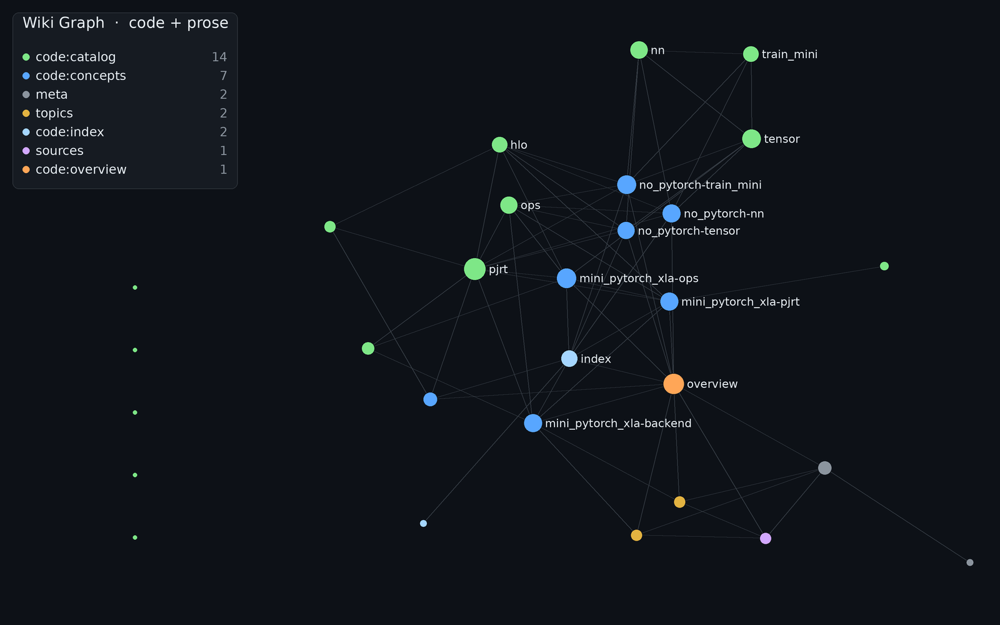

# wikify-repo-demo

**The companion demo for [wikify-repo](https://github.com/vlasenkoalexey/wikify-repo).** wikify-repo
is the tool — a CLI + agent skill that ingests a code repo into a grounded markdown wiki. This repo
is what that tool *produces*: a live, browseable example so you can see the output before installing
anything.

It's a [Karpathy LLM-wiki](https://gist.github.com/karpathy/442a6bf555914893e9891c11519de94f) that
handles **two source types** in one knowledge base: **code repos** — ingested by the
**`wikify-ingest-repo`** skill (which ships with
[wikify-repo](https://github.com/vlasenkoalexey/wikify-repo), not defined here) into a grounded,
lint-clean **markdown** wiki an agent answers internals questions from — and **articles / docs / notes**,
ingested the classic Karpathy way (read → summarize → cross-link). Code is the headline; prose rides
along in the same `index.md` / `log.md`. See [`SCHEMA.md`](SCHEMA.md) for the full workflow.

This repo is both:
- a **showcase** — clone it and browse a real, populated wiki under [`wiki/`](wiki/); and
- a **template** — click **“Use this template”** to start your own code-wiki with the skill and the
  agent conventions already wired up.

## The whole wiki at a glance

[](https://vlasenkoalexey.github.io/wikify-repo-demo/tools/graph/)

Every node is a wiki page; every edge a markdown link between pages. **Code** pages are colored by type
(`code:concepts`, `code:catalog`, `code:overview`) and **prose** by folder (`topics`, `sources`) — both
source types in one cross-linked graph. The big hubs are the citation backbone (the `pjrt` catalog, the
`overview`, the `ops` concept).

**▶ [Open the interactive version →](https://vlasenkoalexey.github.io/wikify-repo-demo/tools/graph/)**
(GitHub Pages) — hover to highlight a node's neighbors, click to open its page, search, toggle groups.
The still above is regenerated by [`tools/graph/`](tools/graph/) (`build_graph.py` → `render_static.py`).

## Repo layout

```
SCHEMA.md              single source of truth — the three layers, ingest/query/lint, retrieval rules.
raw/                   immutable inputs — never modified.
  code/<slug>/           ingested repos as git SUBMODULES, pinned by gitlink (this demo defaults to acquire: submodule).
  sources/               ingested articles / docs / notes — committed source of truth.
wiki/                  LLM-owned markdown — the product.
  index.md               read-first catalog: code repos, topics, sources, notes.
  log.md                 append-only event log (## [date] <op> | <name>).
  code/                  code wikis (one dir per repo) + an auto code catalog (index.md).
    <slug>/                one CODE wiki per repo:
      overview.md            high-level map — main concepts + system diagrams.
      concepts/              grounded mechanism pages (prose + Mermaid + citations).
      catalog/               per-module symbol catalogs — signatures, docstrings, source links, uses-by.
      doc-concepts/          pages derived from the repo's own docs.
  sources/               one summary page per ingested article.
  topics/                synthesized prose pages — entities, concepts, comparisons.
  notes/                 cross-cutting answers filed back from queries.
```

Ingested code repos are **git submodules** (the demo defaults to `acquire: submodule`), so the pin is a
committed gitlink. Clone with the sources in one step:
```bash
git clone --recurse-submodules https://github.com/vlasenkoalexey/wikify-repo-demo
# already cloned?  git submodule update --init
```

## Browse it (no install)

Open [`wiki/index.md`](wiki/index.md) and follow links, or `grep -ri "<term>" wiki/`. Everything is
plain markdown — no embeddings, no database. An agent answers cheaply by reading `index.md`, grepping
to the right page, and citing the catalog anchor. (You don't need the submodules just to read the wiki —
only to follow a catalog link down to the exact source line.)

**Prefer a visual?** See [the graph above](#the-whole-wiki-at-a-glance) — or open the
[interactive viewer](https://vlasenkoalexey.github.io/wikify-repo-demo/tools/graph/) (hover, click a node
to jump to its page, search, toggle groups).

## Start clean (just the pattern, none of the demo's ingested content)

`main` is the **fully-populated showcase** — it carries the demo's ingested sources (the
`mini_pytorch_xla` code wiki and the Karpathy article). If you want to **adopt the pattern for your own
sources** and don't care about what's already been ingested here, start from the **[`clean`](https://github.com/vlasenkoalexey/wikify-repo-demo/tree/clean) branch**:
it's pinned to the state of this repo *before* the first ingest — pure scaffolding (`SCHEMA.md`, the
`wikify-ingest-repo` skill, an empty `wiki/index.md` + `wiki/log.md`), no `raw/`, no ingested pages.

```bash
# fresh start from the empty template:
git clone -b clean https://github.com/vlasenkoalexey/wikify-repo-demo your-wiki

# already cloned, or a fork you want to reset to the empty template:
git checkout clean          # browse it
git reset --hard origin/clean   # or hard-sync a branch to it
```

Then follow **Make your own** below to ingest *your* repos and articles into it.

## Make your own

1. **Use this template** (or `git clone` this repo).
2. Install the tooling once — see [wikify-repo](https://github.com/vlasenkoalexey/wikify-repo)
   (`pip install -e .` → `setup-vendor.sh` → `install-skill.sh /path/to/this-repo`).
3. In **Claude Code, Codex, or Antigravity**, just say:
   > ingest https://github.com/owner/your-repo
   The skill pins + indexes the repo, writes the grounded pages, lints them, assembles `wiki/<slug>/`,
   and updates `index.md` + `log.md`. Re-running is idempotent; `ingest --ref <commit>` updates to a
   newer commit and rebuilds only what changed.

## Why a wiki and not just grep over the source?

The wiki sits *between* raw repos and your questions: the cross-references are already there, the
dynamic-dispatch seams a call-graph walk misses are covered by deterministic catalogs, and every
mechanism page is grounded in real SCIP symbols. The tedious part — the bookkeeping — is done once
and kept current, so answers are fast, grounded, and consistent.
