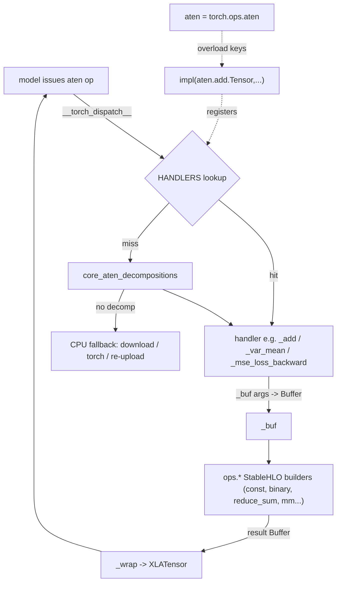

# The aten dispatch backend — lowering torch ops onto StableHLO

How `XLATensor.__torch_dispatch__` turns every aten operation a model issues into a
small composition of `ops.py` StableHLO builders running on the TPU — and why this
one layer also gets you the whole backward pass for free.

## Overview
The backend is a `torch.Tensor` *wrapper subclass* (`XLATensor`) whose payload is a
single device `Buffer` in TPU HBM. Its one job is to intercept aten ops via
`__torch_dispatch__` and re-express each as TPU primitives. The design rests on a
deliberate layering: PyTorch's autograd runs **above** `__torch_dispatch__`, so the
backend only ever implements *forward* ops — every backward formula PyTorch already
owns simply re-dispatches its primitives back through the same table, which is why a
training step's backward pass also lands on the TPU without a single line of gradient
code here. The mapping itself is a plain Python dict: a one-line decorator
[`impl`](../catalog/mini_pytorch_xla/backend.md#impl) registers each handler against
one or more `torch.ops.aten` overloads ([`aten`](../catalog/mini_pytorch_xla/backend.md#aten)),
and two tiny adapters — [`_buf`](../catalog/mini_pytorch_xla/backend.md#_buf) on the
way in, [`_wrap`](../catalog/mini_pytorch_xla/backend.md#_wrap) on the way out —
move between the `torch.Tensor` world and the raw-`Buffer` world the
[`ops`](../catalog/mini_pytorch_xla/ops.md#const) layer speaks.

Most handlers are one expression. The interesting weight of the file is in three
places: the **reduction/statistics** decompositions (mean, var, sum with keepdim
bookkeeping), the handful of **explicit backward** lowerings PyTorch's core decomps
don't cover, and the **in-place optimizer** ops that mutate `_buf` so SGD/Adam run
entirely on device.

## Diagram

## Design rationale (why it's built this way)
The module docstring states the architecture outright: *"`XLATensor` is a wrapper
subclass holding a PJRT device buffer; `__torch_dispatch__` intercepts every aten op
and lowers it to StableHLO (ops.py) on the TPU. PyTorch's autograd runs above
`__torch_dispatch__`, so we implement only forward ops — backward is PyTorch's, and
its backward formulas re-dispatch through here."* That single sentence is the whole
reason the file is small: a wrapper-subclass backend is the pure-Python equivalent of
the C++ dispatch key real `torch_xla` registers, and choosing the dispatch *below*
autograd means gradients come for free.

The decorator-registry shape ([`impl`](../catalog/mini_pytorch_xla/backend.md#impl)
populating a module-level `HANDLERS` dict) keeps the table flat and grep-able: one
overload set per handler, registered at import. Binding to specific
[`aten`](../catalog/mini_pytorch_xla/backend.md#aten) overloads (e.g.
`aten.add.Tensor` *and* `aten.add.Scalar` on one function) lets a single Python body
cover several schema variants.

> [!inferred]
> The surrounding `_dispatch` logic (not in this packet's subgraph) tries the handler
> table first, then PyTorch's `core_aten_decompositions`, then a host CPU fallback. The
> consequence is that the handler set deliberately covers only *primitives*: composites
> like softmax / layernorm / gelu are expanded by PyTorch's decompositions into the
> primitives below, so they need no handler of their own. This is why, e.g.,
> [`_erf`](../catalog/mini_pytorch_xla/backend.md#_erf) exists but `gelu` does not —
> gelu decomposes down to an erf the TPU runs natively.

## Entry points
- [`impl`](../catalog/mini_pytorch_xla/backend.md#impl) — the registration decorator.
  Run once per handler at import time; `@impl(*overloads)` stores `fn` under each aten
  overload key, building the dispatch table that `__torch_dispatch__` later consults.
  Everything else in the file is a function wearing this decorator.
- [`aten`](../catalog/mini_pytorch_xla/backend.md#aten) — `torch.ops.aten`, the
  namespace whose overload objects (`aten.mm.default`, `aten.add.Tensor`, …) are the
  keys handlers register against. Control reaches a handler when a dispatched op's
  overload matches one of these keys.
- [`_buf`](../catalog/mini_pytorch_xla/backend.md#_buf) — the argument coercion every
  handler calls first. *"Coerce an op argument to a device Buffer."* It unwraps an
  `XLATensor` to its `_buf`, uploads a stray CPU `torch.Tensor` via
  [`from_host`](../catalog/mini_pytorch_xla/pjrt.md#PjrtClient.from_host), or
  materializes a Python scalar as a 0-d [`const`](../catalog/mini_pytorch_xla/ops.md#const).
- [`_wrap`](../catalog/mini_pytorch_xla/backend.md#_wrap) — the inverse: re-box a
  result `Buffer` into an `XLATensor` so the value re-enters the torch world and the
  next aten op dispatches through here again.

## Mechanism (step-by-step)
1. **Register the table at import.** Each `@`[`impl`](../catalog/mini_pytorch_xla/backend.md#impl)`(...)`
   line maps one or more [`aten`](../catalog/mini_pytorch_xla/backend.md#aten) overloads
   to a handler. A handler can claim several overloads at once — e.g.
   [`_view`](../catalog/mini_pytorch_xla/backend.md#_view) registers for
   `aten.view.default`, `aten._unsafe_view.default` *and* `aten.reshape.default`,
   collapsing three schemas into one `ops.reshape` body.
2. **Coerce inputs to device Buffers.** Every handler opens by calling
   [`_buf`](../catalog/mini_pytorch_xla/backend.md#_buf) on its tensor arguments,
   which guarantees the rest of the body works on raw `Buffer`s regardless of whether
   the caller passed an `XLATensor`, a CPU tensor, or a scalar. Scalars become 0-d
   constants through [`const`](../catalog/mini_pytorch_xla/ops.md#const), which is how
   `alpha`/`beta`/threshold constants enter the graph.
3. **Lower elementwise + matmul primitives directly.** The bulk of the table is
   thin: [`_mul`](../catalog/mini_pytorch_xla/backend.md#_mul),
   [`_div`](../catalog/mini_pytorch_xla/backend.md#_div),
   [`_maximum`](../catalog/mini_pytorch_xla/backend.md#_maximum),
   [`_exp`](../catalog/mini_pytorch_xla/backend.md#_exp),
   [`_tanh`](../catalog/mini_pytorch_xla/backend.md#_tanh),
   [`_rsqrt`](../catalog/mini_pytorch_xla/backend.md#_rsqrt), and
   [`_mm`](../catalog/mini_pytorch_xla/backend.md#_mm) /
   [`_bmm`](../catalog/mini_pytorch_xla/backend.md#_bmm) each forward to one `ops`
   builder. The fused-affine [`_addmm`](../catalog/mini_pytorch_xla/backend.md#_addmm)
   shows the scalar pattern: it only emits the `alpha`/`beta` multiplies when those
   scalars differ from 1, then adds a `[out]`-shaped bias that broadcasts to `[N, out]`.
   Comparisons like [`_ge`](../catalog/mini_pytorch_xla/backend.md#_ge) /
   [`_gt`](../catalog/mini_pytorch_xla/backend.md#_gt) lower to `ops.compare`, yielding
   the boolean masks that backward ops consume.
4. **Implement views as metadata-only reshapes/transposes.** The view family is purely
   shape arithmetic over the buffer: [`_view`](../catalog/mini_pytorch_xla/backend.md#_view)
   normalizes a `-1` against `numel` then reshapes;
   [`_squeeze`](../catalog/mini_pytorch_xla/backend.md#_squeeze) /
   [`_unsqueeze`](../catalog/mini_pytorch_xla/backend.md#_unsqueeze) compute the new
   tuple and reshape; [`_t`](../catalog/mini_pytorch_xla/backend.md#_t),
   [`_transpose`](../catalog/mini_pytorch_xla/backend.md#_transpose) and
   [`_permute`](../catalog/mini_pytorch_xla/backend.md#_permute) build a permutation
   list (with negative dims taken mod rank) and emit `ops.transpose`;
   [`_expand`](../catalog/mini_pytorch_xla/backend.md#_expand) resolves `-1` entries
   against the source shape and emits `ops.broadcast_to`. None of these touch data —
   they rewrite the StableHLO shape.
5. **Decompose reductions with keepdim bookkeeping.** Reductions are where real logic
   appears. [`_sum_dim`](../catalog/mini_pytorch_xla/backend.md#_sum_dim) and
   [`_amax`](../catalog/mini_pytorch_xla/backend.md#_amax) reduce over mod-normalized
   dims, then, when `keepdim`, reshape the result back to 1-filled axes;
   [`_mean_dim`](../catalog/mini_pytorch_xla/backend.md#_mean_dim) and
   [`_mean_all`](../catalog/mini_pytorch_xla/backend.md#_mean_all) add the divide-by-N
   that aten's `mean` implies, computing N from the reduced extents.
6. **Express variance as a sum-of-squares decomposition.**
   [`_var_mean`](../catalog/mini_pytorch_xla/backend.md#_var_mean) is the densest
   handler and the model for the file's philosophy: there is no "variance" primitive,
   so it is built from primitives — reduce-sum for the mean, subtract to center,
   multiply-and-reduce for the squared deviations, then divide by `max(n - correction, 1)`
   (Bessel's correction, clamped to avoid divide-by-zero). It returns both var and mean
   as a tuple, each [`_wrap`](../catalog/mini_pytorch_xla/backend.md#_wrap)ped, so it
   satisfies aten's `var_mean.correction` schema in one shot — and is exactly what
   layernorm's decomposition calls into.
7. **Hand-lower the backwards core decomps miss.** A few gradient formulas are
   implemented directly rather than left to PyTorch:
   [`_threshold_backward`](../catalog/mini_pytorch_xla/backend.md#_threshold_backward)
   (the relu/threshold gradient) builds a `GT` mask and `ops.select`s the incoming grad
   against zeros; [`_mse_loss_backward`](../catalog/mini_pytorch_xla/backend.md#_mse_loss_backward)
   emits `2*(inp - tgt)`, divides by N for the mean reduction, and scales by the upstream
   grad — the analytic derivative of the forward
   [`_mse_loss`](../catalog/mini_pytorch_xla/backend.md#_mse_loss);
   [`_embedding_backward`](../catalog/mini_pytorch_xla/backend.md#_embedding_backward)
   realizes the embedding-table gradient as a one-hot matrix times the upstream grad
   (`oneᵀ @ grad`), the dense scatter expressed as a matmul.
8. **Mutate `_buf` in place for the optimizer.** Training's update step dispatches
   through mutating aten ops, and the backend honors them by reassigning the tensor's
   `_buf` rather than returning a new tensor:
   [`_iadd`](../catalog/mini_pytorch_xla/backend.md#_iadd) /
   [`_isub`](../catalog/mini_pytorch_xla/backend.md#_isub),
   the fused Adam helpers [`_iaddcmul`](../catalog/mini_pytorch_xla/backend.md#_iaddcmul)
   and [`_iaddcdiv`](../catalog/mini_pytorch_xla/backend.md#_iaddcdiv),
   [`_ilerp`](../catalog/mini_pytorch_xla/backend.md#_ilerp), and the zeroing op
   [`_izero`](../catalog/mini_pytorch_xla/backend.md#_izero) each compute a new device
   buffer and store it into `self._buf`, returning `self`. This keeps parameter tensors'
   identity stable across steps while the data lives only on the TPU.

## Key data structures
- **`XLATensor._buf`** — the single `pjrt.Buffer` payload of the wrapper subclass; a
  handle to a tensor in TPU HBM ([`Buffer`](../catalog/mini_pytorch_xla/pjrt.md#Buffer)).
  All handler logic flows in and out of this field, and the in-place ops rewrite it.
- **`HANDLERS`** (dict) — the aten-overload → handler table built by
  [`impl`](../catalog/mini_pytorch_xla/backend.md#impl). The whole dispatch is a dict
  lookup against keys drawn from [`aten`](../catalog/mini_pytorch_xla/backend.md#aten).
- **The PJRT client singleton** — handlers reach the device through one process-wide
  [`client`](../catalog/mini_pytorch_xla/pjrt.md#client) (*"one TPU client; the chips
  are a shared resource"*); [`const`](../catalog/mini_pytorch_xla/ops.md#const) and
  [`_buf`](../catalog/mini_pytorch_xla/backend.md#_buf) both upload through its
  [`from_host`](../catalog/mini_pytorch_xla/pjrt.md#PjrtClient.from_host), whose dtype
  gate is [`_NP_TO_PJRT`](../catalog/mini_pytorch_xla/pjrt.md#_NP_TO_PJRT).

## Dynamics (design intent)
The module docstring frames the intended control flow: autograd sits above
`__torch_dispatch__`, so the same handler table services both the forward pass and the
re-dispatched backward formulas — *"the backward pass also runs on the TPU."* Forward
math handlers are pure (new buffer out via [`_wrap`](../catalog/mini_pytorch_xla/backend.md#_wrap));
the optimizer handlers are intentionally impure, mutating `_buf` so parameter identity
survives across iterations (see [`_iadd`](../catalog/mini_pytorch_xla/backend.md#_iadd),
[`_izero`](../catalog/mini_pytorch_xla/backend.md#_izero)). The
[`client`](../catalog/mini_pytorch_xla/pjrt.md#client) docstring notes the TPU is a
shared singleton resource, so all of this serializes through one device context.

## Edge cases
- **Scalar operands.** [`_buf`](../catalog/mini_pytorch_xla/backend.md#_buf) turns
  `int`/`float`/`bool` into a 0-d [`const`](../catalog/mini_pytorch_xla/ops.md#const)
  that broadcasts; passing an unrecognized type raises `TypeError`.
- **`pow` special-cased on the exponent.** [`_pow`](../catalog/mini_pytorch_xla/backend.md#_pow)
  uses a literal multiply for exponent 2 or 3 and only falls back to `exp(e·log(a))`
  (which assumes `a > 0`) for the general case — a deliberate accuracy/positivity tradeoff.
- **`alpha`/`beta` = 1 fast path.** [`_add`](../catalog/mini_pytorch_xla/backend.md#_add),
  [`_sub`](../catalog/mini_pytorch_xla/backend.md#_sub) and
  [`_addmm`](../catalog/mini_pytorch_xla/backend.md#_addmm) skip the scaling multiply
  entirely when the scalar is 1, keeping the emitted graph minimal.
- **`_t` is rank-guarded.** [`_t`](../catalog/mini_pytorch_xla/backend.md#_t) only
  transposes a 2-D buffer and returns the input unchanged otherwise, matching aten's
  `t()` semantics for 0/1-D.
- **Reduction `keepdim`.** Every reduction handler reshapes 1-filled axes back only
  when `keepdim=True`; the negative-dim mod-normalization is repeated in each, so a
  reused index is taken modulo rank consistently
  ([`_sum_dim`](../catalog/mini_pytorch_xla/backend.md#_sum_dim),
  [`_var_mean`](../catalog/mini_pytorch_xla/backend.md#_var_mean)).
- **Constructor-likes copy the source shape/dtype.**
  [`_ones_like`](../catalog/mini_pytorch_xla/backend.md#_ones_like) /
  [`_zeros_like`](../catalog/mini_pytorch_xla/backend.md#_zeros_like) build a filled
  const at the input buffer's shape and dtype rather than honoring `**kw` dtype/device
  overrides.

## Open questions
- The actual lookup/fallback driver (`_dispatch`, `__torch_dispatch__`, `HANDLERS`,
  `_DECOMP`, `_cpu_fallback`) is not in this packet's subgraph, so the precise order of
  handler-table vs. core-decomposition vs. host-fallback resolution is described here
  from reading source, not from a citable symbol. A dedicated dispatch-driver concept
  page should own that.
- [`_embedding`](../catalog/mini_pytorch_xla/backend.md#_embedding) and
  [`_embedding_backward`](../catalog/mini_pytorch_xla/backend.md#_embedding_backward)
  rely on host-side index handling (`_idx_np`) and `ops.gather_rows` that fall outside
  this subgraph; their exact device/host split is not settled here.

## See also
- `concepts/mini_pytorch_xla-ops` — the StableHLO builders (`const`, `binary`,
  `reduce_sum`, `mm`, `transpose`) these handlers target.
- `concepts/mini_pytorch_xla-pjrt` — `Buffer`, `client`, and `from_host`, the device
  layer beneath the backend.
