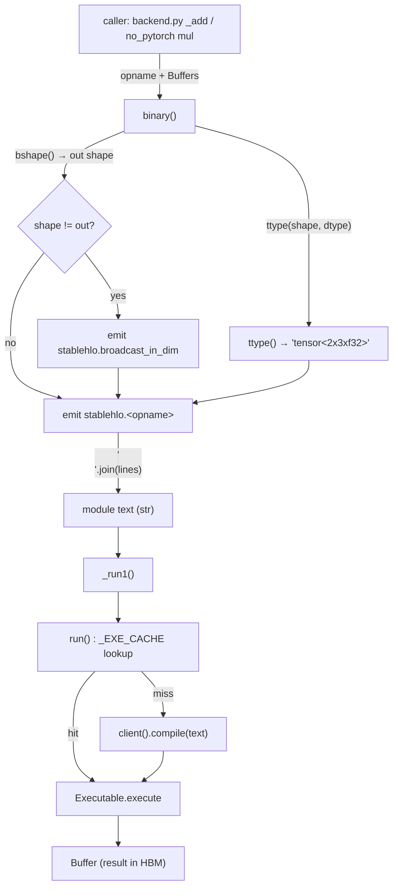

# ops — the StableHLO text-emission op layer

How `mini_pytorch_xla` turns a single buffer-level primitive (`binary("multiply", …)`, `unary("rsqrt", …)`, `reshape`, `const`) into a complete StableHLO/MLIR module *as a Python f-string*, compiles it once, and runs it on the TPU.

## Overview
`ops.py` is the lowering layer: every function takes and returns [`Buffer`](../catalog/mini_pytorch_xla/pjrt.md#Buffer) handles to tensors already living in TPU HBM, and its whole job is to **print a tiny StableHLO program** whose `@main` takes those buffers as arguments and returns the result. There is no in-memory IR, no graph object, no builder API — the "compiler frontend" is string concatenation. The key idea is that an MLIR module is just text, and XLA's compiler will accept that text, so the cheapest possible way to drive a real production compiler from Python is to emit the text directly. Each op emits **one self-contained module per call** ([`unary`](../catalog/mini_pytorch_xla/ops.md#unary), [`binary`](../catalog/mini_pytorch_xla/ops.md#binary)) and hands it to [`_run1`](../catalog/mini_pytorch_xla/ops.md#_run1) → [`run`](../catalog/mini_pytorch_xla/hlo.md#run), which compiles-and-caches keyed on the exact module text. This is *eager op lowering*: one HLO module per PyTorch-level op, no cross-op fusion. The module header `"""Buffer-level StableHLO op lowerings (no autograd here)"""` states the scope — pure forward compute, the analogue of PyTorch/XLA's per-node lowerings.

## Diagram

## Design rationale (why it's built this way)
The whole layer is a bet that **emitting MLIR text is dramatically simpler than building IR**, and the bet pays off because compilation is cached, so the text is produced at most once per distinct (op, shapes, dtypes) tuple. [`run`](../catalog/mini_pytorch_xla/hlo.md#run) keys its `_EXE_CACHE` on the raw `module_text` string, and its docstring — *"Compile (cached) and execute a StableHLO module on the TPU"* — together with the `hlo.py` header (*"We compile that module once (keyed by its text … so a training step that repeats the same shapes pays compilation only on iteration 0"*) makes the design explicit: the text doubles as the cache key. That is why shapes and dtypes are baked into the string by [`ttype`](../catalog/mini_pytorch_xla/hlo.md#ttype) rather than passed as runtime arguments — two calls with different shapes *must* produce different text so they compile separately, and two calls with identical shapes *must* produce byte-identical text so they share the cached executable.

Because each module is self-contained and single-op, there is no fusion across ops; the cost is many small dispatches, the benefit is that every op is independently cacheable and the lowering code stays trivial.

> [!inferred]
> Keeping each module to one result-producing op (broadcasts aside) is what makes the text-as-cache-key scheme robust: a larger fused graph would have far more distinct text variants and a colder cache. This is a reading of the eager-lowering choice, not a stated claim.

## Entry points
- [`binary`](../catalog/mini_pytorch_xla/ops.md#binary) — the elementwise two-input primitive (`"add"`, `"multiply"`, `"subtract"`, `"divide"`, `"maximum"`, …). Control reaches it from essentially every arithmetic aten lowering in `backend.py` — [`_add`](../catalog/mini_pytorch_xla/backend.md#_add), [`_sub`](../catalog/mini_pytorch_xla/backend.md#_sub), [`_div`](../catalog/mini_pytorch_xla/backend.md#_div), [`_pow`](../catalog/mini_pytorch_xla/backend.md#_pow), [`_clamp_min`](../catalog/mini_pytorch_xla/backend.md#_clamp_min), [`_relu`](../catalog/mini_pytorch_xla/backend.md#_relu), [`_recip`](../catalog/mini_pytorch_xla/backend.md#_recip), the fused optimizer ops [`_iaddcmul`](../catalog/mini_pytorch_xla/backend.md#_iaddcmul) / [`_iaddcdiv`](../catalog/mini_pytorch_xla/backend.md#_iaddcdiv) / [`_ilerp`](../catalog/mini_pytorch_xla/backend.md#_ilerp) — and from the standalone autograd tensor ops [`add`](../catalog/no_pytorch/tensor.md#add), [`mul`](../catalog/no_pytorch/tensor.md#mul), [`sub`](../catalog/no_pytorch/tensor.md#sub), [`div`](../catalog/no_pytorch/tensor.md#div).
- [`unary`](../catalog/mini_pytorch_xla/ops.md#unary) — the single-input primitive (`"negate"`, `"exponential"`, `"log"`, `"sqrt"`, `"rsqrt"`, `"tanh"`). Reached from [`_exp`](../catalog/mini_pytorch_xla/backend.md#_exp) and the tensor-level [`neg`](../catalog/no_pytorch/tensor.md#neg), [`exp`](../catalog/no_pytorch/tensor.md#exp), [`log`](../catalog/no_pytorch/tensor.md#log), [`sqrt`](../catalog/no_pytorch/tensor.md#sqrt), [`rsqrt`](../catalog/no_pytorch/tensor.md#rsqrt), [`tanh`](../catalog/no_pytorch/tensor.md#tanh) — the opname maps directly to a `stablehlo.<opname>` so adding an activation is a one-liner.
- [`const`](../catalog/mini_pytorch_xla/ops.md#const) — the only op that does **not** emit StableHLO; it builds a `np.full` host array and uploads it via [`from_host`](../catalog/mini_pytorch_xla/pjrt.md#PjrtClient.from_host). It is how scalars enter the graph — every `ops.const(…, (), np.float32)` in `backend.py` ([`_relu`](../catalog/mini_pytorch_xla/backend.md#_relu), [`_threshold_backward`](../catalog/mini_pytorch_xla/backend.md#_threshold_backward), [`_ones_like`](../catalog/mini_pytorch_xla/backend.md#_ones_like), [`_zeros_like`](../catalog/mini_pytorch_xla/backend.md#_zeros_like), [`_izero`](../catalog/mini_pytorch_xla/backend.md#_izero)) — turns a Python number into a device buffer that `binary` can then broadcast against.
- [`reshape`](../catalog/mini_pytorch_xla/ops.md#reshape) — the canonical shape op and the model for all metadata-only lowerings; the heavy consumers are the view family [`_view`](../catalog/mini_pytorch_xla/backend.md#_view), [`_squeeze`](../catalog/mini_pytorch_xla/backend.md#_squeeze), [`_unsqueeze`](../catalog/mini_pytorch_xla/backend.md#_unsqueeze), and the keep-dim reduction tails of [`_sum_dim`](../catalog/mini_pytorch_xla/backend.md#_sum_dim) / [`_mean_dim`](../catalog/mini_pytorch_xla/backend.md#_mean_dim) / [`_var_mean`](../catalog/mini_pytorch_xla/backend.md#_var_mean) / [`_amax`](../catalog/mini_pytorch_xla/backend.md#_amax).
- [`gather_rows`](../catalog/mini_pytorch_xla/ops.md#gather_rows) — a composite (not a single StableHLO op) showing the layer's fallback strategy: its docstring says it does an embedding row-gather *"as one-hot @ table so we stay within implemented primitives"*, building the one-hot in NumPy and finishing with a [`reshape`](../catalog/mini_pytorch_xla/ops.md#reshape).

## Mechanism (step-by-step)
1. **Resolve the result shape and MLIR types.** [`binary`](../catalog/mini_pytorch_xla/ops.md#binary) first computes the broadcast output shape from the two operands' [`shape`](../catalog/mini_pytorch_xla/pjrt.md#Buffer.shape) fields (`bshape`, NumPy-style right-aligned rules), then renders three MLIR tensor types with [`ttype`](../catalog/mini_pytorch_xla/hlo.md#ttype) — whose docstring gives the format: *"(2,3),f32 -> 'tensor&lt;2x3xf32&gt;'; () -> 'tensor&lt;f32&gt;'"*. These typed strings become the function signature `@main(%a: Ta, %b: Tb) -> To`, so the shapes are now literally part of the program text.

2. **Emit broadcasts only where an operand's shape differs from the output.** Still in [`binary`](../catalog/mini_pytorch_xla/ops.md#binary), if `a.shape != out` it appends a `stablehlo.broadcast_in_dim %a, dims = [...]` line (the `dims` come from `_bdims`, the right-aligned axis map) and rebinds the SSA name `%a → %ab`; same for `b`. Equal-shape operands skip the broadcast entirely — the broadcast is a *textual* conditional, not a runtime branch. This is also why scalars from [`const`](../catalog/mini_pytorch_xla/ops.md#const) work: a `tensor<f32>` differs from the output shape, so it gets a `broadcast_in_dim` up to the full shape.

3. **Append the result op and return statement, then join.** The lines `%r = stablehlo.<opname> %av, %bv : To` and `return %r : To` close the function and module; `"\n".join(lines)` produces the final module string. [`unary`](../catalog/mini_pytorch_xla/ops.md#unary) and [`reshape`](../catalog/mini_pytorch_xla/ops.md#reshape) skip steps 1–2 entirely — they have no broadcasting — and inline the whole module as a single f-string with one `stablehlo.<opname>` / `stablehlo.reshape` body.

4. **Compile-cached execute.** Every emitter ends with [`_run1`](../catalog/mini_pytorch_xla/ops.md#_run1), which calls [`run`](../catalog/mini_pytorch_xla/hlo.md#run) with `n_out=1` and unpacks the single output. [`run`](../catalog/mini_pytorch_xla/hlo.md#run) looks the module text up in `_EXE_CACHE`; on a miss it calls `client().compile(text)` and stores the resulting `Executable`; on a hit it skips straight to `execute`. The text *is* the cache key, so identical shapes/dtypes reuse the same compiled TPU binary.

5. **Marshal buffers across the C ABI and wrap the result.** Execution bottoms out in [`_execute`](../catalog/mini_pytorch_xla/pjrt.md#PjrtClient._execute), which packs the input [`Buffer`](../catalog/mini_pytorch_xla/pjrt.md#Buffer) handles into a `ctypes` array of [`c_vp`](../catalog/mini_pytorch_xla/pjrt.md#c_vp) (`c_void_p`) pointers, invokes `PJRT_LoadedExecutable_Execute`, awaits the completion event, and re-wraps each output handle into a fresh `Buffer` by querying its shape and dtype back from the device. The op-builder layer therefore never sees raw device memory — it only ever traffics in `Buffer` handles.

6. **The host-upload path for constants.** [`const`](../catalog/mini_pytorch_xla/ops.md#const) bypasses all of the above: `pjrt.client().from_host(np.full(shape, value, dtype))`. [`from_host`](../catalog/mini_pytorch_xla/pjrt.md#PjrtClient.from_host) checks the dtype against [`_NP_TO_PJRT`](../catalog/mini_pytorch_xla/pjrt.md#_NP_TO_PJRT), DMAs the contiguous bytes to HBM via `PJRT_Client_BufferFromHostBuffer`, awaits `done_with_host_buffer`, and returns a `Buffer`. This is the single entry by which Python scalars and NumPy arrays become device tensors.

## Key data structures
- **The module string** — the actual product of this layer. Not an object; a `str`. Its content (op name + every [`ttype`](../catalog/mini_pytorch_xla/hlo.md#ttype) rendering) fully determines both the computation and its [`run`](../catalog/mini_pytorch_xla/hlo.md#run) cache identity.
- **[`Buffer`](../catalog/mini_pytorch_xla/pjrt.md#Buffer)** — *"A handle to a tensor living in TPU HBM (a PJRT_Buffer*)"*. Carries the [`shape`](../catalog/mini_pytorch_xla/pjrt.md#Buffer.shape) and [`dtype`](../catalog/mini_pytorch_xla/pjrt.md#Buffer.dtype) that every emitter reads to build types; the data stays on-device.
- **`_EXE_CACHE`** — the `dict[str, Executable]` inside [`run`](../catalog/mini_pytorch_xla/hlo.md#run) mapping module text → compiled TPU executable; the thing that makes per-call text emission cheap.
- **[`_NP_TO_PJRT`](../catalog/mini_pytorch_xla/pjrt.md#_NP_TO_PJRT)** — the dtype whitelist [`from_host`](../catalog/mini_pytorch_xla/pjrt.md#PjrtClient.from_host) enforces on uploads, mirroring the MLIR dtype map `ttype` uses on the emit side.

## Dynamics (design intent)
The intended steady state is *compile-once, run-many*: [`run`](../catalog/mini_pytorch_xla/hlo.md#run)'s docstring and the `hlo.py` module header both describe a training loop where iteration 0 compiles and later iterations with the same shapes only execute. Op dispatch is synchronous from Python's view — [`_execute`](../catalog/mini_pytorch_xla/pjrt.md#PjrtClient._execute) awaits the device completion event before returning the output `Buffer`. The TPU client is a process-wide singleton ([`client`](../catalog/mini_pytorch_xla/pjrt.md#client), *"one TPU client; the chips are a shared resource"*), so all ops share one `_EXE_CACHE` and one device context.

## Edge cases
- **Mixed dtypes are not really supported.** [`binary`](../catalog/mini_pytorch_xla/ops.md#binary) renders `b`'s type with **`a`'s** dtype (`ttype(b.shape, a.dtype)`), so operands are assumed to share a dtype; the layer leans on callers (e.g. [`_buf`](../catalog/mini_pytorch_xla/backend.md#_buf), which coerces scalars to `float32` buffers via [`const`](../catalog/mini_pytorch_xla/ops.md#const)) to keep dtypes uniform.
- **Identity reshape is elided.** [`reshape`](../catalog/mini_pytorch_xla/ops.md#reshape) returns the input `Buffer` unchanged when `a.shape == shape`, emitting no module at all — a fast path the view-family lowerings ([`_view`](../catalog/mini_pytorch_xla/backend.md#_view), [`_squeeze`](../catalog/mini_pytorch_xla/backend.md#_squeeze)) rely on.
- **Non-commutative broadcasts.** `broadcast_in_dim`'s `dims` assume right-alignment (`_bdims`); only size-1 or equal axes broadcast, and `bshape` raises `ValueError` otherwise — there is no implicit transpose.
- **Constants cost a host round-trip.** Each [`const`](../catalog/mini_pytorch_xla/ops.md#const) is a real [`from_host`](../catalog/mini_pytorch_xla/pjrt.md#PjrtClient.from_host) upload, not an in-graph `stablehlo.constant`, so scalar-heavy code (e.g. [`_addmm`](../catalog/mini_pytorch_xla/backend.md#_addmm)'s `alpha`/`beta`) pays a DMA per scalar.

## Open questions
- Reductions and matmul (`reduce`, `mm`, `dot_general`) and shape ops like `transpose` / `broadcast_to` / `slice_dim` are part of this same `ops.py` layer but are **not in this packet's subgraph**, so they are only referenced indirectly here (e.g. via [`gather_rows`](../catalog/mini_pytorch_xla/ops.md#gather_rows) and the keep-dim reductions). Their text-emission details belong on a sibling page.
- The `chlo.erf` path (legalized during XLA compile) is mentioned in source comments as enabling on-device `gelu`, but `erf` is outside the subgraph and not documented here.

## See also
- `concepts/mini_pytorch_xla-hlo` — the compile/execute cache and `ttype`/`mlir_dtype` rendering.
- `concepts/mini_pytorch_xla-pjrt` — `Buffer`, `from_host`, `_execute`, and the C-ABI marshalling these ops bottom out in.
- `concepts/mini_pytorch_xla-backend` — the aten `@impl` lowerings that are the primary callers of `binary` / `unary` / `const` / `reshape`.
