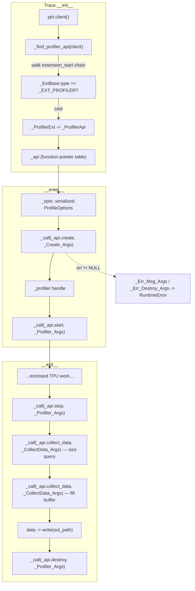

# Profiler — PJRT profiler-extension trace capture
How `Trace` reaches into the TPU plugin over a raw C ABI to start/stop a profiling session and pull back an XSpace buffer — and why, run standalone, that buffer comes back empty.

## Overview
This subsystem is a **pure-ctypes reimplementation of the PJRT profiler extension protocol**. The TPU plugin (libtpu) exposes its profiler not through the normal PJRT C API but as an *extension*: a `PLUGIN_Profiler_Api` function-pointer table hung off a linked list of extension records. `Trace` is a context manager that finds that table, then drives the canonical create → start → (your work) → stop → collect_data → destroy lifecycle directly against function pointers — the same sequence `xla::profiler::PluginTracer` performs in C++. The key idea is that *nothing here is a Python binding*; every call is a hand-laid `ctypes.Structure` matching the plugin's ABI byte-for-byte, dispatched through one tiny [`_call`](../catalog/mini_pytorch_xla/profiler.md#Trace._call) helper. The honest caveat, stated in the module docstring, is that the extension is only a *contributor* to a `tsl::profiler::ProfilerSession` that lives outside the PJRT C API — so standalone it is ABI-correct but yields an empty trace.

## Diagram

## Design rationale (why it's built this way)
The whole module exists to talk to a C ABI with **no generated bindings and no protoc**, so its design is dominated by faithfully mirroring C structs in Python.

- **Extension discovery instead of a fixed entry point.** The profiler isn't a top-level PJRT call; it's reached by walking `PJRT_Api.extension_start` as a linked list and matching a type tag. [`_find_profiler_api`](../catalog/mini_pytorch_xla/profiler.md#_find_profiler_api) casts each node first to the common prefix [`_ExtBase`](../catalog/mini_pytorch_xla/profiler.md#_ExtBase) to read its `type`/`next`, and only when the tag equals [`_EXT_PROFILER`](../catalog/mini_pytorch_xla/profiler.md#_EXT_PROFILER) re-casts the *same* pointer to the wider [`_ProfilerExt`](../catalog/mini_pytorch_xla/profiler.md#_ProfilerExt) to extract the actual API table. This "common-prefix then upcast" is the standard C trick for tagged-union extension chains, reproduced exactly in ctypes.

- **Every struct begins with `struct_size` for forward/backward ABI compatibility.** The plugin reads `struct_size` to know which fields a caller's build knows about, so each arg struct must set it. Rather than repeat that, [`_hdr`](../catalog/mini_pytorch_xla/profiler.md#_hdr) stamps `struct_size = sizeof(type(s))` and returns the struct, so call sites read as `_hdr(_Profiler_Args())`.

- **One dispatch + error path for all calls.** [`_call`](../catalog/mini_pytorch_xla/profiler.md#Trace._call) is the only place a raw function pointer is invoked. It wraps the address in a [`_FN`](../catalog/mini_pytorch_xla/profiler.md#_FN) `CFUNCTYPE(void*, void*)`, and on a non-NULL error pointer it walks the error ABI ([`_Err_Msg_Args`](../catalog/mini_pytorch_xla/profiler.md#_Err_Msg_Args) to decode, [`_Err_Destroy_Args`](../catalog/mini_pytorch_xla/profiler.md#_Err_Destroy_Args) to free) before raising — the same error-message/error-destroy dance the PJRT client itself uses.

- **The serialized `ProfileOptions` is a hand-built protobuf.** [`_opts`](../catalog/mini_pytorch_xla/profiler.md#Trace._opts) is the four bytes `0x10, 2, 0x18, 1`, which is the wire encoding of `host_tracer_level=2` (field 2) and `device_tracer_level=1` (field 3) — avoiding a protobuf dependency for a two-field message.

> [!inferred]
> The empty-buffer outcome is documented in the module docstring, not provable from the cited symbols: the PJRT profiler extension is only a contributor to a `tsl::profiler::ProfilerSession` (the thing that actually arms the TPU hardware tracer and merges host+device XSpaces), and that session is not exposed through the PJRT C API. So this path is kept to *document* the ABI; the working proof-of-TPU-execution lives in the sibling `OpProfile` timeline path, which is outside this packet's subgraph.

## Entry points
- [`__exit__`](../catalog/mini_pytorch_xla/profiler.md#Trace.__exit__) — reached when the `with Trace(...)` block ends. It is the heavy half of the lifecycle: it stops the session, performs the two-phase `collect_data` (size query then fill), serializes the bytes to [`out_path`](../catalog/mini_pytorch_xla/profiler.md#Trace.out_path), and destroys the profiler handle held in [`_profiler`](../catalog/mini_pytorch_xla/profiler.md#Trace._profiler). Returning `False` lets any exception from the enclosed work propagate.
- [`_find_profiler_api`](../catalog/mini_pytorch_xla/profiler.md#_find_profiler_api) — reached once at `Trace` construction, given the process [`client`](../catalog/mini_pytorch_xla/pjrt.md#client). It resolves the plugin's [`_ProfilerApi`](../catalog/mini_pytorch_xla/profiler.md#_ProfilerApi) table and raises if the extension is absent, so a plugin without profiler support fails fast at setup rather than mid-trace.

## Mechanism (step-by-step)
1. **Bind to the process-wide TPU client.** Construction calls [`client`](../catalog/mini_pytorch_xla/pjrt.md#client), the lazy singleton that returns the one [`PjrtClient`](../catalog/mini_pytorch_xla/pjrt.md#PjrtClient) (cached in [`_GLOBAL`](../catalog/mini_pytorch_xla/pjrt.md#_GLOBAL._GLOBAL)) — "one TPU client; the chips are a shared resource." The profiler must attach to that same client because the extension table lives on its `PJRT_Api`.

2. **Resolve the profiler API table.** [`_find_profiler_api`](../catalog/mini_pytorch_xla/profiler.md#_find_profiler_api) walks the client's `extension_start` chain, reading each node through the common-prefix [`_ExtBase`](../catalog/mini_pytorch_xla/profiler.md#_ExtBase); when a node's `type` equals [`_EXT_PROFILER`](../catalog/mini_pytorch_xla/profiler.md#_EXT_PROFILER) it upcasts to [`_ProfilerExt`](../catalog/mini_pytorch_xla/profiler.md#_ProfilerExt) and dereferences its `profiler_api` pointer into a [`_ProfilerApi`](../catalog/mini_pytorch_xla/profiler.md#_ProfilerApi). The resulting table is stored as [`_api`](../catalog/mini_pytorch_xla/profiler.md#Trace._api); [`_profiler`](../catalog/mini_pytorch_xla/profiler.md#Trace._profiler) and [`data`](../catalog/mini_pytorch_xla/profiler.md#Trace.data) start empty.

3. **Create and start the session on entry.** Entering the block builds the serialized options [`_opts`](../catalog/mini_pytorch_xla/profiler.md#Trace._opts), passes them through a [`_Create_Args`](../catalog/mini_pytorch_xla/profiler.md#_Create_Args) to `_api.create` (the returned `profiler` handle is captured), then fires `_api.start` with a [`_Profiler_Args`](../catalog/mini_pytorch_xla/profiler.md#_Profiler_Args) carrying that handle. From here the TPU plugin is recording until stop.

4. **Dispatch every plugin call through one checked helper.** Each lifecycle call goes through [`_call`](../catalog/mini_pytorch_xla/profiler.md#Trace._call): it casts the table slot's address into a [`_FN`](../catalog/mini_pytorch_xla/profiler.md#_FN) callable and invokes it with `byref(args)`. A non-NULL return is a `PJRT_Error*`; `_call` decodes it via [`_Err_Msg_Args`](../catalog/mini_pytorch_xla/profiler.md#_Err_Msg_Args), frees it via [`_Err_Destroy_Args`](../catalog/mini_pytorch_xla/profiler.md#_Err_Destroy_Args), and raises `RuntimeError`, so no error pointer leaks.

5. **Stop, collect in two passes, persist, destroy.** On block exit [`__exit__`](../catalog/mini_pytorch_xla/profiler.md#Trace.__exit__) stops the session, then calls `collect_data` twice with a [`_CollectData_Args`](../catalog/mini_pytorch_xla/profiler.md#_CollectData_Args): first with `buffer = None` to learn `buffer_size_in_bytes`, then with an allocated `c_uint8` array of that size to receive the bytes. The bytes become [`data`](../catalog/mini_pytorch_xla/profiler.md#Trace.data) and are written to [`out_path`](../catalog/mini_pytorch_xla/profiler.md#Trace.out_path), after which `_api.destroy` releases the handle in [`_profiler`](../catalog/mini_pytorch_xla/profiler.md#Trace._profiler).

## Key data structures
- **The ABI structs.** [`_ProfilerApi`](../catalog/mini_pytorch_xla/profiler.md#_ProfilerApi) is the function-pointer table (`create`/`destroy`/`start`/`stop`/`collect_data` plus the error helpers); [`_ProfilerExt`](../catalog/mini_pytorch_xla/profiler.md#_ProfilerExt) and its prefix [`_ExtBase`](../catalog/mini_pytorch_xla/profiler.md#_ExtBase) form the extension-chain node. The per-call argument records — [`_Create_Args`](../catalog/mini_pytorch_xla/profiler.md#_Create_Args), [`_Profiler_Args`](../catalog/mini_pytorch_xla/profiler.md#_Profiler_Args) (shared by start/stop/destroy), [`_CollectData_Args`](../catalog/mini_pytorch_xla/profiler.md#_CollectData_Args), [`_Err_Msg_Args`](../catalog/mini_pytorch_xla/profiler.md#_Err_Msg_Args), [`_Err_Destroy_Args`](../catalog/mini_pytorch_xla/profiler.md#_Err_Destroy_Args) — each open with a `struct_size` field stamped by [`_hdr`](../catalog/mini_pytorch_xla/profiler.md#_hdr).
- **The ctypes scalar aliases.** [`c_sz`](../catalog/mini_pytorch_xla/profiler.md#c_sz) (`c_size_t`), [`c_vp`](../catalog/mini_pytorch_xla/profiler.md#c_vp) (`c_void_p`), and [`c_i64`](../catalog/mini_pytorch_xla/profiler.md#c_i64) (`c_int64`) are the field types those structs are built from — `c_vp` standing in for every opaque handle and function pointer.
- **`Trace` instance state.** [`_api`](../catalog/mini_pytorch_xla/profiler.md#Trace._api) (resolved table), [`_profiler`](../catalog/mini_pytorch_xla/profiler.md#Trace._profiler) (live session handle), [`_opts`](../catalog/mini_pytorch_xla/profiler.md#Trace._opts) (serialized options, kept alive as long as the create call needs it), [`data`](../catalog/mini_pytorch_xla/profiler.md#Trace.data) (collected bytes), and [`out_path`](../catalog/mini_pytorch_xla/profiler.md#Trace.out_path) (output file).

## Dynamics (design intent)
The lifecycle is strictly ordered by the context-manager protocol: create/start on enter, stop/collect/destroy on exit, with the enclosed user work sandwiched between. Because [`client`](../catalog/mini_pytorch_xla/pjrt.md#client) is a process-wide singleton, the profiler and the work it measures share one TPU client by construction. `__exit__` returns `False` ([`__exit__`](../catalog/mini_pytorch_xla/profiler.md#Trace.__exit__)), so it never suppresses exceptions raised inside the block.

> [!inferred]
> No tests in the configured paths reference this subgraph (the packet's Evidence section is empty), so the exact runtime trace contents are not verified here; the standalone-empty-buffer behavior comes from the module docstring, not an executed test.

## Edge cases
- **Plugin lacks the extension.** [`_find_profiler_api`](../catalog/mini_pytorch_xla/profiler.md#_find_profiler_api) walks to the end of the chain and raises `RuntimeError("PJRT Profiler extension not present in this plugin")` — surfaced at `Trace` construction, before any session exists.
- **Plugin returns an error mid-lifecycle.** Any non-NULL error from create/start/stop/collect/destroy is decoded and raised by [`_call`](../catalog/mini_pytorch_xla/profiler.md#Trace._call); the error is always destroyed via [`_Err_Destroy_Args`](../catalog/mini_pytorch_xla/profiler.md#_Err_Destroy_Args) first.
- **Empty trace standalone.** The two-phase collect can legitimately report `buffer_size_in_bytes == 0`, leaving [`data`](../catalog/mini_pytorch_xla/profiler.md#Trace.data) as `b""` and writing an empty file at [`out_path`](../catalog/mini_pytorch_xla/profiler.md#Trace.out_path) — expected per the module docstring when no `ProfilerSession` is arming the hardware tracer.

## Open questions
- The working "proof of TPU execution" path (`OpProfile`, `matmul_throughput`, `build_xspace`, `summarize_xspace`) is referenced by the module docstring and `examples/profile_proof.py` but is outside this packet's subgraph, so it is not documented or cited here — it warrants its own concept page.
- `Trace.__init__` and `Trace.__enter__` are not in the subgraph; the create/start sequence is described via the citable state they produce ([`_api`](../catalog/mini_pytorch_xla/profiler.md#Trace._api), [`_opts`](../catalog/mini_pytorch_xla/profiler.md#Trace._opts)) rather than the methods themselves.

## See also
- `mini_pytorch_xla-pjrt` — the [`PjrtClient`](../catalog/mini_pytorch_xla/pjrt.md#PjrtClient) singleton and the PJRT error-handling pattern this module mirrors.
