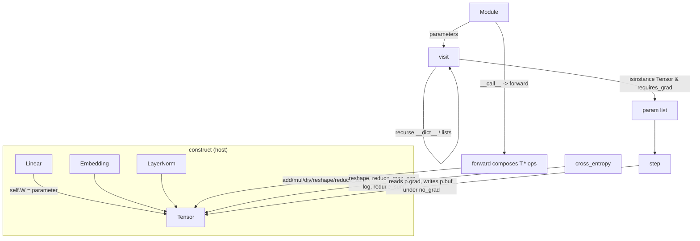

# The nn layer — Modules, layers, loss & AdamW on the autograd Tensor

`no_pytorch/nn.py` is a deliberately tiny `torch.nn` look-alike — `Linear`, `Embedding`,
`LayerNorm`, `softmax`, `cross_entropy`, `AdamW` — built so the example model "reads the same" as
a PyTorch one while sitting entirely on the from-scratch autograd `Tensor`.

## Overview
The whole layer rests on one idea: **a module is just an ordinary Python object whose attributes
hold `Tensor`s and other modules, and "the parameters" are whatever you reach by walking that object
graph.** There is no `Parameter` class, no registration, no `__setattr__` hook. A layer's `forward`
composes autograd `Tensor` ops, so the backward pass it needs is *already* recorded by the tape in
`tensor.py` — `nn.py` never writes a gradient. The only place that touches raw buffers is the
optimizer, which mutates parameters under `no_grad`. So the module system contributes three things
on top of the autograd engine: a containment convention, a reflective parameter walk
([`Module.parameters`](../catalog/no_pytorch/nn.md#Module.parameters)), and a forward-composition
calling convention ([`Module`](../catalog/no_pytorch/nn.md#Module)).

## Diagram

## Design rationale (why it's built this way)
**No `Parameter` type — `requires_grad` on a leaf `Tensor` is the entire marker.**
[`Module.parameters`](../catalog/no_pytorch/nn.md#Module.parameters) discovers state by reflection:
it recurses through `o.__dict__.values()` for nested modules and through lists/tuples, and keeps a
`Tensor` only when [`requires_grad`](../catalog/no_pytorch/tensor.md#Tensor.requires_grad) is true.
The `parameter(...)` factory is nothing but `from_numpy(arr, requires_grad=True)` — see
[`from_numpy`](../catalog/no_pytorch/tensor.md#from_numpy) — so "being a parameter" is identical to
"being a leaf the tape will accumulate grad into." This is why `LayerNorm.eps` (a float) or a cached
constant mask are silently skipped: they are not `requires_grad` `Tensor`s. The de-dup `set()` keyed
on `id(o)` means a weight shared across two attributes is returned once, so the optimizer never
double-updates it.

**Layers store weights in the orientation that makes forward a single op.** The
[`Linear`](../catalog/no_pytorch/nn.md#Linear) docstring is explicit: *"Weight stored [in, out] (so
forward is a clean matmul)."* [`Embedding`](../catalog/no_pytorch/nn.md#Embedding) takes the idea
further — *"Lookup as one-hot @ table"* — so a token lookup is the *same* `T.linear` as a dense
layer, just fed a one-hot. That collapses two PyTorch concepts (`nn.Linear`, `nn.Embedding`) onto
one autograd path and means embedding gradients fall out of matmul backward for free, with no
gather/scatter primitive needed.

> [!inferred]
> Doing embedding as `one_hot @ W` is wasteful (a full V-wide matmul per token instead of a row
> read), but it keeps the StableHLO surface tiny — there is no indexed-gather op to emit. This
> reads as a clarity-over-speed trade consistent with the file's "tiny / reads the same" docstring,
> not a stated claim.

**`cross_entropy` is fused log-softmax + NLL, not `log(softmax(...))`.** Reusing `softmax` then
`log` would build a numerically worse and longer tape; instead
[`cross_entropy`](../catalog/no_pytorch/nn.md#cross_entropy) subtracts a detached max
([`reduce_max`](../catalog/no_pytorch/tensor.md#reduce_max)) for stability and computes the
log-sum-exp directly, so only the differentiable part of the path is taped.

## Entry points
- [`Module`](../catalog/no_pytorch/nn.md#Module) — the base every layer subclasses. Control reaches
  it on **every layer call**: `__call__` simply forwards `*a, **k` to `self.forward`, so writing
  `layer(x)` runs the subclass `forward`. It carries no state of its own; it only supplies the
  calling convention and the parameter walk.
- [`Module.parameters`](../catalog/no_pytorch/nn.md#Module.parameters) — hit once at setup time, when
  the training loop asks a model for the tensors to optimize (e.g. `model.parameters()` feeding
  `AdamW` in [`main`](../catalog/no_pytorch/train_mini.md#main)). Returns a de-duplicated, in-order
  list of trainable leaves.
- [`cross_entropy`](../catalog/no_pytorch/nn.md#cross_entropy) — hit once per step on the model's
  logits to produce the scalar loss whose `.backward()` drives the tape.
- [`AdamW.step`](../catalog/no_pytorch/nn.md#AdamW.step) — hit once per step after backward, the only
  code in this layer that *writes* to parameters.

## Mechanism (step-by-step)
1. **Build the module tree.** Constructing a layer allocates its weights with the `parameter(...)`
   helper, which produces a `requires_grad=True` leaf via
   [`from_numpy`](../catalog/no_pytorch/tensor.md#from_numpy); these are stored as plain attributes
   (`self.W`, `self.b`, `self.g`). A composite like [`LLM`](../catalog/no_pytorch/train_mini.md#LLM)
   just holds child [`Block`](../catalog/no_pytorch/train_mini.md#Block) /
   [`MLP`](../catalog/no_pytorch/train_mini.md#MLP) /
   [`MultiHeadAttention`](../catalog/no_pytorch/train_mini.md#MultiHeadAttention) modules in
   attributes and lists — nesting is just object containment.
2. **Discover parameters by walking the object graph.**
   [`Module.parameters`](../catalog/no_pytorch/nn.md#Module.parameters) runs the nested
   [`visit`](../catalog/no_pytorch/nn.md#Module.visit) recursively: for a
   [`Tensor`](../catalog/no_pytorch/tensor.md#Tensor) it collects the leaf iff
   [`requires_grad`](../catalog/no_pytorch/tensor.md#Tensor.requires_grad) and unseen; for a
   [`Module`](../catalog/no_pytorch/nn.md#Module) it recurses into `__dict__.values()`; for a
   list/tuple it recurses into elements. The `set()` of `id()`s makes the result deduplicated and
   stable in declaration order.
3. **Run the forward pass as composed autograd ops.** Each `forward` is plain `Tensor` arithmetic, so
   the backward graph is recorded as a side effect. `Linear.forward` does `T.linear(x, W)` then an
   [`add`](../catalog/no_pytorch/tensor.md#add) of the bias; `LayerNorm.forward` centers with
   [`reduce_sum`](../catalog/no_pytorch/tensor.md#reduce_sum) means and rescales via
   [`mul`](../catalog/no_pytorch/tensor.md#mul)/[`div`](../catalog/no_pytorch/tensor.md#div). nn.py
   writes **no** backward functions — every op it calls (e.g.
   [`mul`](../catalog/no_pytorch/tensor.md#mul)) registers its own via
   [`_record`](../catalog/no_pytorch/tensor.md#_record).
4. **Reduce to a scalar loss.** [`cross_entropy`](../catalog/no_pytorch/nn.md#cross_entropy) flattens
   logits/targets with [`reshape`](../catalog/no_pytorch/tensor.md#reshape), subtracts a *detached*
   [`reduce_max`](../catalog/no_pytorch/tensor.md#reduce_max) for stability, forms log-sum-exp from
   [`exp`](../catalog/no_pytorch/tensor.md#exp) + [`reduce_sum`](../catalog/no_pytorch/tensor.md#reduce_sum)
   + [`log`](../catalog/no_pytorch/tensor.md#log), and averages the negative log-likelihood. Because
   the max shift is detached, only the differentiable subgraph is on the tape that `loss.backward()`
   later walks.
5. **Update parameters under `no_grad`.** [`AdamW.step`](../catalog/no_pytorch/nn.md#AdamW.step)
   increments [`t`](../catalog/no_pytorch/nn.md#AdamW.t), forms bias-corrections from
   [`b1`](../catalog/no_pytorch/nn.md#AdamW.b1)/[`b2`](../catalog/no_pytorch/nn.md#AdamW.b2), then for
   each parameter reads its [`grad`](../catalog/no_pytorch/tensor.md#Tensor.grad), updates the
   first/second moment buffers [`m`](../catalog/no_pytorch/nn.md#AdamW.m) and
   [`v`](../catalog/no_pytorch/nn.md#AdamW.v), computes the AdamW step (with the `update = m̂ /
   (sqrt(v̂)+eps)` using [`sqrt`](../catalog/no_pytorch/tensor.md#sqrt) and a decoupled weight-decay
   term), and writes the result back **in place** as `p.buf = new_p.buf`. The whole loop runs inside
   `no_grad()` so these arithmetic ops are *not* taped.

## Key data structures
- **The module object itself.** State lives in instance attributes; there is no parameter registry.
  [`Module`](../catalog/no_pytorch/nn.md#Module) adds only behavior (`parameters`, `__call__`). What
  makes an attribute a parameter is purely that it is a
  [`Tensor`](../catalog/no_pytorch/tensor.md#Tensor) with
  [`requires_grad`](../catalog/no_pytorch/tensor.md#Tensor.requires_grad) set.
- **The parameter list.** [`Module.parameters`](../catalog/no_pytorch/nn.md#Module.parameters)
  returns a flat, order-stable, de-duplicated `list[Tensor]` of trainable leaves — the contract the
  optimizer's `self.params` ([`params`](../catalog/no_pytorch/nn.md#AdamW.params)) depends on.
- **AdamW optimizer state.** Three parallel lists indexed alongside `params`: the moments
  [`m`](../catalog/no_pytorch/nn.md#AdamW.m) and [`v`](../catalog/no_pytorch/nn.md#AdamW.v) (each
  initialized with [`zeros`](../catalog/no_pytorch/tensor.md#zeros) matching every parameter
  [`shape`](../catalog/no_pytorch/tensor.md#Tensor.shape)) and the step counter
  [`t`](../catalog/no_pytorch/nn.md#AdamW.t). These are detached `Tensor`s carried across steps.

## Dynamics (design intent)
The separation of phases is the design: `forward` *records* a tape (all ops route through
[`_record`](../catalog/no_pytorch/tensor.md#_record)), `backward` (in `tensor.py`) *fills* every
leaf's [`grad`](../catalog/no_pytorch/tensor.md#Tensor.grad), and
[`AdamW.step`](../catalog/no_pytorch/nn.md#AdamW.step) *consumes* those grads. The optimizer wraps
its math in `no_grad` precisely so the parameter update does not extend the tape into the next step,
and the in-place `p.buf = new_p.buf` keeps the *same leaf object* — so the `id()`-keyed parameter
list and the tape both still point at the live tensor after an update.

> [!inferred]
> Mutating `p.buf` rather than replacing `p` is what lets the optimizer hold its `params` list once
> (at construction) and have updates "stick" to the same objects the model's attributes reference.
> Replacing the `Tensor` object would orphan the optimizer's stored references. This is the evident
> reason for the inline `# in-place param update (keep the leaf object)` comment.

## Edge cases
- **Parameters with no gradient are skipped.** [`AdamW.step`](../catalog/no_pytorch/nn.md#AdamW.step)
  `continue`s when [`grad`](../catalog/no_pytorch/tensor.md#Tensor.grad) is `None` (a leaf that didn't
  participate in the loss), so its moment buffers stay put for that step.
- **Non-tensor / non-trainable attributes vanish from the walk.**
  [`visit`](../catalog/no_pytorch/nn.md#Module.visit) only collects
  [`requires_grad`](../catalog/no_pytorch/tensor.md#Tensor.requires_grad) tensors, so floats like
  `eps` and constant `Tensor`s (e.g. a cached causal mask) are correctly excluded from optimization.
- **Shared weights count once.** The `id()` `set` in
  [`Module.parameters`](../catalog/no_pytorch/nn.md#Module.parameters) means a tensor referenced from
  two attributes is updated a single time.
- **Containers are shallow-walked by type.** [`visit`](../catalog/no_pytorch/nn.md#Module.visit)
  recurses into lists/tuples and module attributes but not into, say, dicts — state hidden in an
  unsupported container would silently not train.

## Open questions
- `forward` bodies call helpers like `T.linear`, `T.tanh`, `T.bmm`, `T.transpose`, `T.rsqrt` and the
  functions `gelu`/`softmax`; these are not in this packet's Subgraph, so their exact taping is
  documented elsewhere (the autograd-`Tensor` concept) rather than asserted here.
- No tests in the configured paths reference this subgraph, so all dynamics above are read from
  source and docstrings, not from executed behavior.

## See also
- The autograd `Tensor` / tape concept (op recording via
  [`_record`](../catalog/no_pytorch/tensor.md#_record), grad accumulation via
  [`_acc`](../catalog/no_pytorch/tensor.md#_acc), broadcast handling via
  [`_unbroadcast`](../catalog/no_pytorch/tensor.md#_unbroadcast)).
- The op/runtime layer ([`binary`](../catalog/mini_pytorch_xla/ops.md#binary),
  [`unary`](../catalog/mini_pytorch_xla/ops.md#unary),
  [`reduce`](../catalog/mini_pytorch_xla/ops.md#reduce),
  [`run`](../catalog/mini_pytorch_xla/hlo.md#run)) that every `Tensor` op lowers to StableHLO on the
  TPU [`Buffer`](../catalog/mini_pytorch_xla/pjrt.md#Buffer).
- The model that instantiates these layers:
  [`LLM`](../catalog/no_pytorch/train_mini.md#LLM) /
  [`main`](../catalog/no_pytorch/train_mini.md#main).
