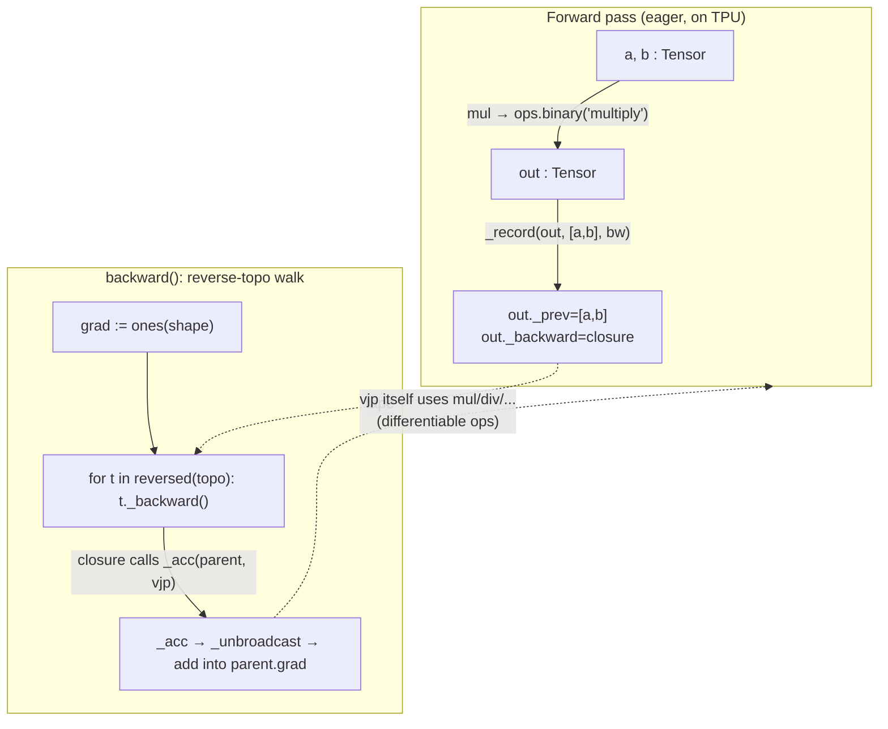

# The no_pytorch autograd Tensor — a tape-based reverse-mode engine

How `no_pytorch/tensor.py` wraps a TPU buffer in a differentiable [`Tensor`](../catalog/no_pytorch/tensor.md#Tensor), builds an autograd graph as a side effect of every forward op, and runs `.backward()` as a reverse topological walk over recorded closures.

## Overview

This is a from-scratch reverse-mode autodiff engine — no real PyTorch underneath. A [`Tensor`](../catalog/no_pytorch/tensor.md#Tensor) is a thin wrapper around a device [`Buffer`](../catalog/mini_pytorch_xla/pjrt.md#Buffer) plus four pieces of autograd bookkeeping: a [`grad`](../catalog/no_pytorch/tensor.md#Tensor.grad) accumulator, a [`requires_grad`](../catalog/no_pytorch/tensor.md#Tensor.requires_grad) flag, a parent list [`_prev`](../catalog/no_pytorch/tensor.md#Tensor._prev), and a [`_backward`](../catalog/no_pytorch/tensor.md#Tensor._backward) closure. The key idea is that *the graph is the tape*: there is no separate `grad_fn` object hierarchy as in PyTorch. Instead, every forward function (e.g. [`mul`](../catalog/no_pytorch/tensor.md#mul)) computes its result eagerly on the TPU, then calls [`_record`](../catalog/no_pytorch/tensor.md#_record) to staple onto the output a Python closure that knows how to push gradient back to its parents. The whole vector-Jacobian product is expressed in the *same* differentiable ops — so backward runs on the TPU too, and could in principle be differentiated again.

## Diagram

## Design rationale (why it's built this way)

The module docstring states the contract directly: "Forward op records a `_backward` closure + its differentiable parents; `backward()` seeds the scalar output with 1, walks the tape in reverse, and each closure accumulates parent grads using the same ops (so backward runs on the TPU too)."

- **Closures instead of a Function/grad_fn class hierarchy.** Each op stores its backward rule as a captured lambda or local `bw` (see [`div`](../catalog/no_pytorch/tensor.md#div)'s nested [`bw`](../catalog/no_pytorch/tensor.md#div.bw)). The closure captures `out`, `a`, `b` by reference, so when it later reads `out.grad` it sees the gradient that flowed in. This collapses what PyTorch spreads across autograd `Node` subclasses into one line per op, which is the whole point of a teaching engine.

- **Backward formulas are written in the forward ops themselves.** [`mul`](../catalog/no_pytorch/tensor.md#mul)'s backward is `(_acc(a, mul(out.grad, b)), _acc(b, mul(out.grad, a)))` — note it calls [`mul`](../catalog/no_pytorch/tensor.md#mul) again. Because every VJP is built from the same differentiable primitives, the gradient computation also lowers to StableHLO and executes on-device; there is no separate CPU gradient path.

- **Gradients still need un-broadcasting.** The forward [`binary`](../catalog/mini_pytorch_xla/ops.md#binary) op broadcasts operands to a common shape, so a parent's gradient can come back larger than the parent. [`_acc`](../catalog/no_pytorch/tensor.md#_acc) routes every incoming gradient through [`_unbroadcast`](../catalog/no_pytorch/tensor.md#_unbroadcast) to sum out the broadcast axes before accumulating — without this, shapes would mismatch on accumulation.

- **A global record flag, not per-tensor `requires_grad` alone, gates taping.** [`_record`](../catalog/no_pytorch/tensor.md#_record) only attaches a closure when the module-level [`_RECORD`](../catalog/no_pytorch/tensor.md#_RECORD) flag is true *and* some parent requires grad. During the backward walk the engine flips `_RECORD` off, so the VJP ops do not themselves record a second-order tape.

> [!inferred]
> The `no_grad` context manager toggles [`_RECORD`](../catalog/no_pytorch/tensor.md#_RECORD); `backward()` enters it before the reverse walk. `no_grad` is not in this packet's subgraph, so this reading rests on the `_RECORD` flag and the module docstring's "A `no_grad` flag held during the walk stops second-order taping."

## Entry points

- **User-facing arithmetic** — Python operators on a [`Tensor`](../catalog/no_pytorch/tensor.md#Tensor) dispatch to the free functions. [`__mul__`](../catalog/no_pytorch/tensor.md#Tensor.__mul__) and [`__rmul__`](../catalog/no_pytorch/tensor.md#Tensor.__rmul__) both coerce the operand with [`_as`](../catalog/no_pytorch/tensor.md#_as) and call [`mul`](../catalog/no_pytorch/tensor.md#mul); the rest of the dunder methods follow the same shape. This is where control enters the autograd layer during a forward pass.

- **Leaf construction** — [`from_numpy`](../catalog/no_pytorch/tensor.md#from_numpy) uploads a host array (down-casting float64→float32, int64→int32) into a device [`Tensor`](../catalog/no_pytorch/tensor.md#Tensor). Trainable leaves come from [`parameter`](../catalog/no_pytorch/nn.md#parameter), which is just `from_numpy(..., requires_grad=True)`. [`ones`](../catalog/no_pytorch/tensor.md#ones) / [`zeros`](../catalog/no_pytorch/tensor.md#zeros) make constant leaves; [`ones`](../catalog/no_pytorch/tensor.md#ones) also seeds the backward pass.

- **`Tensor.backward()`** — the reverse-mode driver. It is a method on [`Tensor`](../catalog/no_pytorch/tensor.md#Tensor) (not separately listed in this subgraph); it reads each node's [`_prev`](../catalog/no_pytorch/tensor.md#Tensor._prev) to build the topo order, seeds `self.grad` with [`ones`](../catalog/no_pytorch/tensor.md#ones), and fires each [`_backward`](../catalog/no_pytorch/tensor.md#Tensor._backward) in reverse. Control reaches it when the user calls `loss.backward()`.

## Mechanism (step-by-step)

1. **Forward op computes eagerly, then records.** Take [`mul`](../catalog/no_pytorch/tensor.md#mul): it builds the output buffer with [`binary`](../catalog/mini_pytorch_xla/ops.md#binary)`("multiply", a.buf, b.buf)` — which generates a StableHLO `module`, broadcasts operands via `broadcast_in_dim`, and runs it through [`_run1`](../catalog/mini_pytorch_xla/ops.md#_run1) → [`run`](../catalog/mini_pytorch_xla/hlo.md#run) → [`execute`](../catalog/mini_pytorch_xla/pjrt.md#Executable.execute) on the TPU. Only after the value exists does it call [`_record`](../catalog/no_pytorch/tensor.md#_record) with the parents and a backward closure.

2. **`_record` stitches the node into the tape.** [`_record`](../catalog/no_pytorch/tensor.md#_record) checks the global [`_RECORD`](../catalog/no_pytorch/tensor.md#_RECORD) flag and whether any parent has [`requires_grad`](../catalog/no_pytorch/tensor.md#Tensor.requires_grad); if so it flips the output's `requires_grad` on, sets [`_prev`](../catalog/no_pytorch/tensor.md#Tensor._prev) to the subset of parents that require grad, and stores the closure in [`_backward`](../catalog/no_pytorch/tensor.md#Tensor._backward). Constants are pruned from `_prev` here, so the graph only contains nodes that actually carry gradient.

3. **`backward()` builds reverse-topological order.** The method does a DFS over [`_prev`](../catalog/no_pytorch/tensor.md#Tensor._prev) using `id(t)` in a `seen` set, appending each node *after* its parents (post-order), giving a list where every node precedes its consumers; iterating it reversed visits consumers before producers. It then seeds the root gradient with [`ones`](../catalog/no_pytorch/tensor.md#ones)`(self.shape)` — the `dL/dL = 1` of a scalar loss.

4. **Each closure pushes a vector-Jacobian product to its parents.** Replaying in reverse, every [`_backward`](../catalog/no_pytorch/tensor.md#Tensor._backward) reads `out.grad` and calls [`_acc`](../catalog/no_pytorch/tensor.md#_acc) on each parent with that parent's local gradient. For [`div`](../catalog/no_pytorch/tensor.md#div) the closure [`bw`](../catalog/no_pytorch/tensor.md#div.bw) sends `out.grad / b` to `a` and `-out.grad·a / b²` to `b`; for [`mm`](../catalog/no_pytorch/tensor.md#mm) the closure [`bw`](../catalog/no_pytorch/tensor.md#mm.bw) sends `g @ bᵀ` and `aᵀ @ g` using [`transpose`](../catalog/no_pytorch/tensor.md#transpose). Because these VJPs are themselves [`mul`](../catalog/no_pytorch/tensor.md#mul)/[`div`](../catalog/no_pytorch/tensor.md#div)/[`mm`](../catalog/no_pytorch/tensor.md#mm) calls, they execute on the TPU.

5. **`_acc` un-broadcasts and accumulates.** [`_acc`](../catalog/no_pytorch/tensor.md#_acc) early-returns if the parent does not require grad; otherwise it shrinks the incoming gradient to the parent's shape with [`_unbroadcast`](../catalog/no_pytorch/tensor.md#_unbroadcast), then sets `p.grad = g` if empty or `add(p.grad, g)` otherwise. The `add` is what makes a tensor used in multiple places correctly *sum* the gradients from all its consumers (the multivariate chain rule).

6. **`_unbroadcast` reverses the forward broadcast.** [`_unbroadcast`](../catalog/no_pytorch/tensor.md#_unbroadcast) first [`reduce_sum`](../catalog/no_pytorch/tensor.md#reduce_sum)s away leading axes the parent never had, then sums (keepdim) any axis where the parent was size-1 but the gradient is larger, and finally [`reshape`](../catalog/no_pytorch/tensor.md#reshape)s to exactly the parent shape. This is the exact dual of the `broadcast_in_dim` that [`binary`](../catalog/mini_pytorch_xla/ops.md#binary) emitted in the forward pass.

## Key data structures

- **The `Tensor` node** ([`Tensor`](../catalog/no_pytorch/tensor.md#Tensor)). Five fields: [`buf`](../catalog/no_pytorch/tensor.md#Tensor.buf) (the device [`Buffer`](../catalog/mini_pytorch_xla/pjrt.md#Buffer) holding the data), [`requires_grad`](../catalog/no_pytorch/tensor.md#Tensor.requires_grad), [`grad`](../catalog/no_pytorch/tensor.md#Tensor.grad) (initially `None`), [`_prev`](../catalog/no_pytorch/tensor.md#Tensor._prev) (parents, the graph edges), and [`_backward`](../catalog/no_pytorch/tensor.md#Tensor._backward) (the VJP closure, defaulting to a no-op for leaves). Shape metadata is forwarded from the buffer via the [`shape`](../catalog/no_pytorch/tensor.md#Tensor.shape) and [`ndim`](../catalog/no_pytorch/tensor.md#Tensor.ndim) properties.

- **The tape** is implicit: it is the transitive closure of [`_prev`](../catalog/no_pytorch/tensor.md#Tensor._prev) edges plus the [`_backward`](../catalog/no_pytorch/tensor.md#Tensor._backward) closure on each node. There is no global tape object — the graph *is* the tape, rooted at whatever tensor you call `backward()` on.

- **The record flag** [`_RECORD`](../catalog/no_pytorch/tensor.md#_RECORD) — a module-global boolean that [`_record`](../catalog/no_pytorch/tensor.md#_record) consults to decide whether to tape at all.

## Dynamics (design intent)

- **Second-order taping is suppressed during backward.** The module docstring: "A `no_grad` flag held during the walk stops second-order taping." Concretely, the VJP ops would otherwise call [`_record`](../catalog/no_pytorch/tensor.md#_record) and grow the graph mid-traversal; gating on [`_RECORD`](../catalog/no_pytorch/tensor.md#_RECORD) prevents that.

- **Parameter discovery is structural, not tape-based.** [`visit`](../catalog/no_pytorch/nn.md#Module.visit) recursively walks a `Module`'s `__dict__`, lists, and tuples collecting every [`Tensor`](../catalog/no_pytorch/tensor.md#Tensor) with `requires_grad`, de-duplicating by `id`. This is how an optimizer enumerates leaves to update after `backward()` fills their [`grad`](../catalog/no_pytorch/tensor.md#Tensor.grad).

- **`reduce_max` is deliberately detached.** Its source comment marks it "detached (shift only)" — [`reduce_max`](../catalog/no_pytorch/tensor.md#reduce_max) builds its output and never calls [`_record`](../catalog/no_pytorch/tensor.md#_record), so no gradient flows through it. It exists for numerically-stable softmax shifts where the max should be treated as a constant.

## Edge cases

- **Identity ops short-circuit before recording.** [`reshape`](../catalog/no_pytorch/tensor.md#reshape) returns `a` unchanged when the shape already matches, so no tape node (and no device op) is created for a no-op reshape. The same identity guard lives in the buffer-level [`reshape`](../catalog/mini_pytorch_xla/ops.md#reshape).

- **Constants get pruned from the graph.** A scalar literal entering [`mul`](../catalog/no_pytorch/tensor.md#mul) via [`_as`](../catalog/no_pytorch/tensor.md#_as) has `requires_grad=False`, so [`_record`](../catalog/no_pytorch/tensor.md#_record) drops it from [`_prev`](../catalog/no_pytorch/tensor.md#Tensor._prev) and [`_acc`](../catalog/no_pytorch/tensor.md#_acc) early-returns on it — gradients are never computed for non-leaf constants.

- **Shared subexpressions accumulate, not overwrite.** Because [`_acc`](../catalog/no_pytorch/tensor.md#_acc) uses `add` when [`grad`](../catalog/no_pytorch/tensor.md#Tensor.grad) is already set, a tensor consumed by several ops correctly receives the sum of all incoming gradients; the `seen`-set in the topo build ensures each node is still visited exactly once.

- **`backward()` assumes a scalar-shaped root in spirit.** The seed is [`ones`](../catalog/no_pytorch/tensor.md#ones)`(self.shape)`, so calling it on a non-scalar effectively seeds an all-ones cotangent rather than raising — a vector-Jacobian product with the ones vector.

## Open questions

- The `backward()` method itself, the `no_grad` context manager, `matmul`/`linear`/`transpose_last2`, and `ops.unary` are referenced by this mechanism but are not in the packet subgraph, so their exact bodies are cited only indirectly here. A future packet seeded on `backward`/`no_grad` would let those claims be cited directly.
- Whether `grad` is ever zeroed between steps (optimizer responsibility vs. engine) is not visible in this file's subgraph.

## See also

- [`overview.md`](../overview.md) — the map of mini_pytorch_xla subsystems.
- Buffer-level lowering: [`binary`](../catalog/mini_pytorch_xla/ops.md#binary), [`reduce`](../catalog/mini_pytorch_xla/ops.md#reduce), and the [`run`](../catalog/mini_pytorch_xla/hlo.md#run) → [`compile`](../catalog/mini_pytorch_xla/pjrt.md#PjrtClient.compile)/[`execute`](../catalog/mini_pytorch_xla/pjrt.md#Executable.execute) TPU path that every forward and backward op bottoms out in.
