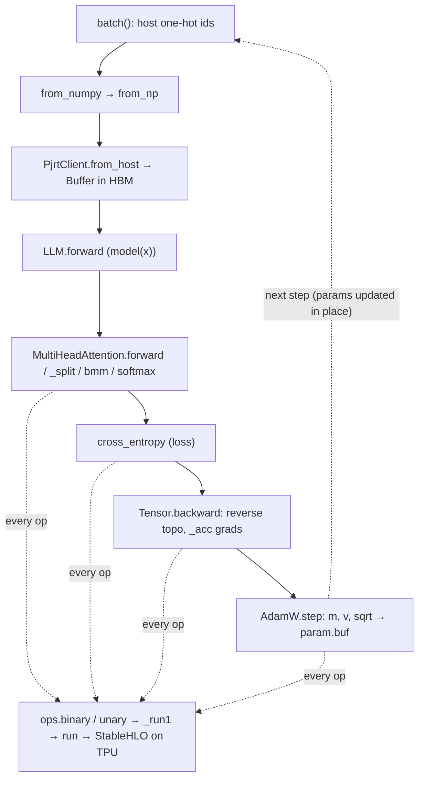

# The mini-stack training step — how a from-scratch transformer trains on TPU

How `main`'s loop in `no_pytorch/train_mini.py` composes data → forward → loss → backward → optimizer into one training step, where every numeric op is lowered to StableHLO and run eagerly on the TPU with **no torch, no jax** underneath.

## Overview
This is the end-to-end demo: a char-level Shakespeare transformer (pre-LN, AdamW) trained entirely on the home-grown stack. The single key idea is that **there is no special "framework runtime"** — the `Tensor` autograd layer ([`Tensor`](../catalog/no_pytorch/tensor.md#Tensor)) is a thin tape over a `Buffer` ([`Buffer`](../catalog/mini_pytorch_xla/pjrt.md#Buffer)) that lives in TPU HBM, and *every* arithmetic op (`add`, `mul`, `bmm`, `exp`, …) eagerly builds a one-function StableHLO module and ships it to the chip via [`run`](../catalog/mini_pytorch_xla/hlo.md#run). The training loop therefore reads like ordinary PyTorch — `model(x)`, `loss.backward()`, `opt.step()` — but each line is a fan-out of small compiled TPU programs, cached by source text so step 0 pays compilation and every later step reuses executables. The "mini-pytorch" pieces (eager tape, op recording, `_acc` gradient accumulation) and the "xla" pieces (StableHLO text, PJRT buffer upload) meet exactly here.

## Diagram

## Design rationale (why it's built this way)
The defining choice is **eager per-op StableHLO lowering instead of one traced graph.** Each tensor primitive emits a complete `module { func.func @main … }` and runs it immediately: see [`binary`](../catalog/mini_pytorch_xla/ops.md#binary) and [`unary`](../catalog/mini_pytorch_xla/ops.md#unary), which assemble MLIR text from the operand `shape`/`dtype` and hand it to [`_run1`](../catalog/mini_pytorch_xla/ops.md#_run1). That keeps the autograd layer trivial — a value is just a `Buffer` plus a backward closure — at the cost of many tiny compiled programs. The cost is recovered by caching in [`run`](../catalog/mini_pytorch_xla/hlo.md#run): the StableHLO *text* is the cache key, so step 0 compiles each distinct op shape once and later steps reuse the executable, which is exactly what `main`'s banner promises ("Step 0 compiles each op's StableHLO (one-time); steps then reuse cached executables").

A second deliberate choice is **doing embedding and the loss as matmuls over host-side one-hots** rather than gather/scatter. Token and target ids are one-hot'd on the host (`onehot`) and uploaded, so the embedding table lookup and the cross-entropy target selection both become plain matmuls/reductions — no indexed op needs a StableHLO primitive. The MLIR type machinery that all of this rests on is [`ttype`](../catalog/mini_pytorch_xla/hlo.md#ttype): "MLIR tensor type, e.g. (2,3),f32 -> 'tensor<2x3xf32>'".

> [!inferred]
> Using one-hot matmuls for embedding means the `Embedding` weight gets a *dense* gradient every step (the whole table participates in the matmul), which is simpler than sparse index gradients but wastes compute on a large vocab. For a tiny char vocab that trade is clearly worth it; at GPT-scale vocab it would not be.

## Entry points
- [`main`](../catalog/no_pytorch/train_mini.md#main) — the process entry. It parses hyperparameters, builds the char vocabulary, constructs the `LLM` and an `AdamW` over `model.parameters()`, then runs the `for step in range(args.steps)` loop that is the subject of this page. Each iteration draws a batch, uploads it with [`from_numpy`](../catalog/no_pytorch/tensor.md#from_numpy), runs forward, computes [`cross_entropy`](../catalog/no_pytorch/nn.md#cross_entropy), then `zero_grad` / [`backward`](../catalog/no_pytorch/tensor.md#Tensor.backward) / [`step`](../catalog/no_pytorch/nn.md#AdamW.step).
- [`forward`](../catalog/no_pytorch/train_mini.md#LLM.forward) — reached by `model(x)` (via `Module.__call__`). It is the forward pass: it adds token and position embeddings, threads the activations through each transformer `Block`, applies the final LayerNorm, and projects to vocab logits `[B,L,V]`.
- [`backward`](../catalog/no_pytorch/tensor.md#Tensor.backward) — reached by `loss.backward()`. It walks the recorded tape in reverse-topological order and fires each node's stored backward closure, which is where every gradient on every parameter is produced.

## Mechanism (step-by-step)
1. **Batch → device.** `main`'s inner `batch()` slices a random window of token ids and one-hots both inputs `xb` and next-token targets `yb` on the host, then [`from_numpy`](../catalog/no_pytorch/tensor.md#from_numpy) wraps each `np.ndarray` in a leaf `Tensor`. `from_numpy` narrows float64→float32 / int64→int32 and calls [`from_np`](../catalog/mini_pytorch_xla/ops.md#from_np), which routes through the singleton [`client`](../catalog/mini_pytorch_xla/pjrt.md#client) to [`from_host`](../catalog/mini_pytorch_xla/pjrt.md#PjrtClient.from_host). That is the actual host→TPU upload: it maps the numpy dtype through [`_NP_TO_PJRT`](../catalog/mini_pytorch_xla/pjrt.md#_NP_TO_PJRT), fills a ctypes args struct (see [`_args_header`](../catalog/mini_pytorch_xla/pjrt.md#_args_header), [`c_i64`](../catalog/mini_pytorch_xla/pjrt.md#c_i64)), invokes PJRT through [`_raw_call`](../catalog/mini_pytorch_xla/pjrt.md#PjrtClient._raw_call), blocks on [`_await`](../catalog/mini_pytorch_xla/pjrt.md#PjrtClient._await) so the host array is safe to free, and returns a [`Buffer`](../catalog/mini_pytorch_xla/pjrt.md#Buffer) — "A handle to a tensor living in TPU HBM".

2. **Forward pass.** `model(x)` enters [`forward`](../catalog/no_pytorch/train_mini.md#LLM.forward): `self.tok(tok_onehot) + self.pos(self._pos_oh)` turns one-hots into embeddings via matmul, the `Block` list applies attention and MLP, and `self.head(x)` produces logits. The attention core is [`forward`](../catalog/no_pytorch/train_mini.md#MultiHeadAttention.forward): it projects q/k/v, reshapes each into heads with [`_split`](../catalog/no_pytorch/train_mini.md#MultiHeadAttention._split) (a [`reshape`](../catalog/no_pytorch/tensor.md#reshape) + [`transpose`](../catalog/no_pytorch/tensor.md#transpose)), scores with batched matmul [`bmm`](../catalog/no_pytorch/tensor.md#bmm) against the key transpose [`transpose_last2`](../catalog/no_pytorch/tensor.md#transpose_last2), adds the broadcast causal mask, normalizes with [`softmax`](../catalog/no_pytorch/nn.md#softmax), and merges heads back. Each of these is an ordinary `Tensor` op, so the forward pass *also lays down the autograd tape* as a side effect.

3. **Every op records a backward closure (the tape).** A primitive like [`mul`](../catalog/no_pytorch/tensor.md#mul) or [`add`](../catalog/no_pytorch/tensor.md#add) computes its output `Buffer` (through [`binary`](../catalog/mini_pytorch_xla/ops.md#binary)/[`unary`](../catalog/mini_pytorch_xla/ops.md#unary)) and then calls [`_record`](../catalog/no_pytorch/tensor.md#_record) to attach parents and a `bw()` closure to the output `Tensor` — but only when recording is on and a parent needs grad. This is what makes the reverse pass possible without a separate graph object: the closure (e.g. `bmm`'s [`bw`](../catalog/no_pytorch/tensor.md#bmm.bw), `div`'s [`bw`](../catalog/no_pytorch/tensor.md#div.bw), `reduce_sum`'s [`bw`](../catalog/no_pytorch/tensor.md#reduce_sum.bw)) captures exactly the tensors it needs to push gradient to its inputs.

4. **Loss.** [`cross_entropy`](../catalog/no_pytorch/nn.md#cross_entropy) — "mean NLL over all leading positions" — flattens logits and targets to `[n,V]`, computes a numerically stable log-softmax (shift by detached [`reduce_max`](../catalog/no_pytorch/tensor.md#reduce_max), then [`log`](../catalog/no_pytorch/tensor.md#log) of [`reduce_sum`](../catalog/no_pytorch/tensor.md#reduce_sum) of [`exp`](../catalog/no_pytorch/tensor.md#exp)), and returns the mean negative log-prob of the target one-hots as a scalar `Tensor`. Because the targets are one-hots, the "pick the true class" step is just `tg * logprob` summed — no gather.

5. **Backward.** `opt.zero_grad()` clears every `p.grad` to `None`, then [`backward`](../catalog/no_pytorch/tensor.md#Tensor.backward) builds the topological order from the loss node, seeds `dL/dL = ones`, and — inside `no_grad()` so the backward math itself isn't taped — fires each `_backward()` closure in reverse. Those closures funnel gradient into parents through [`_acc`](../catalog/no_pytorch/tensor.md#_acc), which reduces a gradient back to the parameter's shape via [`_unbroadcast`](../catalog/no_pytorch/tensor.md#_unbroadcast) and either sets or `add`s into the parent's [`grad`](../catalog/no_pytorch/tensor.md#Tensor.grad). After this step every leaf parameter found by `Module.parameters()` carries its accumulated gradient.

6. **Optimizer step.** [`step`](../catalog/no_pytorch/nn.md#AdamW.step) advances `t`, then for each param with a gradient updates the first/second moment estimates [`m`](../catalog/no_pytorch/nn.md#AdamW.m) and [`v`](../catalog/no_pytorch/nn.md#AdamW.v), bias-corrects them, forms the AdamW update `mhat / (sqrt(vhat) + eps)` using [`sqrt`](../catalog/no_pytorch/tensor.md#sqrt), adds decoupled weight decay, and writes the result back with `p.buf = new_p.buf`. The whole body runs under `no_grad()`, and the in-place `buf` swap is deliberate: it keeps the *same* leaf `Tensor` object that `model.parameters()` enumerated, so the moment buffers and the param identity stay aligned across steps.

## Key data structures
- **`Tensor`** ([`Tensor`](../catalog/no_pytorch/tensor.md#Tensor)) — the tape node: a `buf` (the device `Buffer`), a `requires_grad` flag, a `grad` slot, the parent list `_prev`, and the `_backward` closure. The forward pass grows this graph implicitly; `backward` consumes it.
- **`Buffer`** ([`Buffer`](../catalog/mini_pytorch_xla/pjrt.md#Buffer)) — the device handle a `Tensor` wraps, holding the HBM handle plus cached [`shape`](../catalog/mini_pytorch_xla/pjrt.md#Buffer.shape) and [`dtype`](../catalog/mini_pytorch_xla/pjrt.md#Buffer.dtype) used to build StableHLO types.
- **Parameter list** — `model.parameters()` (via [`Module`](../catalog/no_pytorch/nn.md#Module)'s [`visit`](../catalog/no_pytorch/nn.md#Module.visit), which recurses submodules/lists and dedupes by id) gives the exact leaves the `AdamW` `m`/`v` buffers shadow positionally.
- **Constant inputs** — `LLM` holds a causal mask and a position one-hot uploaded once; these are reused every step rather than rebuilt, and constants in general come from [`const`](../catalog/mini_pytorch_xla/ops.md#const).

## Dynamics (design intent)
- **Compile-once, run-many.** The banner `main` prints — "Step 0 compiles each op's StableHLO (one-time); steps then reuse cached executables" — states the intended timing: [`run`](../catalog/mini_pytorch_xla/hlo.md#run) keys its executable cache on the module text, so only the first occurrence of each op-shape compiles.
- **Recording is scoped.** `_record` only attaches a backward when recording is enabled and a parent requires grad, and both `backward` and `AdamW.step` run inside `no_grad()` — so gradient computation and the optimizer update never themselves get taped. This is the mechanism that keeps the tape bounded to one forward pass.
- **Single device client.** Uploads and executes all go through the process-wide [`client`](../catalog/mini_pytorch_xla/pjrt.md#client) singleton — "one TPU client; the chips are a shared resource".

## Edge cases
- **Shape-restoring gradients.** Broadcasting in the forward pass (e.g. the `[1,1,L,L]` mask, scalar multipliers) means a raw gradient can be larger than its parent; [`_acc`](../catalog/no_pytorch/tensor.md#_acc) always routes through [`_unbroadcast`](../catalog/no_pytorch/tensor.md#_unbroadcast) ([`reduce_sum`](../catalog/no_pytorch/tensor.md#reduce_sum) + [`reshape`](../catalog/no_pytorch/tensor.md#reshape)) so the accumulated grad matches the parameter shape.
- **Numerical stability of the loss.** [`cross_entropy`](../catalog/no_pytorch/nn.md#cross_entropy) and [`softmax`](../catalog/no_pytorch/nn.md#softmax) both subtract a *detached* [`reduce_max`](../catalog/no_pytorch/tensor.md#reduce_max) before exponentiating; the max is detached so the shift doesn't perturb gradients while still preventing overflow in [`exp`](../catalog/no_pytorch/tensor.md#exp).
- **Params with no gradient are skipped.** `AdamW.step` `continue`s when `p.grad is None`, so a parameter that didn't participate in the step's forward (or was zeroed by `zero_grad`) is left untouched rather than decayed.
- **Identity-preserving update.** Because `step` swaps `p.buf` instead of rebinding `p`, the positional pairing between `self.params[i]` and `m[i]`/`v[i]` survives across steps — rebinding the `Tensor` would silently desync the moments.

## Open questions
- The forward pass uses `Embedding`, `LayerNorm`, `gelu`, `tanh`, `rsqrt`, `linear`, and `neg`, and the optimizer uses `T.zeros` / `no_grad`; none are in this packet's Subgraph, so their internals (especially the LayerNorm and gelu backward paths) are described only at the call-site level here. They belong to their own concept/catalog pages.
- This page does not quantify how many distinct StableHLO modules a single step compiles at step 0, only that the count is bounded by distinct op-shapes; confirming it would need a run with the `_TIMER` instrumentation visible in [`run`](../catalog/mini_pytorch_xla/hlo.md#run).

## See also
- `no_pytorch-tensor` — the autograd tape (`_record`, `_acc`, `backward`) these steps lean on.
- `no_pytorch-nn` — `Linear`/`Embedding`/`LayerNorm`/`AdamW` module definitions.
- `mini_pytorch_xla-ops` and `mini_pytorch_xla-hlo` — how each op becomes StableHLO and runs.
- `mini_pytorch_xla-pjrt` — the `Buffer`/`PjrtClient` host↔TPU boundary.
