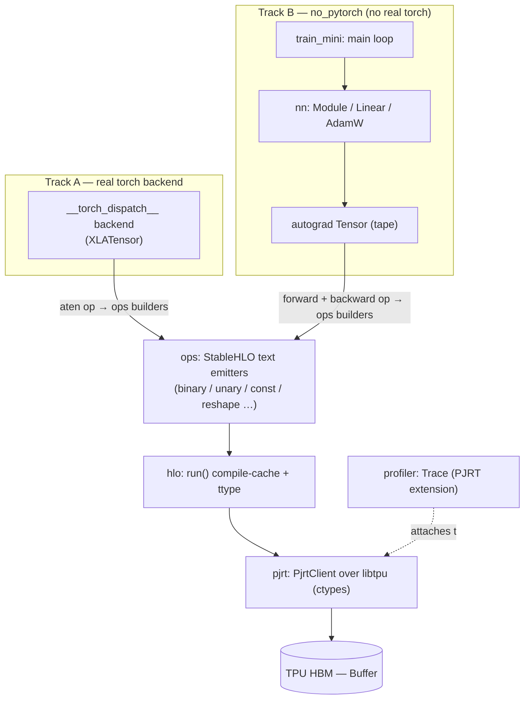
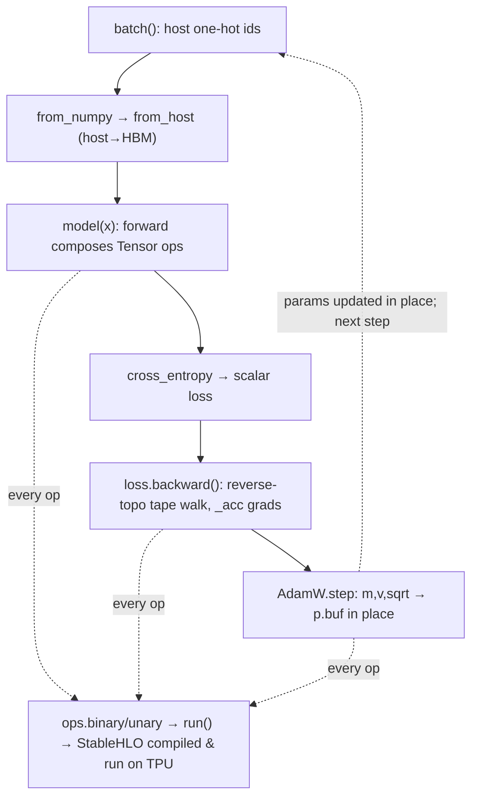

# mini_pytorch_xla — what it is and how it fits together

## In one paragraph
`mini_pytorch_xla` is a pure-Python proof that you can drive a TPU end-to-end with no
`torch_xla`, no JAX, and no compiled bindings — just `ctypes` talking to `libtpu.so` and
StableHLO emitted as text. It carries **two tracks that meet at StableHLO + PJRT**. The first,
the `mini_pytorch_xla` package, is a real PyTorch backend: an `XLATensor` wrapper subclass
intercepts every aten op via `__torch_dispatch__`, lowers it to a one-function StableHLO module
built by string concatenation, compiles that text once (cached), and executes it on the chip —
and because the dispatch sits *below* autograd, the backward pass runs on the TPU for free. The
second, the `no_pytorch` package, is a from-scratch reverse-mode autograd `Tensor` plus a tiny
`nn` library and a training loop, depending on no real torch at all. Both tracks bottom out in
the *same* lowering layer (`ops.py` → `hlo.py`) and the *same* runtime (`pjrt.py`): one emits
StableHLO from aten overloads, the other from hand-written tape closures, but every number on
either path becomes StableHLO text, compiles through PJRT, and lands in TPU HBM as a `Buffer`.

## Core architecture

The two tracks never call each other; they converge on the shaded waist
(`ops` → `hlo` → `pjrt`). Track A reaches it from PyTorch's dispatcher, Track B from its own
tape — but the StableHLO they emit and the device they target are identical.

## Main concepts

**The `__torch_dispatch__` backend (Track A).** `XLATensor` is a `torch.Tensor` wrapper subclass
whose only payload is a device `Buffer`. A flat `@impl`-registered dict maps each `torch.ops.aten`
overload to a handler that re-expresses it as `ops.py` primitives; autograd runs above dispatch,
so only *forward* ops need handlers and the backward pass re-dispatches through the same table.
The real weight is in reduction/variance decompositions, a few hand-lowered backwards, and
in-place optimizer ops that mutate `_buf` on device.
→ [mini_pytorch_xla-backend](concepts/mini_pytorch_xla-backend.md)

**StableHLO by string concatenation (the lowering waist).** `ops.py` is the "compiler frontend"
with no IR object: each op (`binary`, `unary`, `const`, `reshape`, `reduce`, `mm`, …) prints a
tiny self-contained `module { func.func @main … }` as an f-string, baking shapes and dtypes into
the text via `ttype`. One HLO module per PyTorch-level op — eager lowering, no cross-op fusion.
This is the single layer **both** tracks target.
→ [mini_pytorch_xla-ops](concepts/mini_pytorch_xla-ops.md)

**Text-as-cache-key compile (`hlo.run`).** Compilation is expensive, so `run()` memoizes
`Executable`s in `_EXE_CACHE` keyed on the *exact* module text. Identical shapes produce
byte-identical text and reuse the compiled binary; step 0 of a training loop compiles each
distinct op-shape once, every later step only executes. (Detailed on the `hlo` concept page.)

**The PJRT runtime over `libtpu` (the device waist).** `pjrt.py` is the whole runtime: it dials
`libtpu.so`'s PJRT C API through `ctypes` with zero torch_xla/JAX dependency, modelling the API
as one order-sensitive function-pointer table where every call has the same
`PJRT_Error* fn(FOO_Args*)` shape. Four verbs matter — `from_host` (upload), `compile`, `_execute`,
`_buffer_to_host` (readback) — and every boundary is awaited synchronously, which makes execute a
true wall-clock measure. A `Buffer` is a thin handle to bytes in TPU HBM.
→ [mini_pytorch_xla-pjrt](concepts/mini_pytorch_xla-pjrt.md)

**The profiler extension (ABI documentation).** `Trace` is a context manager that walks the
`PJRT_Api` extension chain to find the `PLUGIN_Profiler_Api` table and drives
create→start→stop→collect→destroy, all hand-laid ctypes structs. Run standalone it is ABI-correct
but yields an empty buffer (the real `ProfilerSession` lives outside the PJRT C API) — it exists
to document the protocol.
→ [mini_pytorch_xla-profiler](concepts/mini_pytorch_xla-profiler.md)

**The from-scratch autograd `Tensor` (Track B core).** A `Tensor` wraps a `Buffer` plus four
autograd fields (`grad`, `requires_grad`, `_prev`, `_backward`). The graph *is* the tape: every
forward op computes eagerly on the TPU then staples on a closure that pushes a vector-Jacobian
product to its parents — and those VJPs are written in the same differentiable ops, so backward
runs on the TPU too. `backward()` is a reverse-topo walk; `_acc`/`_unbroadcast` handle gradient
accumulation and the dual of forward broadcasting.
→ [no_pytorch-tensor](concepts/no_pytorch-tensor.md)

**The tiny `nn` library (Track B layers).** `Linear`, `Embedding`, `LayerNorm`, `softmax`,
`cross_entropy`, `AdamW` — a `torch.nn` look-alike with no `Parameter` class and no registration:
a parameter is just a `requires_grad` leaf `Tensor`, discovered by reflectively walking the module
object graph (`Module.parameters`). Layers store weights in the orientation that makes forward one
matmul; embedding is `one_hot @ table`; `cross_entropy` is fused log-softmax + NLL. Only `AdamW.step`
touches raw buffers, mutating `p.buf` in place under `no_grad`.
→ [no_pytorch-nn](concepts/no_pytorch-nn.md)

**The end-to-end training step (Track B spine).** `train_mini.main` trains a char-level
Shakespeare transformer (pre-LN, AdamW) entirely on this stack: batch → upload → forward → loss →
backward → optimizer, where each line fans out into small cached TPU programs. This is the page
that shows the two halves — eager tape (mini-pytorch) and StableHLO/PJRT (xla) — meeting in one loop.
→ [no_pytorch-train_mini](concepts/no_pytorch-train_mini.md)

## How a request flows
**Track A:** a model issues an aten op → `__torch_dispatch__` looks it up in `HANDLERS` (falling
back to PyTorch's core decompositions, then a CPU fallback) → the handler coerces inputs to
`Buffer`s and calls `ops.py` builders → `ops` emits StableHLO text → `hlo.run` compiles (cached)
and executes via PJRT → the result `Buffer` is re-wrapped as an `XLATensor`. Backward is the same
path, re-entered by PyTorch's own gradient formulas.
**Track B:** `train_mini.main` uploads a batch, calls `model(x)` whose `nn` layers compose autograd
`Tensor` ops (each recording a tape closure), reduces to a scalar via `cross_entropy`, calls
`loss.backward()` to walk the tape in reverse and fill every parameter's `grad`, then `AdamW.step`
mutates `p.buf` in place. Every numeric op on both spines bottoms out in `ops` → `hlo.run` → `pjrt`.

## Map of the wiki
- *"Where does Python stop and the TPU begin? How does upload/compile/execute work?"* →
  [mini_pytorch_xla-pjrt](concepts/mini_pytorch_xla-pjrt.md).
- *"How does an aten op become TPU compute, and why is backward free?"* →
  [mini_pytorch_xla-backend](concepts/mini_pytorch_xla-backend.md).
- *"How is StableHLO actually produced and cached?"* →
  [mini_pytorch_xla-ops](concepts/mini_pytorch_xla-ops.md) (and its sibling `hlo` page).
- *"How does the no-torch autograd / tape work?"* →
  [no_pytorch-tensor](concepts/no_pytorch-tensor.md).
- *"Where are the layers, loss, and optimizer?"* → [no_pytorch-nn](concepts/no_pytorch-nn.md).
- *"What does a full training step look like end-to-end?"* →
  [no_pytorch-train_mini](concepts/no_pytorch-train_mini.md).
- *"How is profiling/trace capture wired?"* →
  [mini_pytorch_xla-profiler](concepts/mini_pytorch_xla-profiler.md).
- For the exhaustive per-module symbol index (signatures, source links, uses-by) see
  [`catalog/`](catalog/); for the concept table and pinned commit see [`index.md`](../../index.md).
