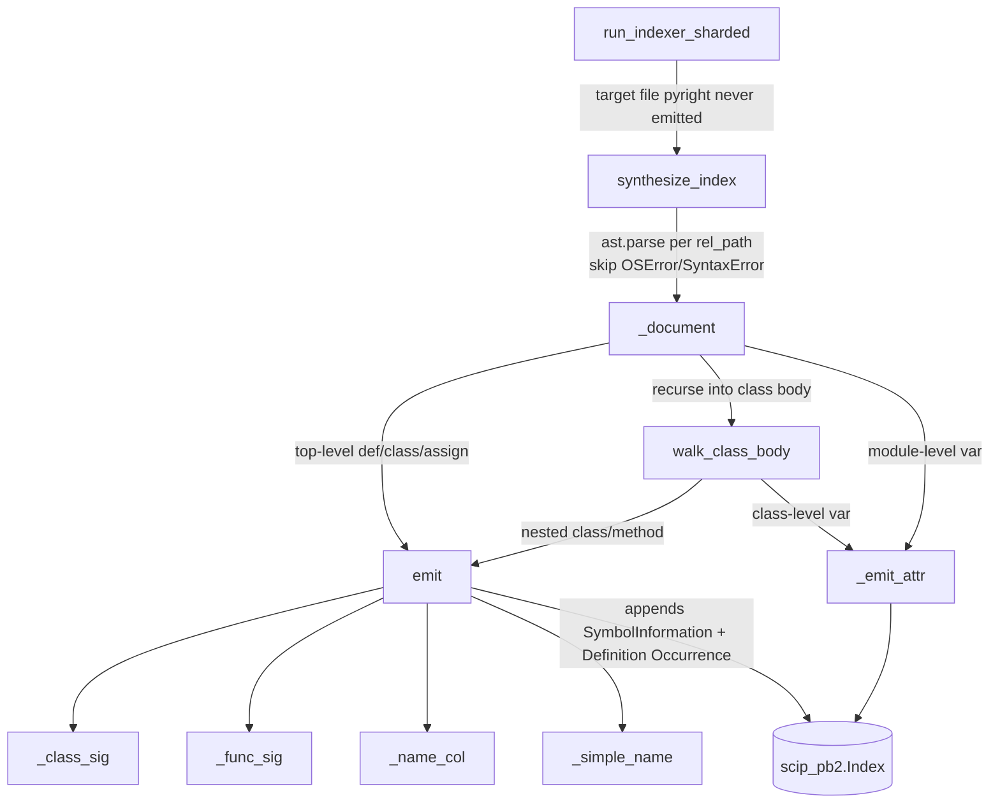

# AST fallback — symbol recovery without a type checker

How wikify recovers citable symbols from files that pyright/scip-python refuses to index, by parsing the source with Python's own `ast` module and emitting a synthetic SCIP index whose monikers line up exactly with the real one.

## Overview
The precise indexer (scip-python, a pyright wrapper) is a *type checker*: to emit a symbol it must successfully evaluate the file's types. On pathological inputs — very large or deeply-generic classes like `torch/_tensor.py`'s `Tensor` — pyright's constraint solver blows its stack and the **entire file's index is never emitted**, so that symbol vanishes even though thousands of other files reference it. This module is the floor against that hole: [`synthesize_index`](../catalog/wikify/ast_fallback.md#synthesize_index) re-parses just the missing files with the standard library's `ast`, walks the parse tree, and fabricates `SymbolInformation` whose monikers are byte-for-byte what scip-python would have produced. The recovered definition then unifies with the already-emitted references purely by moniker-string equality — no type resolution required. The key idea: **enumeration, not traversal.** Listing every `def`/`class`/assignment in a parse tree is deterministic and crash-proof, where evaluating their types is neither.

## Diagram

## Design rationale (why it's built this way)
The module's docstring states the design contract directly: it "recovers those symbols WITHOUT a type checker… emits a synthetic SCIP index whose monikers match scip-python's scheme exactly, so the recovered definitions unify with the existing references (callers populate by moniker join). It is deterministic and crash-proof — enumeration, not traversal." That last clause is the whole bet, visible in [`synthesize_index`](../catalog/wikify/ast_fallback.md#synthesize_index): it only ever *lists* the nodes in `tree.body`; it never asks what a name resolves to, so there is no constraint solver to overflow.

The accuracy trade-off is paid on the **outbound** side. Because nothing is type-resolved, an AST-recovered symbol has no callees of its own — the module docstring is explicit: "no outbound edges (no type resolution), so these symbols have no callees of their own; but inbound references from pyright-indexed files connect, and coverage/catalogs/citations all work." So a recovered `Tensor` will show *who calls it* (every pyright-indexed reference joins back) but not *what it calls*. That is an acceptable asymmetry: the symbol becomes citable, gets a catalog home, and satisfies coverage — it just isn't a full graph node.

> [!inferred]
> This makes the fallback strictly a *completeness* mechanism, not a fidelity one. It guarantees a symbol is never silently dropped, but a reader chasing the recovered symbol's own dependencies should drop to the pinned source rather than trust an (absent) callee list. The asymmetry is invisible at citation time and only matters for call-graph questions rooted at the recovered symbol.

The moniker scheme is reproduced by hand rather than reused, and the tests pin it precisely. The prefix in [`synthesize_index`](../catalog/wikify/ast_fallback.md#synthesize_index) (`scip-python python {project_name} {project_version} `) plus [`module_path`](../catalog/wikify/ast_fallback.md#module_path)'s dotted-path conversion plus the per-node suffixes (`#` for class, `().` for callable, `.` for var) must equal scip-python's encoding character-for-character, or the moniker join silently fails to connect. [`test_moniker_encoding_matches_scip_scheme`](../catalog/tests/test_ast_fallback.md#test_moniker_encoding_matches_scip_scheme) exists to freeze every one of those suffixes.

## Entry points
- [`synthesize_index`](../catalog/wikify/ast_fallback.md#synthesize_index) — the public entry. Given a repo dir and a list of repo-relative `.py` paths, it builds a complete `scip_pb2.Index`. Control reaches it from [`run_indexer_sharded`](../catalog/wikify/scip_index.md#run_indexer_sharded): after the sharded pyright pass merges its shards, the sharder computes which target files pyright *never emitted* and hands exactly those to the fallback ("any target .py file pyright never emitted… is recovered deterministically from source, so its symbols stay citable"). It is also the symbol every fallback test drives.
- [`module_path`](../catalog/wikify/ast_fallback.md#module_path) — the path→dotted-module converter (`torch/optim/adam.py` → `torch.optim.adam`, collapsing `__init__`). It is hit once per recovered file inside [`_document`](../catalog/wikify/ast_fallback.md#_document) and is the first half of every moniker, so getting it wrong unjoins an entire file's symbols.

## Mechanism (step-by-step)
1. **Best-effort parse, skip the unsalvageable.** [`synthesize_index`](../catalog/wikify/ast_fallback.md#synthesize_index) loops over `rel_paths`, reads each file, and `ast.parse`s it inside a `try` that swallows `OSError`, `SyntaxError`, and `ValueError`. A missing or syntactically broken file is simply `continue`d — the fallback is itself crash-proof, so one bad file can't sink the recovery of the others. [`test_unparseable_file_skipped`](../catalog/tests/test_ast_fallback.md#test_unparseable_file_skipped) pins this: a garbage file *and* a nonexistent one yield an empty document list with no exception.

2. **Build the moniker base and define the emitters.** For each surviving parse tree, [`_document`](../catalog/wikify/ast_fallback.md#_document) computes the module's dotted name via [`module_path`](../catalog/wikify/ast_fallback.md#module_path) and assembles `base = f"{prefix}\`{mod}\`/"` — the shared left side of every symbol in the file. It then closes over two helpers, [`emit`](../catalog/wikify/ast_fallback.md#_document.emit) and [`walk_class_body`](../catalog/wikify/ast_fallback.md#_document.walk_class_body), capturing `doc` and `base` so the recursion can append without threading state.

3. **Enumerate the top level.** [`_document`](../catalog/wikify/ast_fallback.md#_document) iterates `tree.body` and dispatches on node type: a `ClassDef` is emitted with suffix `#` and then descended; a `FunctionDef`/`AsyncFunctionDef` is emitted with suffix `().` and kind `Function`; anything else is run through [`_assign_targets`](../catalog/wikify/ast_fallback.md#_assign_targets) and any module-level variable names become attribute symbols. This is the "enumeration not traversal" contract made concrete — every documentable construct is *listed*, none is *resolved*.

4. **Emit one symbol + one definition occurrence.** [`emit`](../catalog/wikify/ast_fallback.md#_document.emit) constructs the full moniker (`base + name_path`), attaches a fenced-code signature line and, when present, the authored docstring pulled straight from `ast.get_docstring(node)` — so recovered symbols keep their real documentation for free. It then records a `Definition` occurrence (role [`_DEFINITION`](../catalog/wikify/ast_fallback.md#_DEFINITION)) whose range points at the *name token*: line is `node.lineno - 1` (SCIP is 0-based) and the column comes from [`_name_col`](../catalog/wikify/ast_fallback.md#_name_col), which skips past the `class `/`def `/`async def ` keyword, with the name length taken from [`_simple_name`](../catalog/wikify/ast_fallback.md#_simple_name). [`test_signature_and_docstring_captured`](../catalog/tests/test_ast_fallback.md#test_signature_and_docstring_captured) asserts both the rendered signature and the recovered docstring land in `documentation`.

5. **Recurse through class bodies for nested scope.** [`walk_class_body`](../catalog/wikify/ast_fallback.md#_document.walk_class_body) re-applies the same class/function/assign dispatch to a class's children, but threading a growing `scope` string so a nested class appends `Inner#` and a method appends `method().` onto the enclosing path. Because it calls itself on each nested `ClassDef`, arbitrarily deep nesting produces correctly-qualified monikers. [`test_moniker_encoding_matches_scip_scheme`](../catalog/tests/test_ast_fallback.md#test_moniker_encoding_matches_scip_scheme) checks the full ladder down to `Outer#Inner#inner_method().`.

6. **Render signatures from the AST.** The kind-specific suffixes are paired with kind-specific signature renderers: [`_class_sig`](../catalog/wikify/ast_fallback.md#_class_sig) unparses base classes and keyword args (e.g. `class Outer(Base, metaclass=Meta):`) and [`_func_sig`](../catalog/wikify/ast_fallback.md#_func_sig) unparses the argument list and prefixes `async def ` when appropriate. These give the recovered symbol a human-readable header without any type information.

7. **Emit bare attribute symbols.** Module- and class-level variables don't go through [`emit`](../catalog/wikify/ast_fallback.md#_document.emit); they take the lighter path [`_emit_attr`](../catalog/wikify/ast_fallback.md#_emit_attr), which appends a `Variable` `SymbolInformation` and a `Definition` occurrence at the assignment's own column (no name-token skipping, no docstring — assignments have neither). The eligible targets come from [`_assign_targets`](../catalog/wikify/ast_fallback.md#_assign_targets), which only accepts simple `name =` / `name: T =` forms (plain `ast.Name` targets), deliberately ignoring tuple-unpacking and attribute/subscript targets.

8. **Drop empty documents, return the index.** Back in [`synthesize_index`](../catalog/wikify/ast_fallback.md#synthesize_index), a `_document` that produced no symbols (e.g. a file of only imports) is *not* appended — `if doc.symbols:` keeps the index free of empty shells. The result is a `scip_pb2.Index` tagged with tool name `wikify-ast-fallback` that downstream merge/build treats like any other shard.

## Key data structures
- The **moniker string** is the load-bearing data structure — there is no symbol table object, just the convention `f"{prefix}\`{mod}\`/{scope}{name}{suffix}"`. Unification with the precise index happens entirely through string equality of this moniker, which is why every piece ([`module_path`](../catalog/wikify/ast_fallback.md#module_path), the `#`/`().`/`.` suffixes, the `scip-python python …` prefix) must match scip-python exactly.
- [`_Kind`](../catalog/wikify/ast_fallback.md#_Kind) and [`_DEFINITION`](../catalog/wikify/ast_fallback.md#_DEFINITION) are module-level aliases for the SCIP protobuf enums (`SymbolInformation.Kind` and `SymbolRole.Definition`), used to tag each emitted symbol's category and to mark each occurrence as a definition (vs. a reference).
- The output `scip_pb2.Document` accumulates two parallel lists — `symbols` (the what) and `occurrences` (the where) — that [`emit`](../catalog/wikify/ast_fallback.md#_document.emit) and [`_emit_attr`](../catalog/wikify/ast_fallback.md#_emit_attr) append to in lockstep.

## Dynamics (design intent)
The author's intent is that recovered definitions are *passive join targets*: they carry definitions but no outbound edges, and inbound references from the precise index attach by moniker. [`test_recovered_symbol_joins_with_existing_references`](../catalog/tests/test_ast_fallback.md#test_recovered_symbol_joins_with_existing_references) is the design's proof-of-intent — its docstring is "A reference emitted by the 'real' indexer connects to the AST-recovered def." It fabricates a separate document that *references* `pkg.mod.Outer` with no `SymbolInformation` for it (exactly the hole pyright leaves), runs [`synthesize_index`](../catalog/wikify/ast_fallback.md#synthesize_index) over the real file, and asserts that after graph-building the fabricated caller appears in `Outer`'s callers and `Outer`'s `def_path` resolves to the recovered file. That is the contract: the fallback supplies the missing *definition end* of an edge whose *reference end* already exists.

In [`run_indexer_sharded`](../catalog/wikify/scip_index.md#run_indexer_sharded), the fallback runs *after* and *only on the gap left by* the precise sharded pass — it is invoked on the set-difference between requested targets and files pyright actually emitted, so it never competes with or overwrites a real index, it only fills holes.

## Edge cases
- **Unparseable / missing files** are silently skipped, not errored ([`synthesize_index`](../catalog/wikify/ast_fallback.md#synthesize_index)'s `try/except (OSError, SyntaxError, ValueError)`); confirmed by [`test_unparseable_file_skipped`](../catalog/tests/test_ast_fallback.md#test_unparseable_file_skipped).
- **`__init__.py`** collapses to its package name (the trailing `__init__` part is dropped in [`module_path`](../catalog/wikify/ast_fallback.md#module_path)), so package-level symbols get the right module moniker.
- **Complex assignment targets** (tuple unpacking, `a.b = …`, subscripts) are *not* recovered — [`_assign_targets`](../catalog/wikify/ast_fallback.md#_assign_targets) only matches plain `ast.Name` targets in `Assign`/`AnnAssign`.
- **No outbound edges:** a recovered symbol's own callees are absent by design; only inbound references connect.
- **Import-only files** produce a document with no symbols and are dropped, keeping the index clean.

## Open questions
- The packet's subgraph does not include `build_graph` or `scip_index.build_graph` (referenced only inside the test), so the exact moniker-join logic that turns a recovered definition into a connected node lives outside this concept and is described here only via the test's asserted behavior.
- How [`run_indexer_sharded`](../catalog/wikify/scip_index.md#run_indexer_sharded) computes the precise "missing target files" set (the `_missing_target_files` helper visible in its source) is outside this subgraph; treated here as the trigger condition only.

## See also
- `concepts/wikify-scip_index.md` (sharded precise indexing — the pass whose gaps this fills)
- `concepts/wikify-coverage.md` (the set-difference coverage floor that recovered symbols must satisfy)
