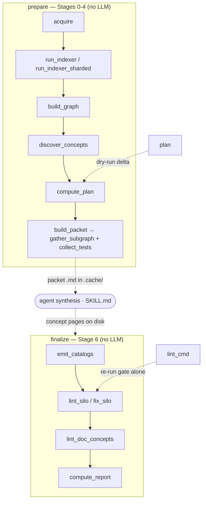

# wikify CLI — the deterministic driver around agent synthesis

## Overview
`wikify/cli.py` is the Typer app that drives the whole ingest pipeline, but the
single idea that explains its shape is a **hard split around the model**: the CLI
is the *deterministic* half (acquire → index → graph → discover → packets →
catalog → lint → assemble), and it never calls an LLM. The *synthesis* half — one
grounded page per packet — happens entirely outside Python, in the agent driven by
`SKILL.md`. The two halves never share memory; they hand off through **files in
`.cache/`**. So the command surface is really two phases bridged by a human/agent
step: [`prepare`](../catalog/wikify/cli.md#prepare) emits packets and stops;
[`finalize`](../catalog/wikify/cli.md#finalize) picks the agent's pages back up,
gates them, and assembles the wiki. [`plan`](../catalog/wikify/cli.md#plan) and
[`lint_cmd`](../catalog/wikify/cli.md#lint_cmd) are read-only windows onto the same
machinery. The module docstring states the contract directly: "The deterministic
half never calls a model; the agent half never parses protobuf."

## Diagram

## Design rationale (why it's built this way)
The file/handoff boundary is not incidental — it is the architecture. Because the
agent never sees protobuf and Python never sees a prompt, each half can be tested,
re-run, and reasoned about in isolation, and the expensive model work is replayable
from a frozen packet without re-indexing. This is why there are *two* top-level
commands instead of one `ingest`: the pipeline has to physically suspend between
[`prepare`](../catalog/wikify/cli.md#prepare) and
[`finalize`](../catalog/wikify/cli.md#finalize) so an out-of-process agent can do
the writing.

Two smaller decisions follow the same grain. First, the *agenda is derived, not
authored*: [`prepare`](../catalog/wikify/cli.md#prepare) calls
[`discover_concepts`](../catalog/wikify/discover.md#discover_concepts) to rank
modules by centrality and auto-seed concepts, then merges hand-written
[`concepts`](../catalog/wikify/config.md#RepoConfig.concepts) from config on slug
collision — so a fresh repo needs zero hand-written concern list. Second, *catalogs
are emitted before linting*: the inline comment in
[`finalize`](../catalog/wikify/cli.md#finalize) is explicit that
[`emit_catalogs`](../catalog/wikify/coverage.md#emit_catalogs) must run first
because citations resolve against each catalog page's frontmatter `symbols:` map —
the linter has nothing to resolve against until the homes exist.

## Entry points
- [`prepare`](../catalog/wikify/cli.md#prepare) — Stages 0-4, the front half. Control
  reaches it when the user (or `SKILL.md`) runs `wikify prepare <slug>`. It acquires
  the pinned source, runs the indexer, builds the graph via
  [`_graph`](../catalog/wikify/cli.md#_graph), derives the agenda, computes the
  reconcile plan, and writes one packet per to-build concept — then stops, leaving
  synthesis to the agent.
- [`finalize`](../catalog/wikify/cli.md#finalize) — Stage 6, the back half. Reached
  *after* the agent has written concept pages to disk. It emits catalogs, runs the
  citation gate ([`lint_silo`](../catalog/wikify/lint.md#lint_silo) or
  [`fix_silo`](../catalog/wikify/fix.md#fix_silo)), updates reconcile state from the
  pages actually on disk, and assembles the index. A missing SCIP index makes it
  refuse with exit code 2 — it cannot lint what was never prepared.
- [`plan`](../catalog/wikify/cli.md#plan) — the dry run. It acquires + indexes just
  enough to call [`compute_plan`](../catalog/wikify/diff.md#compute_plan) and print
  the reconcile delta (build / rebuild / leave), emitting no packets and no pages.
  This is the idempotent-reconcile contract made inspectable.
- [`lint_cmd`](../catalog/wikify/cli.md#lint_cmd) — the citation gate, re-run alone.
  It skips acquire/index entirely, rebuilds the graph, and runs
  [`lint_silo`](../catalog/wikify/lint.md#lint_silo) (or `--fix` →
  [`fix_silo`](../catalog/wikify/fix.md#fix_silo)) so an author can tighten pages
  without paying for a full finalize.

## Mechanism (step-by-step)
1. **Resolve config, then pin the source.** Every command opens with
   [`_load`](../catalog/wikify/cli.md#_load), which reads `config/<slug>.md` via
   [`load_config`](../catalog/wikify/config.md#load_config) (validated frontmatter +
   parsed concept list) and a `Paths` object that fixes the on-disk layout — note
   it then re-points the wiki subdir from config. [`prepare`](../catalog/wikify/cli.md#prepare)
   then calls [`acquire`](../catalog/wikify/acquire.md#acquire) to resolve the repo
   (local path or git URL) to a pinned tree, exposing `acq.commit` and
   [`repo_dir`](../catalog/wikify/acquire.md#Acquired.repo_dir). The pin is what
   makes the rest reproducible.

2. **Index to SCIP, then build the graph.** Still in
   [`prepare`](../catalog/wikify/cli.md#prepare), Python is indexed with
   [`run_indexer`](../catalog/wikify/scip_index.md#run_indexer), or
   [`run_indexer_sharded`](../catalog/wikify/scip_index.md#run_indexer_sharded) when
   `index_shards` is set (one `scip-python --target-only` per shard, for repos too
   big to index in one pass). A mixed C++ repo additionally runs scip-clang. The
   resulting `.scip` files are folded into a single
   [`SymbolGraph`](../catalog/wikify/graph.md#SymbolGraph) by
   [`_graph`](../catalog/wikify/cli.md#_graph) → [`build_graph`](../catalog/wikify/scip_index.md#build_graph),
   which *unions* multiple indexes — SCIP's stable monikers keep Python and C++
   symbols distinct in one namespace.

3. **Derive the agenda from topology.** Rather than trust a hand-written list,
   [`discover_concepts`](../catalog/wikify/discover.md#discover_concepts) ranks
   modules by centrality and auto-seeds a concept per high-fan-in module
   (deterministic). The command unions these with the config
   [`concepts`](../catalog/wikify/config.md#RepoConfig.concepts), config winning on
   a slug clash, and wraps the merged list as the working `agenda`. This is design
   decision 8 — comprehension is derived, not authored.

4. **Compute the reconcile delta.** [`compute_plan`](../catalog/wikify/diff.md#compute_plan)
   compares per-symbol content hashes ([`current_hashes`](../catalog/wikify/diff.md#current_hashes))
   against the saved state: a concept with no page is *build*, a concept whose cited
   symbols changed is *rebuild*, everything else is *leave*. Only the `plan.todo`
   set proceeds, so a re-run with no source movement builds nothing — the
   idempotent-reconcile invariant. [`plan`](../catalog/wikify/cli.md#plan) is exactly
   this step in isolation, printing [`render`](../catalog/wikify/diff.md#Plan.render)
   and exiting.

5. **Emit one packet per to-build concept — then suspend.** For each agenda concept
   in `todo`, [`build_packet`](../catalog/wikify/packet.md#build_packet) renders the
   grounding document: [`gather_subgraph`](../catalog/wikify/packet.md#gather_subgraph)
   takes the discovery seeds and grows a relevance-bounded subgraph (the *only*
   symbols a page may cite), and [`collect_tests`](../catalog/wikify/evidence.md#collect_tests)
   attaches the tests whose bodies exercise those symbols as evidence. The packet is
   written to `.cache/`, and `prepare` returns. This is the suspend point: the agent
   now writes pages; Python is done until `finalize`.

6. **Lay catalogs, then gate the agent's pages.** [`finalize`](../catalog/wikify/cli.md#finalize)
   first calls [`emit_catalogs`](../catalog/wikify/coverage.md#emit_catalogs) to write
   one catalog page per module (the symbol homes whose frontmatter the linter
   resolves against) — the whole-repo coverage floor, a set-difference over the
   symbol table, not a graph walk. Then it runs the gate:
   [`lint_silo`](../catalog/wikify/lint.md#lint_silo) checks every concept page's
   citations resolve and lie inside the packet subgraph, while
   [`lint_doc_concepts`](../catalog/wikify/lint.md#lint_doc_concepts) applies the
   lighter rule to doc-derived pages. With `--fix`,
   [`fix_silo`](../catalog/wikify/fix.md#fix_silo) auto-repairs first. If the merged
   report's [`ok`](../catalog/wikify/lint.md#LintReport.ok) is false, it prints each
   of [`errors`](../catalog/wikify/lint.md#LintReport.errors) and exits non-zero —
   the lint is a build gate, not advice.

7. **Record state and assemble.** Once green, `finalize` re-pins state to
   `acq.commit`, re-hashes symbols, and walks the concept pages on disk calling
   [`page_citations`](../catalog/wikify/lint.md#page_citations) to record what each
   page actually cites (so the *next* `compute_plan` knows what to invalidate).
   Finally [`compute_report`](../catalog/wikify/coverage.md#compute_report) classifies
   every documentable symbol as covered / catalog-only / unrepresented, and the
   index is assembled. State is derived from the pages that exist, not from what
   `prepare` intended — the two halves stay decoupled.

## Key data structures
`Paths` (in `cli.py`) centralizes the on-disk contract — [`cache`](../catalog/wikify/cli.md#Paths.cache),
[`scip`](../catalog/wikify/cli.md#Paths.scip), [`state`](../catalog/wikify/cli.md#Paths.state),
and [`wiki_slug`](../catalog/wikify/cli.md#Paths.wiki_slug) — so the file handoff
between the two halves has one source of truth for where things live; `wiki_slug`
is recomputed from `cfg.wiki_subdir` so a repo's wiki can sit under `wiki/code/<slug>`.
The [`RepoConfig`](../catalog/wikify/config.md#load_config)/[`Concept`](../catalog/wikify/config.md#Concept)
pair (and its [`concepts`](../catalog/wikify/config.md#RepoConfig.concepts)/
[`slug`](../catalog/wikify/config.md#Concept.slug) fields) is the parsed config that
seeds discovery and the agenda. The [`SymbolGraph`](../catalog/wikify/graph.md#SymbolGraph)
of [`Symbol`](../catalog/wikify/graph.md#Symbol) nodes (each with a
[`moniker`](../catalog/wikify/graph.md#Symbol.moniker),
[`name`](../catalog/wikify/graph.md#Symbol.name),
[`kind`](../catalog/wikify/graph.md#Symbol.kind),
[`suffix`](../catalog/wikify/graph.md#Symbol.suffix), and
[`def_path`](../catalog/wikify/graph.md#Symbol.def_path)/[`def_line`](../catalog/wikify/graph.md#Symbol.def_line))
is the shared substrate every later stage queries.

## Dynamics (design intent)
Sharded indexing is the one place the CLI deliberately introduces parallelism:
[`run_indexer_sharded`](../catalog/wikify/scip_index.md#run_indexer_sharded) runs
several `scip-python` processes concurrently (one per `--target-only` target) and
merges the shards, for upstreams too large to index in a single pass — `build_graph`
then unions them, so downstream stages are oblivious to whether one or many indexes
were produced. Everything else in the CLI is straight-line and deterministic by
design: discovery, planning, and coverage are all order-independent computations
over the graph so that the same source at the same commit always yields the same
packets and the same plan.

> [!inferred]
> The graph is rebuilt from the on-disk `.scip` files inside `finalize`, `plan`,
> and `lint` rather than carried over from `prepare` — there is no in-memory graph
> shared across commands. This keeps each command independently runnable (the file
> cache is the only shared state), which is what lets the agent step sit between
> them, but it does mean the index is parsed once per command invocation.

## Edge cases
- **No config / no source.** `_load` exits with code 2 if `config/<slug>.md` is
  missing; `prepare`/`plan`/`finalize` also exit 2 when no `--repo` is given and
  none is set in config — see [`load_config`](../catalog/wikify/config.md#load_config).
- **Finalize before prepare.** [`finalize`](../catalog/wikify/cli.md#finalize)
  refuses with exit 2 if neither a Python nor a C++ SCIP index exists — there is
  nothing to resolve citations against.
- **Lint failure halts the build.** A non-`ok` report in `finalize` or
  [`lint_cmd`](../catalog/wikify/cli.md#lint_cmd) raises a non-zero exit before any
  index is assembled, so a wiki is never published with a dangling citation.
- **Converged re-run.** When [`compute_plan`](../catalog/wikify/diff.md#compute_plan)
  yields an empty `todo`, `prepare` writes no packets and prints "nothing to build
  (converged)".

## Open questions
- The C++ path (`run_clang_indexer`, `bazel_cc.generate_compile_db`) and the
  doc-ingest worklist (`_find_docs`) are wired in `prepare`/`finalize` but their
  internals live outside this packet's subgraph; see the scip-index and doc-ingest
  concept pages.
- Whether the relevance bound inside
  [`gather_subgraph`](../catalog/wikify/packet.md#gather_subgraph) can ever exclude
  a symbol the agent genuinely needs (forcing an Open-question instead of a
  citation) is a tuning question the source doesn't settle.

## See also
- `packets` — how [`build_packet`](../catalog/wikify/packet.md#build_packet) and
  [`gather_subgraph`](../catalog/wikify/packet.md#gather_subgraph) bound the citation set.
- `scip-index` — [`build_graph`](../catalog/wikify/scip_index.md#build_graph),
  [`run_indexer`](../catalog/wikify/scip_index.md#run_indexer), and
  [`devirtualize`](../catalog/wikify/graph.md#devirtualize).
- `coverage` — [`emit_catalogs`](../catalog/wikify/coverage.md#emit_catalogs) and
  [`compute_report`](../catalog/wikify/coverage.md#compute_report).
- `lint` / `fix` — the gate ([`lint_silo`](../catalog/wikify/lint.md#lint_silo),
  [`fix_silo`](../catalog/wikify/fix.md#fix_silo)) `finalize` enforces.
- `diff` — [`compute_plan`](../catalog/wikify/diff.md#compute_plan) and the
  reconcile delta.
