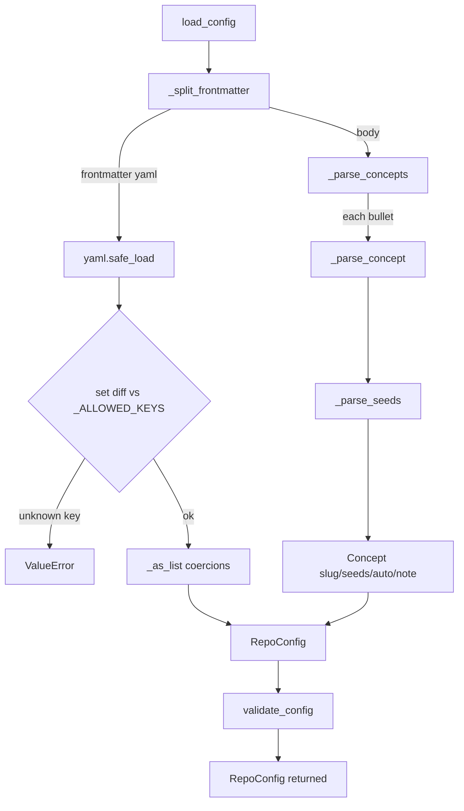

# wikify-config — the per-repo ingest contract

How `config/<slug>.md` — markdown with YAML frontmatter — is parsed and validated into
the typed `RepoConfig` that drives every downstream stage of an ingest.

## Overview
The single design idea here is that **the ingest input is a wiki page, not a config file**.
A repo is configured with the exact same shape the wiki itself uses: a YAML frontmatter
fence for typed scalars (slug, languages, build, ref, glob lists) followed by a markdown
body whose `## Concepts` list *is* the table of contents the wiki will be built around. The
agent authoring an ingest never learns a second syntax (no TOML, no JSON) — it edits
markdown. The cost of that ergonomic choice is that markdown has no schema, so this module
is the layer that *recovers* the strictness TOML would have given for free: it is pure
Python with **zero model calls**, it rejects unknown keys, and it turns prose bullets into
structured [`Concept`](../catalog/wikify/config.md#Concept) records. The parse splits cleanly
into two halves — frontmatter → typed [`RepoConfig`](../catalog/wikify/config.md#RepoConfig)
fields, and the `## Concepts` body → a `list[Concept]` — joined and validated by
[`load_config`](../catalog/wikify/config.md#load_config).

## Diagram

## Design rationale (why it's built this way)
The module docstring states the intent directly: the config is *"markdown with YAML
frontmatter — the same shape as a wiki page, so the agent edits it with no second syntax,"*
and this module *"parses the file into a `RepoConfig` and validates structure … the strict
parse TOML would give, recovered with the linter tooling already in the build."* That framing
explains nearly every decision below — markdown for ergonomics, an explicit validation pass
to claw back strictness.

[`RepoConfig`](../catalog/wikify/config.md#RepoConfig)'s own docstring underlines a subtle
point: it is *"an authored ingest input, not a product."* It sits on the **raw/input** side
of the wikify invariant that markdown wiki pages are the only shipped *output* — the config
is hand-edited, the wiki is generated. The dataclass is deliberately wide and mostly
optional: only [`slug`](../catalog/wikify/config.md#RepoConfig.slug) is required; everything
else ([`languages`](../catalog/wikify/config.md#RepoConfig.languages),
[`build`](../catalog/wikify/config.md#RepoConfig.build),
[`ref`](../catalog/wikify/config.md#RepoConfig.ref),
[`tests`](../catalog/wikify/config.md#RepoConfig.tests),
[`docs`](../catalog/wikify/config.md#RepoConfig.docs)) defaults so a minimal config is a slug
plus an empty `## Concepts` section.

A second deliberate choice is that **`seeds` are optional and the agenda is derived, not
authored**. The [`Concept`](../catalog/wikify/config.md#Concept) docstring says seeds are
*"empty when the seeds clause was `(auto)` or `(discover: …)`, in which case `auto` is True
(Stage 5 discovers entry points instead)."* So the config does not force a human to name
entry-point symbols; it lets them say "figure it out" and lets centrality-based discovery
fill in. The parser treats `(auto)` and `(discover: …)` identically — both collapse to
`auto=True` with no seeds — because from the config's point of view they mean the same thing
("no human-supplied seeds"); the *difference* between them, if any, is the discovery stage's
concern, not this parser's.

> [!inferred]
> The `repo`/`acquire`/`source_url`/`bazel_targets`/`compile_commands` fields are parsed and
> stored here but consumed by later stages (Stage 0 acquisition, indexing, catalog source
> links). This page documents how they are *parsed*; their runtime use lives in the acquire
> and indexing concepts. The field comments in the source are the authoritative description of
> their meaning.

## Entry points
- [`load_config`](../catalog/wikify/config.md#load_config) is the only public entry point and
  the whole module's purpose: *"Parse and validate `config/<slug>.md` into a `RepoConfig`."*
  Control reaches it once per CLI invocation through
  [`_load`](../catalog/wikify/cli.md#_load), which resolves the project paths, calls
  `load_config(p.config)`, and then sets the wiki sub-directory from the parsed
  [`wiki_subdir`](../catalog/wikify/config.md#RepoConfig.wiki_subdir). Every later command
  ([`prepare`](../catalog/wikify/cli.md#prepare),
  [`compute_plan`](../catalog/wikify/diff.md#compute_plan),
  [`build_packet`](../catalog/wikify/packet.md#build_packet)) operates on the `RepoConfig`
  this returns — it is the root of the configuration dependency tree.

## Mechanism (step-by-step)
1. **Split the file into frontmatter and body.**
   [`load_config`](../catalog/wikify/config.md#load_config) reads the file and hands its text
   to [`_split_frontmatter`](../catalog/wikify/config.md#_split_frontmatter), which requires
   the very first non-blank line to be a `---` fence and scans for the closing `---`,
   returning `(frontmatter_yaml, body)`. A missing opening fence or an unterminated block is a
   `ValueError`, not a silent empty parse — the structural strictness the docstring promised
   begins here.

2. **Parse and key-check the frontmatter.** The frontmatter half is run through
   `yaml.safe_load`; a non-mapping result is rejected. Then
   [`load_config`](../catalog/wikify/config.md#load_config) computes `set(fm) - `
   [`_ALLOWED_KEYS`](../catalog/wikify/config.md#_ALLOWED_KEYS) and raises on any unknown key,
   listing both the offenders and the allowed set. This is the TOML-strictness recovery: a
   typo'd key (`bogus:`) fails loudly rather than being ignored, as
   [`test_unknown_frontmatter_key_raises`](../catalog/tests/test_config.md#test_unknown_frontmatter_key_raises)
   pins. The required-key check for [`slug`](../catalog/wikify/config.md#RepoConfig.slug)
   happens here too — both absence and an empty value are errors
   ([`test_missing_slug_raises`](../catalog/tests/test_config.md#test_missing_slug_raises)).

3. **Coerce scalars into the dataclass.**
   [`load_config`](../catalog/wikify/config.md#load_config) builds the
   [`RepoConfig`](../catalog/wikify/config.md#RepoConfig), normalizing each field: optional
   string scalars become `None`-or-`str`, and list fields
   ([`languages`](../catalog/wikify/config.md#RepoConfig.languages),
   [`tests`](../catalog/wikify/config.md#RepoConfig.tests),
   [`docs`](../catalog/wikify/config.md#RepoConfig.docs),
   [`index_shards`](../catalog/wikify/config.md#RepoConfig.index_shards)) pass through
   [`_as_list`](../catalog/wikify/config.md#_as_list), which tolerates absent / scalar / list
   YAML shapes and always yields a `list[str]`. [`wiki_subdir`](../catalog/wikify/config.md#RepoConfig.wiki_subdir)
   is special-cased to default to `"code"` when unset (yielding `wiki/code/<slug>`), and an
   explicit empty string is honoured to get the classic flat `wiki/<slug>` layout —
   [`test_wiki_subdir_defaults_to_code_and_is_configurable`](../catalog/tests/test_acquire_submodule.md#test_wiki_subdir_defaults_to_code_and_is_configurable)
   exercises all three cases.

4. **Parse the `## Concepts` body into the table of contents.**
   [`_parse_concepts`](../catalog/wikify/config.md#_parse_concepts) line-scans the body for a
   `## Concepts` heading (it also accepts the legacy `## Concerns` for back-compat), then
   collects every `- ` bullet until the next `## ` heading. A body with no such section is a
   hard error
   ([`test_missing_concepts_section_raises`](../catalog/tests/test_config.md#test_missing_concepts_section_raises)) —
   the concepts list is the wiki's spine, so it cannot be empty-by-omission. Each bullet is
   delegated to [`_parse_concept`](../catalog/wikify/config.md#_parse_concept).

5. **Turn one bullet into a `Concept`.**
   [`_parse_concept`](../catalog/wikify/config.md#_parse_concept) first strips any
   `<!-- … -->` HTML comment (keeping its inner text as a fallback note), then matches the
   bullet against [`_CONCEPT_RE`](../catalog/wikify/config.md#_CONCEPT_RE): the concept
   [`slug`](../catalog/wikify/config.md#Concept.slug) is the `**bold**` name if present, else
   the first whitespace token
   ([`test_concept_without_bold_uses_first_word`](../catalog/tests/test_config.md#test_concept_without_bold_uses_first_word)).
   It then searches the remainder with
   [`_SEEDS_RE`](../catalog/wikify/config.md#_SEEDS_RE) — which accepts either an em-dash
   `—` or a plain hyphen `-` as the separator before `seeds:`
   ([`test_hyphen_separator_tolerated`](../catalog/tests/test_config.md#test_hyphen_separator_tolerated)) —
   and routes the payload to [`_parse_seeds`](../catalog/wikify/config.md#_parse_seeds). With
   no seeds clause, the leftover dash-prefixed text becomes the
   [`note`](../catalog/wikify/config.md#Concept.note).

6. **Classify the seeds payload.**
   [`_parse_seeds`](../catalog/wikify/config.md#_parse_seeds) matches the payload against
   [`_AUTO_RE`](../catalog/wikify/config.md#_AUTO_RE) first: `(auto)` or `(discover: …)`
   return `([], auto=True, "")`, deferring entry-point selection to discovery
   ([`test_auto_seeds`](../catalog/tests/test_config.md#test_auto_seeds),
   [`test_discover_treated_as_auto`](../catalog/tests/test_config.md#test_discover_treated_as_auto)).
   Otherwise [`_BACKTICK_TOKEN_RE`](../catalog/wikify/config.md#_BACKTICK_TOKEN_RE) extracts
   each backtick-quoted token as a seed symbol (backticks stripped), and whatever non-token
   text remains is the note. [`test_seeds_backticks_stripped`](../catalog/tests/test_config.md#test_seeds_backticks_stripped)
   pins that raw symbol names like `LazyGraphExecutor::Compile` survive intact while the
   backticks are removed.

7. **Validate and return.** [`load_config`](../catalog/wikify/config.md#load_config) finishes
   by calling [`validate_config`](../catalog/wikify/config.md#validate_config), the single
   semantic gate, which currently re-asserts a non-empty
   [`slug`](../catalog/wikify/config.md#RepoConfig.slug). The fully-populated
   [`RepoConfig`](../catalog/wikify/config.md#RepoConfig) — scalars plus the ordered
   [`concepts`](../catalog/wikify/config.md#RepoConfig.concepts) list — is returned to the
   caller, as the round-trip assertions in
   [`test_frontmatter_parsed`](../catalog/tests/test_config.md#test_frontmatter_parsed) and
   [`test_concept_slugs`](../catalog/tests/test_config.md#test_concept_slugs) confirm.

## Key data structures
- [`RepoConfig`](../catalog/wikify/config.md#RepoConfig) — the typed result. Required
  [`slug`](../catalog/wikify/config.md#RepoConfig.slug); optional scalars
  [`build`](../catalog/wikify/config.md#RepoConfig.build),
  [`ref`](../catalog/wikify/config.md#RepoConfig.ref),
  [`repo`](../catalog/wikify/config.md#RepoConfig.repo),
  [`acquire`](../catalog/wikify/config.md#RepoConfig.acquire),
  [`source_url`](../catalog/wikify/config.md#RepoConfig.source_url),
  [`compile_commands`](../catalog/wikify/config.md#RepoConfig.compile_commands),
  [`bazel_targets`](../catalog/wikify/config.md#RepoConfig.bazel_targets),
  [`wiki_subdir`](../catalog/wikify/config.md#RepoConfig.wiki_subdir); and the list fields
  [`languages`](../catalog/wikify/config.md#RepoConfig.languages),
  [`index_shards`](../catalog/wikify/config.md#RepoConfig.index_shards),
  [`tests`](../catalog/wikify/config.md#RepoConfig.tests),
  [`docs`](../catalog/wikify/config.md#RepoConfig.docs), and
  [`concepts`](../catalog/wikify/config.md#RepoConfig.concepts).
- [`Concept`](../catalog/wikify/config.md#Concept) — one entry from the `## Concepts` list:
  a [`slug`](../catalog/wikify/config.md#Concept.slug), a list of
  [`seeds`](../catalog/wikify/config.md#Concept.seeds), the
  [`auto`](../catalog/wikify/config.md#Concept.auto) flag, and a free-text
  [`note`](../catalog/wikify/config.md#Concept.note).
- The compiled regexes ([`_CONCEPT_RE`](../catalog/wikify/config.md#_CONCEPT_RE),
  [`_SEEDS_RE`](../catalog/wikify/config.md#_SEEDS_RE),
  [`_AUTO_RE`](../catalog/wikify/config.md#_AUTO_RE),
  [`_BACKTICK_TOKEN_RE`](../catalog/wikify/config.md#_BACKTICK_TOKEN_RE),
  [`_HTML_COMMENT_RE`](../catalog/wikify/config.md#_HTML_COMMENT_RE)) and
  [`_DASH`](../catalog/wikify/config.md#_DASH) are the grammar of the concept mini-language;
  [`_ALLOWED_KEYS`](../catalog/wikify/config.md#_ALLOWED_KEYS) is the frontmatter whitelist.

## Dynamics (design intent)
This is a pure, synchronous, deterministic parse — no model call, no IO beyond reading the one
config file, no concurrency. That is itself a design invariant: configuration parsing belongs
to the *deterministic* half of wikify, so the same config text always yields the same
`RepoConfig`. The ordering guarantee that matters is that
[`_parse_concepts`](../catalog/wikify/config.md#_parse_concepts) preserves the authored order
of bullets — [`test_concept_slugs`](../catalog/tests/test_config.md#test_concept_slugs)
asserts the exact concept sequence — because the concepts list is consumed in order by both
[`prepare`](../catalog/wikify/cli.md#prepare) (which merges discovered concepts with config
concepts on slug collision) and [`compute_plan`](../catalog/wikify/diff.md#compute_plan)
(which iterates `config.concepts` to decide build/rebuild/leave).

## Edge cases
- **Unknown frontmatter key** → `ValueError` listing offenders and the allowed set; not
  ignored ([`test_unknown_frontmatter_key_raises`](../catalog/tests/test_config.md#test_unknown_frontmatter_key_raises)).
- **Missing / empty `slug`** → rejected both at the frontmatter check and again in
  [`validate_config`](../catalog/wikify/config.md#validate_config)
  ([`test_missing_slug_raises`](../catalog/tests/test_config.md#test_missing_slug_raises)).
- **No `## Concepts` section** → `ValueError`; `## Concerns` is silently accepted for
  back-compat ([`test_missing_concepts_section_raises`](../catalog/tests/test_config.md#test_missing_concepts_section_raises)).
- **Empty frontmatter lists** default to `[]`, not `None`, and `build`/`ref` default to
  `None` ([`test_missing_frontmatter_lists_default_empty`](../catalog/tests/test_config.md#test_missing_frontmatter_lists_default_empty)).
- **HTML comment in a bullet** is stripped before seed parsing, so comment text never leaks
  into [`seeds`](../catalog/wikify/config.md#Concept.seeds) — it survives only as a note
  fallback ([`test_html_comment_stripped_from_note`](../catalog/tests/test_config.md#test_html_comment_stripped_from_note)).
- **A bare `Concept(slug="x")`** carries the dataclass defaults: empty seeds, `auto=False`,
  empty note ([`test_concept_dataclass_defaults`](../catalog/tests/test_config.md#test_concept_dataclass_defaults)).
- **`acquire` unset** stays `None` (the acquire stage applies its own default); an explicit
  `submodule` round-trips ([`test_config_parses_acquire_field`](../catalog/tests/test_acquire_submodule.md#test_config_parses_acquire_field)).

## Open questions
- [`validate_config`](../catalog/wikify/config.md#validate_config) currently only re-checks
  `slug`; it does not validate, e.g., that `acquire ∈ {clone, submodule}` or that
  `languages` values are recognized. Whether stricter semantic validation is intended to live
  here or is deliberately deferred to the consuming stages is not settled by this module's
  source alone.
- The source-resolution detail the task mentions (turning `repo` + a CLI `--repo` override
  into a concrete source for Stage 0) is performed by the CLI's `_source` helper, which is
  outside this packet's subgraph; only the *parsed* fields it reads are documented here.

## See also
- `concepts/acquire-and-pin` — how [`acquire`](../catalog/wikify/config.md#RepoConfig.acquire)
  / [`ref`](../catalog/wikify/config.md#RepoConfig.ref) /
  [`repo`](../catalog/wikify/config.md#RepoConfig.repo) drive Stage 0.
- `concepts/discovery-and-agenda` — how `(auto)`/`(discover: …)` concepts get their seeds.
- `concepts/packets` — how [`build_packet`](../catalog/wikify/packet.md#build_packet) turns a
  [`Concept`](../catalog/wikify/config.md#Concept) into a grounded subgraph.
- `concepts/reconcile-and-diff` — how
  [`compute_plan`](../catalog/wikify/diff.md#compute_plan) uses
  [`concepts`](../catalog/wikify/config.md#RepoConfig.concepts) to compute the delta.
