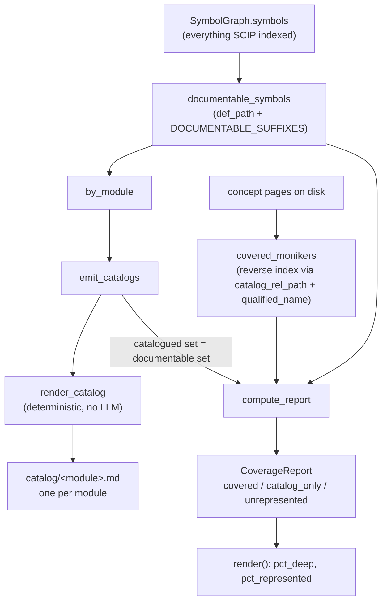

# Coverage — the whole-repo floor as a set-difference, not a graph walk

How wikify guarantees that *no module is silently dropped* from the wiki — by
subtracting "what the deep concept pages already cite" from "every symbol SCIP
enumerated," and deterministically generating a catalog page for whatever is left.

## Overview
Concept synthesis (the deep tier) is selective by design: it documents the
handful of mechanisms it is handed and deliberately skips per-file summaries, so
on its own it leaves whole subsystems invisible. Coverage is the *floor* against
that. Its key idea is the one in the module docstring: coverage is a
**set-difference over the SCIP symbol table, NOT a graph walk**. SCIP already
enumerated every symbol, so the floor never relies on *reachability* to find
code — only on enumeration. [`documentable_symbols`](../catalog/wikify/coverage.md#documentable_symbols)
is the universe; [`covered_monikers`](../catalog/wikify/coverage.md#covered_monikers)
is the deep-cited subset; the difference is "catalog-only," and
[`emit_catalogs`](../catalog/wikify/coverage.md#emit_catalogs) writes one
generated page per module for it. The result is two tiers feeding one wiki:
concept pages for *depth*, catalogs for *whole-repo representation* — and a
[`CoverageReport`](../catalog/wikify/coverage.md#compute_report) that grades how
much of each you have.

The non-obvious part is *why* a walk would fail. The architecturally
load-bearing edges in real repos are dynamic by design (a model invoked as
`model_parts[0](inputs)` through `nn.Module.__call__` leaves no static edge), so
traversal from entry points dies at that seam and a per-file "is this connected?"
check false-flags the unreached files as dead code. Enumeration sidesteps
dispatch entirely because it never asks about connectivity.

## Diagram

## Design rationale (why it's built this way)
The module docstring states the thesis outright: *"Coverage is a set-difference
over the SCIP symbol table, NOT a graph walk. SCIP already enumerated every
symbol, so we never rely on reachability to find code — only on enumeration."*
Three decisions follow from that.

First, **enumeration is the universe, and it is filtered, not traversed.**
[`documentable_symbols`](../catalog/wikify/coverage.md#documentable_symbols) is a
plain dict-comprehension over [`symbols`](../catalog/wikify/graph.md#SymbolGraph.symbols)
keeping only nodes that have a [`def_path`](../catalog/wikify/graph.md#Symbol.def_path)
(in-repo, not an external reference) and whose [`suffix`](../catalog/wikify/graph.md#Symbol.suffix)
is one of `Type`/`Method`/`Term` (a citable class/function/value, not a local or
type-param). There is no edge-following anywhere in the find step — that is the
whole point, and `test_documentable_excludes_external`
([`test_documentable_excludes_external`](../catalog/tests/test_coverage.md#test_documentable_excludes_external))
pins that symbols without a def fall out.

Second, **coverage is two-tier on purpose: depth vs. representation.**
[`compute_report`](../catalog/wikify/coverage.md#compute_report) does not ask
"is this documented yes/no"; it sorts every symbol into three bands — *covered*
(cited by a deep concept page), *catalog-only* (represented but only structurally),
and *unrepresented* (a bug — nothing should land here once catalogs are emitted).
The [`CoverageReport`](../catalog/wikify/coverage.md#compute_report) exposes both
[`pct_deep`](../catalog/wikify/coverage.md#CoverageReport.pct_deep) and
[`pct_represented`](../catalog/wikify/coverage.md#CoverageReport.pct_represented)
precisely so the two tiers are graded separately: you can be 100% *represented*
and only 15% *deep*, and that is a healthy state, not a failure.

Third, **catalog generation is deterministic — zero LLM.**
[`render_catalog`](../catalog/wikify/coverage.md#render_catalog)'s docstring is
explicit: *"Render one module's catalog page from the graph (no synthesis)."* The
hard Python/LLM split means the floor cannot hallucinate and cannot miss a file;
a module's own contents are a mechanical function of the graph.

> [!inferred]
> "Coverage ≠ connection." The catalog floor *represents* every module and
> connects symbols *within* a module (intra-module edges are real static calls),
> but it deliberately does not invent the missing trainer→model dynamic edge, nor
> unify N separate `Attention` classes into one concept. Those are separate,
> optional operations (devirtualization / concept-correspondence) — coverage's job
> is only to guarantee nothing is dropped, which it can do without ever resolving
> dispatch.

## Entry points
- [`coverage`](../catalog/wikify/cli.md#coverage) — the standalone CLI command
  (*"Report whole-repo coverage (set-difference over the SCIP symbol table)"*).
  Control reaches it when a user runs `wikify coverage <slug>` to inspect the
  health number; with `--emit` it also writes catalogs, otherwise it treats an
  existing `catalog/` dir's documentable set as represented and just prints
  [`compute_report(...).render()`](../catalog/wikify/coverage.md#compute_report).
- [`finalize`](../catalog/wikify/cli.md#finalize) — the real driver. Stage 6b calls
  [`emit_catalogs`](../catalog/wikify/coverage.md#emit_catalogs) *first* (catalogs
  are the symbol homes the citation linter resolves against, so they must exist
  before lint runs), then lints, then records reconcile state. This is where the
  whole-repo guarantee is materialized on every ingest.
- [`emit_catalogs`](../catalog/wikify/coverage.md#emit_catalogs) — the materializer:
  *"Write one catalog page per in-repo module. Returns (catalogued monikers,
  paths)."* The returned set is *exactly* the documentable set — that equality IS
  the whole-repo guarantee, and `test_report_classifies_covered_vs_catalog`
  ([`test_report_classifies_covered_vs_catalog`](../catalog/tests/test_coverage.md#test_report_classifies_covered_vs_catalog))
  asserts `catalogued == set(documentable_symbols(g))`.
- [`compute_report`](../catalog/wikify/coverage.md#compute_report) — the
  classifier: *"Classify every documentable symbol as covered / catalog-only /
  unrepresented."* The reporting head of the whole subsystem.

## Mechanism (step-by-step)
1. **Enumerate the universe (no walk).**
   [`documentable_symbols`](../catalog/wikify/coverage.md#documentable_symbols)
   filters the graph's [`symbols`](../catalog/wikify/graph.md#SymbolGraph.symbols)
   to in-repo, citable nodes — a [`def_path`](../catalog/wikify/graph.md#Symbol.def_path)
   exists and [`suffix`](../catalog/wikify/graph.md#Symbol.suffix) ∈ `{Type,
   Method, Term}`. This single set is "everything that *must* appear somewhere in
   the wiki." [`class_symbols`](../catalog/wikify/coverage.md#class_symbols) is the
   same filter narrowed to `suffix == "Type"`, used later to grade class coverage
   separately (classes are the architectural skeleton).

2. **Compute what the deep tier already covers.**
   [`covered_monikers`](../catalog/wikify/coverage.md#covered_monikers) builds a
   reverse index keyed by `(catalog page path, anchor)` and scans every concept
   page's markdown for `../catalog/<module>.md#<anchor>` citation links. Crucially
   it resolves those links **against the graph**, not against the catalog files —
   via [`catalog_rel_path`](../catalog/wikify/coverage.md#catalog_rel_path) (module
   file → page path) and [`qualified_name`](../catalog/wikify/coverage.md#qualified_name)
   (moniker → link-safe anchor) — so it works *while catalogs are still being
   generated*. The output maps each cited moniker → the concept slug that cites it.

3. **Take the difference and classify.**
   [`compute_report`](../catalog/wikify/coverage.md#compute_report) walks the
   documentable dict and bins each moniker: in `covered` →
   [`covered`](../catalog/wikify/coverage.md#CoverageReport.covered)++ (deep), else
   in the passed-in `catalogued` set →
   [`catalog_only`](../catalog/wikify/coverage.md#CoverageReport.catalog_only)++,
   else it is appended to *unrepresented*. The `catalogued` argument is the seam
   that makes the report honest about ordering: pass the planned catalog set to see
   post-catalog state, pass nothing to see pre-catalog (concept-only) state. It
   then grades classes — [`classes_represented`](../catalog/wikify/coverage.md#CoverageReport.classes_represented)
   counts [`class_symbols`](../catalog/wikify/coverage.md#class_symbols) that are
   covered or catalogued — and stashes a sample of up to ten
   [`uncovered_examples`](../catalog/wikify/coverage.md#CoverageReport.uncovered_examples)
   (by [`name`](../catalog/wikify/graph.md#Symbol.name)) so a non-empty floor is
   visible, not silent.

4. **Group the leftover by module.**
   [`by_module`](../catalog/wikify/coverage.md#by_module) buckets documentable
   monikers by their [`def_path`](../catalog/wikify/graph.md#Symbol.def_path) — the
   module *is* the file. This is the unit of catalog generation: one page mirrors
   one source file, so the catalog tree mirrors the source tree.

5. **Emit one catalog page per module — the guarantee made concrete.**
   [`emit_catalogs`](../catalog/wikify/coverage.md#emit_catalogs) iterates the
   [`by_module`](../catalog/wikify/coverage.md#by_module) buckets and writes
   `catalog/<module>.md` for each via
   [`render_catalog`](../catalog/wikify/coverage.md#render_catalog), accumulating
   every moniker into the returned `catalogued` set. Because it iterates *all*
   modules of the documentable set, that returned set equals the documentable set
   by construction — no subsystem can be skipped. It also resolves source links
   here: a `source_url` base (github `…/blob/<commit>`) is used verbatim, else a
   path **relative to each page** into the local repo (never absolute — a leading
   `/` would point at repo-root and break), else `""` disables links.

6. **Render each catalog deterministically from the graph.**
   [`render_catalog`](../catalog/wikify/coverage.md#render_catalog) partitions a
   module's monikers into classes (`suffix == "Type"`), their members (via
   [`_owner_class`](../catalog/wikify/coverage.md#_owner_class), which parses the
   moniker's [`descriptors`](../catalog/wikify/monikers.md#ParsedSymbol.descriptors)),
   and module-level defs. Each symbol becomes a detail bullet through
   [`_detail`](../catalog/wikify/coverage.md#render_catalog._detail) —
   `name(params)` from [`_params`](../catalog/wikify/coverage.md#_params)/[`_clean_sig`](../catalog/wikify/coverage.md#_clean_sig)
   (decorator lines stripped), a compact source link from
   [`_loc_line`](../catalog/wikify/coverage.md#render_catalog._loc_line)/[`_loc`](../catalog/wikify/coverage.md#render_catalog._loc),
   and the author's own [`doc_summary`](../catalog/wikify/graph.md#Symbol.doc_summary)
   when present. Public/documented members get full detail; undocumented
   dunder/private fold to a terse-but-present list — so nothing is dropped at the
   *symbol* level either (`test_member_detail_promotes_documented_and_folds_plumbing`,
   [`test_member_detail_promotes_documented_and_folds_plumbing`](../catalog/tests/test_coverage.md#test_member_detail_promotes_documented_and_folds_plumbing)).

7. **Connect symbols within and across modules — real static edges only.**
   [`class_connections`](../catalog/wikify/coverage.md#class_connections) rolls a
   class's member edges up to the class itself (so `self.attention = Attention(...)`
   counts as the class *using* `Attention`), unioning
   [`callees`](../catalog/wikify/graph.md#SymbolGraph.callees) and
   [`callers`](../catalog/wikify/graph.md#SymbolGraph.callers) over the member group
   and subtracting self-references. Those targets are rendered by
   [`_link_targets`](../catalog/wikify/coverage.md#render_catalog._link_targets),
   which filters test/example callers as noise, ranks the rest by
   [`importance`](../catalog/wikify/graph.md#SymbolGraph.importance) (so a cap keeps
   the load-bearing callers, not an alphabetical slice), and reports any hidden
   count rather than truncating silently (`test_used_by_excludes_tests_and_ranks_by_importance`,
   [`test_used_by_excludes_tests_and_ranks_by_importance`](../catalog/tests/test_coverage.md#test_used_by_excludes_tests_and_ranks_by_importance)).

8. **Grade and report.**
   [`render`](../catalog/wikify/coverage.md#CoverageReport.render) prints the
   plain-text scorecard: [`total`](../catalog/wikify/coverage.md#CoverageReport.total)
   documentable symbols, the deep count with
   [`pct_deep`](../catalog/wikify/coverage.md#CoverageReport.pct_deep), the
   catalog-only count, the [`represented`](../catalog/wikify/coverage.md#CoverageReport.represented)
   total with [`pct_represented`](../catalog/wikify/coverage.md#CoverageReport.pct_represented),
   class coverage, and the uncovered sample. Two percentages because the two tiers
   are graded independently.

## Key data structures
- **[`CoverageReport`](../catalog/wikify/coverage.md#compute_report)** — the
  classification result. The load-bearing fields are the three counts —
  [`covered`](../catalog/wikify/coverage.md#CoverageReport.covered) (deep),
  [`catalog_only`](../catalog/wikify/coverage.md#CoverageReport.catalog_only)
  (structural floor), and the derived
  [`represented`](../catalog/wikify/coverage.md#CoverageReport.represented) =
  covered + catalog_only — plus [`uncovered_examples`](../catalog/wikify/coverage.md#CoverageReport.uncovered_examples),
  the sample that should be empty post-catalog.
- **The documentable dict** — `{moniker → `[`Symbol`](../catalog/wikify/graph.md#Symbol)`}`
  from [`documentable_symbols`](../catalog/wikify/coverage.md#documentable_symbols),
  read off the [`SymbolGraph`](../catalog/wikify/graph.md#SymbolGraph). This single
  set is the universe everything is measured against.
- **The catalog frontmatter anchor map** — built by
  [`symbol_anchor_map`](../catalog/wikify/coverage.md#symbol_anchor_map) (`{anchor →
  moniker}`, higher-[`importance`](../catalog/wikify/graph.md#SymbolGraph.importance)
  symbol wins on collision). This is the linter's resolution table: because both
  the packet's citations and the catalog's frontmatter derive their anchors from the
  same [`qualified_name`](../catalog/wikify/coverage.md#qualified_name), what a
  concept page cites and what a catalog resolves always agree.

## Dynamics (design intent)
The ordering inside [`finalize`](../catalog/wikify/cli.md#finalize) is deliberate
and load-bearing: catalogs are emitted *before* lint, because a citation is a
catalog anchor and the linter resolves against catalog frontmatter — so the symbol
homes must exist first. The whole pass is single-threaded, pure Python, and a
deterministic function of the graph: same graph in ⇒ same catalogs out, which is
what lets `ingest` be an idempotent reconcile (re-running converges instead of
churning). Author docstrings are preferred over any synthesis — extracted via
[`doc_summary`](../catalog/wikify/graph.md#Symbol.doc_summary) from the symbol's
[`documentation`](../catalog/wikify/graph.md#Symbol.documentation)/[`docstring`](../catalog/wikify/graph.md#Symbol.docstring)
— so the floor carries ground-truth comprehension at zero model cost
(`test_docstring_extracted_into_catalog`,
[`test_docstring_extracted_into_catalog`](../catalog/tests/test_coverage.md#test_docstring_extracted_into_catalog)).

## Edge cases
- **Pre-catalog vs. post-catalog reporting.**
  [`compute_report`](../catalog/wikify/coverage.md#compute_report) with
  `catalogued=None` counts *only* concept coverage (everything not deep shows as
  unrepresented); pass the planned/emitted set to see the true post-catalog state.
  The `wikify coverage` CLI without `--emit` substitutes the existing `catalog/`
  dir's documentable set so the number isn't misleadingly low.
- **Empty repo / zero symbols.** The percentage properties
  ([`pct_deep`](../catalog/wikify/coverage.md#CoverageReport.pct_deep),
  [`pct_represented`](../catalog/wikify/coverage.md#CoverageReport.pct_represented))
  guard `total == 0` and return `0.0` rather than dividing by zero.
- **Anchor collisions across same-named symbols.**
  [`symbol_anchor_map`](../catalog/wikify/coverage.md#symbol_anchor_map) keeps the
  higher-[`importance`](../catalog/wikify/graph.md#SymbolGraph.importance) moniker
  when two symbols share a qualified name in one module, so resolution stays
  deterministic; [`_link_targets`](../catalog/wikify/coverage.md#render_catalog._link_targets)
  appends the [`qualified_name`](../catalog/wikify/coverage.md#qualified_name) anchor
  to cross-links so two classes' `__call__` don't collapse to the same target.
- **Source links must be relative.**
  [`emit_catalogs`](../catalog/wikify/coverage.md#emit_catalogs) computes a path
  relative to each page for local repos; an absolute `/path` in markdown means
  repo-root and would be a broken link, so it is never emitted.

## Open questions
- The exact set of `DOCUMENTABLE_SUFFIXES` and the `_is_noise_path` segment list
  live in `coverage.py` module scope but are not citable symbols in this packet's
  subgraph, so the precise membership ("which suffixes / which path segments") is
  described here from reading the source, not from a cited symbol.
- How the *agenda* of deep concept pages is chosen upstream (which symbols become
  "covered" in the first place) is owned by `discover.py` —
  [`module_importance`](../catalog/wikify/discover.md#module_importance) is the
  centrality input — and is out of scope for the coverage floor itself.

## See also
- `catalog/wikify/coverage.md` — the module's own catalog (every symbol cited here,
  with source links).
- `concepts/wikify-graph` — the [`SymbolGraph`](../catalog/wikify/graph.md#SymbolGraph)
  and [`importance`](../catalog/wikify/graph.md#SymbolGraph.importance) ranking that
  enumeration and catalog ordering rest on.
