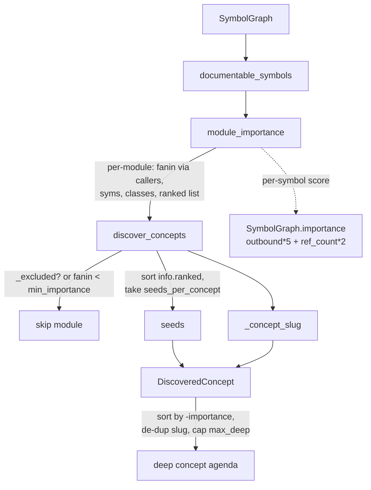

# wikify-discover: the derived comprehension agenda

How wikify decides *what to write a deep page about* — without anyone hand-listing concepts. The agenda is **computed from the code's own topology**, ranked by centrality, auto-seeded from the most-referenced symbols, and made reproducible so the same commit always yields the same plan.

## Overview
The headline problem this module solves: a top-down, concern-driven wiki is selective *on purpose* (it avoids shallow per-file summaries), so someone has to choose which subsystems deserve a deep mechanism page. Hand-authoring that list is exactly the bookkeeping the project refuses to do. `wikify-discover` replaces the author with a pure-Python ranking pass: it treats each **module** (def-file) as a candidate concept, scores it by the aggregate inbound fan-in of its symbols, drops the test/example/vendored tail, and emits the top units as [`DiscoveredConcept`](../catalog/wikify/discover.md#DiscoveredConcept) specs — each pre-seeded with its highest-centrality symbols so the downstream packet builder knows where to anchor. The module docstring states the contract plainly: it "only *selects and seeds*; synthesis (LLM) writes the pages for the units this picks." No model is called here; the selection is the deterministic half of the hard Python/LLM split.

The single key idea: **importance is a graph property, not an opinion.** A module matters in proportion to how much the rest of the repo *refers to* it, and the most-referred symbol inside it is the natural seed. Everything else — exclusion, slug naming, de-duplication, ordering — exists to make that ranking stable and legible.

## Diagram

## Design rationale (why it's built this way)
**Why the *module* is the unit, scored by fan-in.** The module docstring spells out the model: "A concept unit is a *module* (the def file); its importance is the aggregate centrality (inbound fan-in) of its symbols; the deep tier is the top units by importance." [`module_importance`](../catalog/wikify/discover.md#module_importance) computes that aggregate by summing `len(graph.callers(m))` over every documentable symbol `m` in the module — using [`callers`](../catalog/wikify/graph.md#SymbolGraph.callers), the reference-derived inbound adjacency. Fan-in is the right signal because a subsystem that the rest of the repo depends on is, almost by definition, what a reader needs to understand first.

**Two different "importance" numbers, deliberately.** There is a subtle but intentional split. A *module's* rank is pure inbound fan-in (how much is this depended upon), while a *symbol's* seed rank inside that module uses [`SymbolGraph.importance`](../catalog/wikify/graph.md#SymbolGraph.importance) — `outbound*5 + ref_count*2`, the "context-sherpa" score that favours symbols that both reach out and are referenced. So a module is chosen because the world points *at* it, but its seed is chosen because it is the richest hub *within* it. [`module_importance`](../catalog/wikify/discover.md#module_importance) stores both in its per-module `ranked` list as `(graph.importance(m), fanin, m)` tuples, so the later seed-selection can sort on the symbol score while the module total stays fan-in.

**Why exclusion happens by path substring, before ranking.** [`_excluded`](../catalog/wikify/discover.md#_excluded) is a blunt instrument on purpose: `any(e in path for e in excludes)` against [`DEFAULT_EXCLUDES`](../catalog/wikify/discover.md#DEFAULT_EXCLUDES). The comment on that tuple explains the breadth — it covers both torchtitan's `tests/` and xla's `test/`/`examples/` conventions, plus vendored `third_party/`. The intent (per the tuple's comments) is *not* to hide that code: vendored and test code is still cataloged for coverage, but "never elevate it to a *concept* — a deep page about bundled {fmt} is noise." Selectivity for depth, full representation for coverage — two different jobs.

**Why determinism is a first-class requirement.** The `discover_concepts` docstring ends with one word: "Deterministic." That is load-bearing because the whole project is built on *idempotent reconcile* — re-running ingest on the same commit must converge to the same wiki. A non-deterministic agenda would make every re-run churn pages. Determinism here comes from three sources: a fixed sorted iteration when picking seeds (`sorted(info["ranked"], reverse=True)`), a stable final sort by `-importance`, and an ordered de-dup loop. No randomness, no hash-order dependence in the output.

> [!inferred]
> Python dict iteration order is insertion order, so `module_importance` returns modules in symbol-discovery order; `discover_concepts` then re-sorts by `-c.importance`, which makes the *output* order independent of dict iteration. Ties in `importance` are not explicitly broken in the final sort, so two equally-central modules could in principle swap — but the slug de-dup that follows still produces stable slug *assignment* for a fixed input.

## Entry points
- [`discover_concepts`](../catalog/wikify/discover.md#discover_concepts) — the one public entry. Control reaches it from the CLI's [`prepare`](../catalog/wikify/cli.md#prepare) command (Stage 5), which calls it on the built graph, turns each spec's [`seeds`](../catalog/wikify/discover.md#DiscoveredConcept.seeds) into a seedmap, and folds the discovered slugs into the ingest agenda. It returns the ranked, de-duplicated list of deep-concept specs and nothing else — selection only.
- [`module_importance`](../catalog/wikify/discover.md#module_importance) — the scoring core, called first inside `discover_concepts`. It is the bridge from the [`SymbolGraph`](../catalog/wikify/graph.md#SymbolGraph) to per-module statistics; reachable on its own for inspection but primarily an internal step.

## Mechanism (step-by-step)
1. **Enumerate what is worth scoring.** [`module_importance`](../catalog/wikify/discover.md#module_importance) begins by calling [`documentable_symbols`](../catalog/wikify/coverage.md#documentable_symbols), which filters the graph's [`symbols`](../catalog/wikify/graph.md#SymbolGraph.symbols) down to those with a real definition and a citable [`suffix`](../catalog/wikify/graph.md#Symbol.suffix) in `{Type, Method, Term}`. This matters because discovery never ranks external or undefinable nodes — it only considers symbols the wiki could actually cite, the same population coverage uses. Enumeration (not graph traversal) is what guarantees nothing is silently unreachable.

2. **Aggregate each symbol into its module.** For every documentable [`Symbol`](../catalog/wikify/graph.md#Symbol), `module_importance` groups by its [`def_path`](../catalog/wikify/graph.md#Symbol.def_path) and accumulates a small record: `fanin += len(graph.callers(m))`, a symbol count, a class count (incremented when [`suffix`](../catalog/wikify/graph.md#Symbol.suffix) is `"Type"`), and an append to the `ranked` list of `(graph.importance(m), fanin, m)`. The module's centrality is thus the *sum* of its symbols' inbound references via [`callers`](../catalog/wikify/graph.md#SymbolGraph.callers) — a busy module of many lightly-used symbols and a lean module with one heavily-used symbol can land at the same rank, which is the intended "importance is mass × usage" behaviour.

3. **Filter the module list down to deep candidates.** [`discover_concepts`](../catalog/wikify/discover.md#discover_concepts) walks the modules and drops any where [`_excluded`](../catalog/wikify/discover.md#_excluded) matches a [`DEFAULT_EXCLUDES`](../catalog/wikify/discover.md#DEFAULT_EXCLUDES) prefix, or where `info["fanin"] < min_importance` (default 25). This is the "exclude the experiment/test/script tail" rule from the module docstring, applied as a hard gate so low-centrality and non-library modules never become deep pages — they fall through to the catalog tier instead.

4. **Auto-seed from the highest-centrality symbols.** For each surviving module, `discover_concepts` does `ranked = sorted(info["ranked"], reverse=True)` and takes the first `seeds_per_concept` monikers as [`seeds`](../catalog/wikify/discover.md#DiscoveredConcept.seeds). Because `ranked` tuples lead with [`SymbolGraph.importance`](../catalog/wikify/graph.md#SymbolGraph.importance), the seeds are the module's richest hubs — "no hand-seeding," exactly as the module header promises. The test [`test_central_module_ranked_first_and_seeded`](../catalog/tests/test_discover.md#test_central_module_ranked_first_and_seeded) pins this: it asserts the highest-centrality symbol of the top module appears in that module's `seeds`.

5. **Name the concept readably.** Each spec's slug comes from [`_concept_slug`](../catalog/wikify/discover.md#_concept_slug), which strips the `.py` extension and `__init__`, drops a known umbrella package (`torchtitan`/`src`), and collapses a repeated trailing leaf (`models/llama3/model/model` → `models-llama3-model`). The result is a human-meaningful slug rather than a path. [`test_slugs_are_unique_and_readable`](../catalog/tests/test_discover.md#test_slugs_are_unique_and_readable) checks that `demo/core.py` becomes `demo-core`.

6. **Materialize, order, de-duplicate, cap.** Each surviving module becomes a [`DiscoveredConcept`](../catalog/wikify/discover.md#DiscoveredConcept) carrying its [`slug`](../catalog/wikify/discover.md#DiscoveredConcept.slug), [`module`](../catalog/wikify/discover.md#DiscoveredConcept.module), [`importance`](../catalog/wikify/discover.md#DiscoveredConcept.importance) (= module fan-in), seeds, [`symbol_count`](../catalog/wikify/discover.md#DiscoveredConcept.symbol_count), and [`class_count`](../catalog/wikify/discover.md#DiscoveredConcept.class_count). The list is sorted by `-importance`, then a `seen`-set loop disambiguates colliding slugs by suffixing `-2`, `-3`, … (distinct modules can collapse to the same slug), and finally the list is truncated to `max_deep` (default 24). The cap is the budget knob: only the top N modules ever get an LLM-written page.

## Key data structures
- [`DiscoveredConcept`](../catalog/wikify/discover.md#DiscoveredConcept) — the output unit. A dataclass binding a [`slug`](../catalog/wikify/discover.md#DiscoveredConcept.slug) (mutable: rewritten during de-dup), the source [`module`](../catalog/wikify/discover.md#DiscoveredConcept.module) path, the module-level [`importance`](../catalog/wikify/discover.md#DiscoveredConcept.importance), the auto-derived [`seeds`](../catalog/wikify/discover.md#DiscoveredConcept.seeds), and [`symbol_count`](../catalog/wikify/discover.md#DiscoveredConcept.symbol_count) / [`class_count`](../catalog/wikify/discover.md#DiscoveredConcept.class_count) for display.
- The per-module dict from [`module_importance`](../catalog/wikify/discover.md#module_importance) — transient `{fanin, syms, classes, ranked}`; only `fanin` and `ranked` drive selection, the rest is reporting.
- [`SymbolGraph`](../catalog/wikify/graph.md#SymbolGraph) — the read-only substrate. Discovery only *reads* it, through [`callers`](../catalog/wikify/graph.md#SymbolGraph.callers) (fan-in), [`importance`](../catalog/wikify/graph.md#SymbolGraph.importance) (seed rank), and [`symbols`](../catalog/wikify/graph.md#SymbolGraph.symbols).

## Dynamics (design intent)
Discovery is a single-pass, pure-function pipeline: read graph → score → filter → seed → order. There is no model call and no I/O, so it is fast and replayable. The reproducibility guarantee is explicit in the [`discover_concepts`](../catalog/wikify/discover.md#discover_concepts) docstring ("Deterministic") and enforced by the test suite: [`test_excludes_tests_and_low_importance`](../catalog/tests/test_discover.md#test_excludes_tests_and_low_importance) confirms `demo/tests/test_core.py` never reaches the concept tier, and [`test_central_module_ranked_first_and_seeded`](../catalog/tests/test_discover.md#test_central_module_ranked_first_and_seeded) pins the rank-and-seed contract against a fixed fixture graph. The relationship to the *light tier* in the same module ([`detect_communities`](../catalog/wikify/discover.md#detect_communities) / [`label_propagation`](../catalog/wikify/discover.md#label_propagation) / [`pareto_communities`](../catalog/wikify/discover.md#pareto_communities)) is a deliberate parallel: both pre-restrict to the library via the same exclude rule (here as a per-module gate, there via [`_library_nodes`](../catalog/wikify/discover.md#_library_nodes)) so test drivers never contaminate the result.

## Edge cases
- **A module with all symbols filtered out** never appears in `module_importance`'s output (it groups only over [`documentable_symbols`](../catalog/wikify/coverage.md#documentable_symbols)), so it cannot be a concept regardless of its raw size.
- **Slug collisions across distinct modules** are resolved by numeric suffixing inside [`discover_concepts`](../catalog/wikify/discover.md#discover_concepts), mutating [`slug`](../catalog/wikify/discover.md#DiscoveredConcept.slug) in place — so the returned slugs are unique even though [`_concept_slug`](../catalog/wikify/discover.md#_concept_slug) is not injective.
- **`min_importance` is a fan-in floor, not a symbol-count floor**: a module of many trivial, never-referenced symbols can have high `syms` but `fanin = 0` and be dropped, while a single heavily-referenced class clears the bar alone.
- **The `max_deep` cap silently truncates**: modules ranked below position 24 get no deep page (they remain in the catalog tier). This is intended budgeting, not an error.

## Open questions
- The final sort by `-c.importance` does not specify a tiebreaker for equal-fan-in modules; the symbols needed to confirm whether ties are stable across runs (the underlying dict construction order) are not in this packet's subgraph. Flagged rather than asserted.
- How [`prepare`](../catalog/wikify/cli.md#prepare) merges config-authored concepts with discovered ones (override vs. extend on slug collision) is visible in the source comment but the config `Concept` type is outside this subgraph — see the cli/config concept page.

## See also
- `concepts/wikify-coverage` — the set-difference floor that catalogs every module discovery *doesn't* elevate to a deep page; shares [`documentable_symbols`](../catalog/wikify/coverage.md#documentable_symbols).
- `concepts/wikify-graph` — the [`SymbolGraph`](../catalog/wikify/graph.md#SymbolGraph) and the [`importance`](../catalog/wikify/graph.md#SymbolGraph.importance) / [`callers`](../catalog/wikify/graph.md#SymbolGraph.callers) signals discovery ranks on.
- The light community tier in this same module ([`detect_communities`](../catalog/wikify/discover.md#detect_communities), [`pareto_communities`](../catalog/wikify/discover.md#pareto_communities)).
