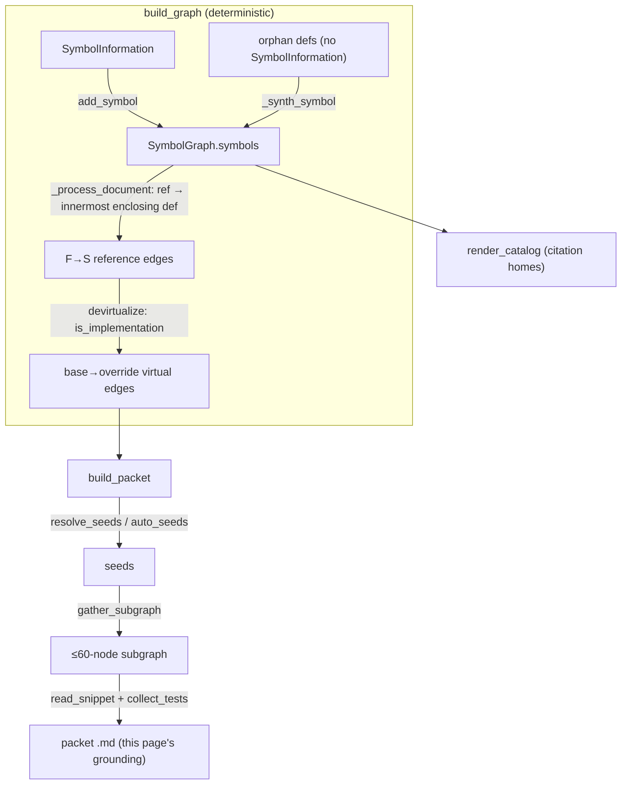

# The symbol graph — citation namespace, reference edges, and per-concept packets

How SCIP symbols and their references become an in-repo graph, and how each concept page is grounded by carving a small, relevance-bounded subgraph out of it.

## Overview
The symbol graph is the load-bearing data model of wikify: it is simultaneously the **citation namespace** the linter resolves wiki citations against, and the **call-ish graph** that discovery and packet-building traverse. The key design idea is a deliberate two-part approximation. First, nodes are SCIP symbols keyed by their stable moniker ([`Symbol`](../catalog/wikify/graph.md#Symbol), held in [`SymbolGraph`](../catalog/wikify/graph.md#SymbolGraph)); edges are *not* true calls — SCIP has no "call" role — but a **reference-scoping heuristic**: "the body of F contains a reference to in-repo symbol S." Second, because that static heuristic dies at dynamic dispatch, a class-hierarchy pass ([`devirtualize`](../catalog/wikify/graph.md#devirtualize)) adds *virtual* base→override edges so traversal can cross the seam. Everything downstream — coverage, discovery, and the per-concept packet ([`build_packet`](../catalog/wikify/packet.md#build_packet)) — reads this one structure; nothing in it calls a model.

## Diagram

## Design rationale (why it's built this way)
The whole subsystem is shaped by one admission the author makes up front: **SCIP gives occurrences, not calls.** The docstring on [`SymbolGraph`](../catalog/wikify/graph.md#SymbolGraph) states the edge semantics precisely — directed `F -> S` meaning "the body of F contains a reference to in-repo symbol S (an approximation of a call)." Naming the edges "calls/refs" rather than "calls" is an honesty decision, not a hedge: the grounding the wiki ships must not overclaim a call edge the indexer never proved.

That heuristic has a known blind spot, and the second design decision is to patch it explicitly rather than pretend it isn't there. [`devirtualize`](../catalog/wikify/graph.md#devirtualize)'s docstring spells out the failure: a call like `model_parts[0](x)` reaches `nn.Module.__call__` → the *base* `forward`, but the real work is an override that no static reference edge points to, so a walk from a trainer dies at the base. The fix uses SCIP's `is_implementation` relationship to add `T → S` (base → override). Crucially these edges are kept in a *separate* `virtual_edges` set so they can be labelled `(virtual)` and audited — the wiki distinguishes a proven static reference from a recovered dispatch possibility.

> [!inferred]
> Keeping virtual edges separate also lets the importance rank stay reference-based while traversal still benefits from the recovered edges — the two concerns (ranking vs. reachability) don't contaminate each other.

A third decision is resilience: pyright sometimes drops the `SymbolInformation` for a symbol (e.g. when type-checking a huge class fails) while still emitting its definition occurrence. Rather than lose that symbol from the citation namespace, [`_synth_symbol`](../catalog/wikify/scip_index.md#_synth_symbol) rebuilds a minimal node from the moniker alone, so partial type-check failures don't silently drop whole files from coverage.

## Entry points
- [`build_graph`](../catalog/wikify/scip_index.md#build_graph) — the deterministic constructor. Given one *or more* parsed SCIP indexes (a scip-python index plus a scip-clang index for a mixed C++/Python repo), it unions them into a single [`SymbolGraph`](../catalog/wikify/graph.md#SymbolGraph). Reached once per ingest after indexing; `test_merge_cpp_and_python` ([`test_merge_cpp_and_python`](../catalog/tests/test_cpp_ingestion.md#test_merge_cpp_and_python)) pins the mixed-language union path.
- [`index_repo`](../catalog/wikify/scip_index.md#index_repo) — the end-to-end wrapper (run indexer → parse → [`build_graph`](../catalog/wikify/scip_index.md#build_graph)); where ingestion enters when starting from raw source rather than a pre-built `.scip` file.
- [`build_packet`](../catalog/wikify/packet.md#build_packet) — the read side. For one concept it carves a subgraph and renders the markdown packet (subgraph + snippets + test evidence) that grounds *this very page*; reached once per concept during `prepare`.

## Mechanism (step-by-step)
1. **Node pass — populate the citation namespace.** [`build_graph`](../catalog/wikify/scip_index.md#build_graph) walks every document of every index and, for each global `SymbolInformation`, parses the moniker, drops locals/parameters, and registers a [`Symbol`](../catalog/wikify/graph.md#Symbol) via [`add_symbol`](../catalog/wikify/graph.md#SymbolGraph.add_symbol). `add_symbol` is the only insert point — it seeds the node in [`symbols`](../catalog/wikify/graph.md#SymbolGraph.symbols) and initializes its empty adjacency/ref-count entries. The authoritative identity of a node is its `moniker`; the human-facing [`name`](../catalog/wikify/graph.md#Symbol.name) is just the terminal descriptor used for display and seed matching.
2. **Orphan recovery.** Before edges are derived, a second occurrence sweep finds symbols that have a Definition-role occurrence but no `SymbolInformation` and synthesizes a node for each via [`_synth_symbol`](../catalog/wikify/scip_index.md#_synth_symbol). Doing this *before* the edge pass is deliberate so that later cross-document references to a recovered symbol still resolve to a real node; `test_recovered_symbol_joins_with_existing_references` ([`test_recovered_symbol_joins_with_existing_references`](../catalog/tests/test_ast_fallback.md#test_recovered_symbol_joins_with_existing_references)) pins that a normal reference connects to an AST-recovered def.
3. **Edge pass — reference scoping.** [`_process_document`](../catalog/wikify/scip_index.md#_process_document) is where the "call-ish" structure is actually derived, per document. It splits occurrences into definitions (with a body *span*, preferring SCIP's enclosing range, else `[def start, next def start)`) and references. For each non-import reference it finds the **innermost** enclosing definition F and records an edge F→S; every reference also bumps S's `ref_count`. Imports are counted but never produce an edge — "imports are not calls." The innermost-span rule is what makes the heuristic reasonable: a reference is attributed to the tightest function that lexically contains it, not the module.
4. **Devirtualization — cross the dispatch seam.** [`devirtualize`](../catalog/wikify/graph.md#devirtualize) runs last inside [`build_graph`](../catalog/wikify/scip_index.md#build_graph). It scans each node's `is_implementation` relationships and adds a base→override virtual edge wherever one is missing, returning the count added. `test_devirtualize_adds_base_to_override_edge` ([`test_devirtualize_adds_base_to_override_edge`](../catalog/tests/test_devirt_subgraph.md#test_devirtualize_adds_base_to_override_edge)) pins the edge creation, and `test_devirtualize_connects_a_caller_through_the_base` ([`test_devirtualize_connects_a_caller_through_the_base`](../catalog/tests/test_devirt_subgraph.md#test_devirtualize_connects_a_caller_through_the_base)) pins the payoff: a caller that referenced the base now reaches the real override through it.
5. **Carve the per-concept subgraph.** [`build_packet`](../catalog/wikify/packet.md#build_packet) turns seed tokens into monikers with [`resolve_seeds`](../catalog/wikify/packet.md#resolve_seeds) (falling back to the top-importance callables via [`auto_seeds`](../catalog/wikify/packet.md#auto_seeds) when nothing resolves), then calls [`gather_subgraph`](../catalog/wikify/packet.md#gather_subgraph) to select a relevance-bounded neighbourhood. Per its docstring, `gather_subgraph` expands a `MAX_HOPS` frontier of callees plus one hop of the seeds' callers, scores every candidate by **importance ÷ (1 + distance from a seed)**, and fills a budget by score — so a hub like `nn.Module` with 1000+ callers contributes its central collaborators, not an arbitrary BFS-order first-50. Seeds are always kept; ties break on the moniker string for determinism.
6. **Render the grounding packet.** Still inside [`build_packet`](../catalog/wikify/packet.md#build_packet), each selected symbol is printed with its `cite:` link, signature, docstring summary, and in-subgraph edges — edge labels run through [`_edge_name`](../catalog/wikify/packet.md#_edge_name)/[`_short`](../catalog/wikify/packet.md#_short), which tag dispatch edges `(virtual)`. Source bodies come from [`read_snippet`](../catalog/wikify/source.md#read_snippet) and exercising tests from [`collect_tests`](../catalog/wikify/evidence.md#collect_tests). The returned subgraph moniker list is written as a sidecar so the linter can later reject any citation outside it.

## Key data structures
[`SymbolGraph`](../catalog/wikify/graph.md#SymbolGraph) holds the whole model: the node map [`symbols`](../catalog/wikify/graph.md#SymbolGraph.symbols) (moniker → [`Symbol`](../catalog/wikify/graph.md#Symbol)), the two directed adjacency views, a per-moniker reference count and reference-location list, and the separate `virtual_edges` set for audited dispatch edges. Each [`Symbol`](../catalog/wikify/graph.md#Symbol) is a dataclass whose `moniker` is the authoritative id and whose [`name`](../catalog/wikify/graph.md#Symbol.name) is the terminal display name; the optional [`def_path`](../catalog/wikify/graph.md#Symbol.def_path) (filled lazily in the edge pass, first occurrence wins) is what makes a symbol *citable* — a node without a def has no catalog home and the packet marks it "external — do not cite."

> [!inferred]
> The importance rank used for selection appears to be `outbound_edges*5 + ref_count*2` (read from `graph.py` source); it is a deliberately cheap, clustering-free centrality proxy. It is stated here from source rather than cited because the rank accessor itself is not in this packet's subgraph.

## Dynamics (design intent)
Graph construction is strictly ordered and single-pass-per-stage: all nodes (including synthesized orphans) exist before any edge is drawn, and [`devirtualize`](../catalog/wikify/graph.md#devirtualize) runs only after the reference edges are complete, so a virtual edge is added only when no static one already exists. Selection is designed to be fully deterministic — [`gather_subgraph`](../catalog/wikify/packet.md#gather_subgraph) breaks score ties on the moniker string, and `test_subgraph_keeps_high_importance_over_low_within_budget` ([`test_subgraph_keeps_high_importance_over_low_within_budget`](../catalog/tests/test_devirt_subgraph.md#test_subgraph_keeps_high_importance_over_low_within_budget)) and `test_subgraph_always_keeps_seeds_and_respects_budget` ([`test_subgraph_always_keeps_seeds_and_respects_budget`](../catalog/tests/test_devirt_subgraph.md#test_subgraph_always_keeps_seeds_and_respects_budget)) pin the two invariants: prefer high-importance neighbours within budget, and never evict a seed nor exceed the cap.

## Edge cases
- A reference whose target has no enclosing definition (module-level code) produces no edge — only nodes wrapped by a def can be edge sources, per [`_process_document`](../catalog/wikify/scip_index.md#_process_document).
- Imports increment `ref_count` (so they influence importance) but are skipped as edges, so import-only relationships never masquerade as calls.
- A symbol with no `def_path` survives in the graph but is non-citable; the union build in [`build_graph`](../catalog/wikify/scip_index.md#build_graph) keeps cross-language nodes distinct purely by moniker, so a name collision across C++ and Python does not merge two symbols (`test_merge_cpp_and_python` [`test_merge_cpp_and_python`](../catalog/tests/test_cpp_ingestion.md#test_merge_cpp_and_python)).

## Open questions
- The exact importance-rank accessor and the `MAX_HOPS`/`MAX_SUBGRAPH` budget constants are read from source but their tuning rationale isn't captured in this subgraph's symbols.
- How discovery consumes graph centrality (e.g. [`module_importance`](../catalog/wikify/discover.md#module_importance), [`discover_concepts`](../catalog/wikify/discover.md#discover_concepts), [`detect_communities`](../catalog/wikify/discover.md#detect_communities)) to choose *which* concepts get packets in the first place is adjacent to this page and documented under the discovery concept.

## See also
- [`render_catalog`](../catalog/wikify/coverage.md#render_catalog) / [`documentable_symbols`](../catalog/wikify/coverage.md#documentable_symbols) — how the same graph is enumerated into per-module catalog pages (the citation *homes* this page's links resolve into).
- [`module_importance`](../catalog/wikify/discover.md#module_importance), [`discover_concepts`](../catalog/wikify/discover.md#discover_concepts) — the centrality-driven agenda that picks concepts and seeds.
