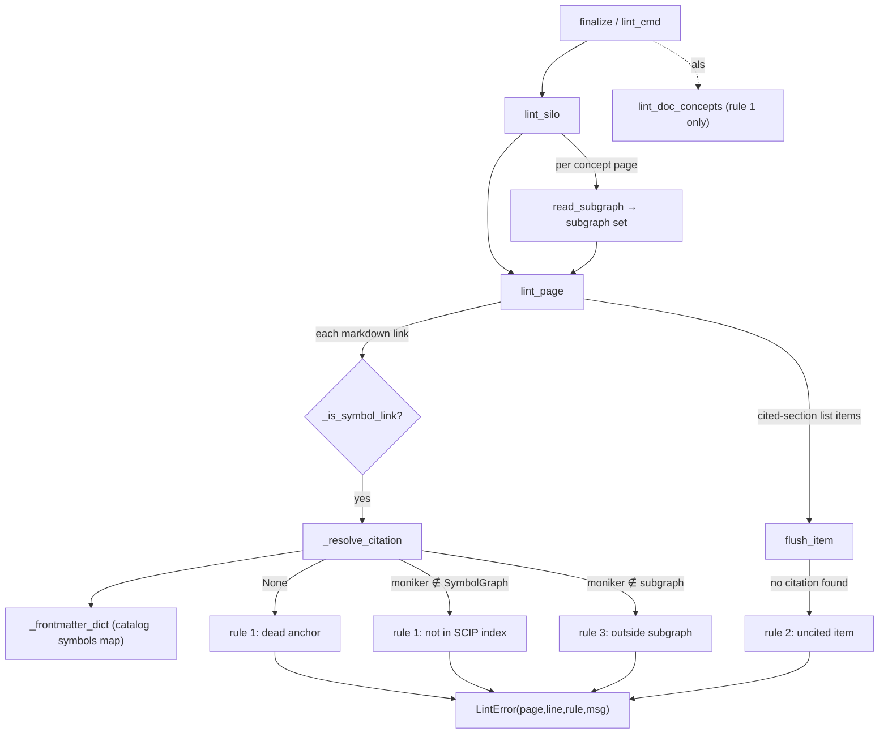

# wikify-lint — the citation linter, a hard hallucination floor over concepts/

How `finalize` decides whether an agent-written concept page is allowed to ship: every
symbol citation must resolve to a real, in-subgraph SCIP symbol, and every claim in a
load-bearing section must carry one.

## Overview
The linter is the deterministic gate that makes the wiki *trustable*. Synthesis is an
LLM writing prose; this stage is pure Python that reads that prose back and refuses any
page whose grounding is fake. The key design idea: grounding is checkable *without NLP*
because the rules are scoped to syntax the agent must use anyway — a citation is a
markdown link into a module **catalog** (`../catalog/<module>.md#anchor`), and the
sections that must be cited are named headings (`## Entry points`, `## Mechanism`) full
of list items. So the linter never judges meaning; it checks that links resolve, that
they point at symbols the packet authorized, and that cited sections aren't bluffing.
Three rules, each a hard FAIL, reported as `page:line [rule N] message` via
[`LintError`](../catalog/wikify/lint.md#LintError); the page-level verdict is a
[`LintReport`](../catalog/wikify/lint.md#LintReport) whose `.ok` is simply "no errors".

The three rules, as the module docstring states them:
1. **Rule 1 — resolvable.** Every symbol citation links into a catalog with an anchor
   that resolves, via that catalog's frontmatter `symbols` map, to a moniker present in
   the silo's SCIP graph. A dead anchor or a moniker the index never saw = FAIL.
2. **Rule 2 — cited where it counts.** In `## Entry points` and `## Mechanism`, every
   list item carries ≥1 symbol citation or an evidence link — unless it sits inside a
   `> [!inferred]` block. An uncited assertion there = FAIL.
3. **Rule 3 — in-subgraph.** No page may cite a symbol absent from *this* concept's
   packet subgraph. This is the anti-hallucination catch: a symbol that exists in the
   repo but wasn't handed to this packet is still a FAIL, because the agent had no
   grounded basis to mention it.

## Diagram

## Design rationale (why it's built this way)
The whole stage exists because invariant 3 — "grounding before prose" — cannot be a
prompt instruction the model is trusted to obey; it has to be a build gate it cannot
talk its way past. The non-obvious choices all follow from "checkable without a model":

- **Citations are catalog anchors, not free symbol names.** A citation only counts if
  [`_is_symbol_link`](../catalog/wikify/lint.md#_is_symbol_link) recognizes it — the
  link's path contains `catalog/`, ends in `.md`, and carries a `#anchor`. That single
  predicate is what lets the linter resolve a human-readable label to an authoritative
  moniker deterministically, with no name-matching heuristics.
- **Resolution goes through the catalog's own frontmatter**, so the linter and the
  catalog generator share one source of truth for the anchor format.
  [`_resolve_citation`](../catalog/wikify/lint.md#_resolve_citation) reads the target
  catalog's `symbols` map and reconstructs `symbol_base + suffix` — the catalog factors
  out the common moniker prefix to stay compact, and the docstring notes the fallback
  for "older, uncompressed catalogs" with no `symbol_base`.
- **Rule 2 is scoped to two named sections, not the whole page.** Overview prose may
  flow freely; only `## Entry points` and `## Mechanism` (matched by prefix against
  [`_CITED_SECTIONS`](../catalog/wikify/lint.md#_CITED_SECTIONS)) demand a citation per
  item. This is the deliberate seam that keeps the rule mechanical: "a list item in a
  cited section" is a syntactic notion.
- **`> [!inferred]` is a sanctioned escape hatch, not a loophole.** The agent is told to
  put ungroundable claims in inferred blocks; the linter honors that by exempting them
  from rule 2 — so the pressure is to *label* a guess, never to fabricate a citation for
  it.

## Entry points
- [`finalize`](../catalog/wikify/cli.md#finalize) — Stage 6. After it emits the module
  catalogs (the symbol homes citations resolve against), it runs
  [`lint_silo`](../catalog/wikify/lint.md#lint_silo) over `concepts/` plus the lighter
  [`lint_doc_concepts`](../catalog/wikify/lint.md#lint_doc_concepts) over
  `doc-concepts/`, merges both into one [`LintReport`](../catalog/wikify/lint.md#LintReport),
  and on any error prints each `page:line [rule N]` line and exits non-zero — the wiki
  does not assemble. This is *the* gate.
- [`lint_cmd`](../catalog/wikify/cli.md#lint_cmd) — the standalone `wikify lint <slug>`
  command, the same gate re-runnable in isolation; `--fix` routes through
  [`fix_silo`](../catalog/wikify/fix.md#fix_silo) to auto-repair first, then re-lints.
- [`lint_silo`](../catalog/wikify/lint.md#lint_silo) — the per-silo driver: it globs
  every `concepts/*.md`, loads that concept's authorized symbol set via
  [`read_subgraph`](../catalog/wikify/packet.md#read_subgraph), and accumulates the
  errors from [`lint_page`](../catalog/wikify/lint.md#lint_page).

## Mechanism (step-by-step)
1. **Load the authorization set per page.** For each concept page,
   [`lint_silo`](../catalog/wikify/lint.md#lint_silo) calls
   [`read_subgraph`](../catalog/wikify/packet.md#read_subgraph), which reads
   `<cache>/packets/<slug>/<concept>.subgraph.txt` into a `set[str]` of monikers — the
   exact symbols the packet authorized this page to cite. A missing file yields the
   empty set, which (per rule 3's `if subgraph and …` guard) disables the subgraph check
   rather than failing every citation — important for pages that have no packet.
2. **Walk the page line by line tracking section and inferred state.**
   [`lint_page`](../catalog/wikify/lint.md#lint_page) scans the lines, updating `section`
   on every `## ` heading and flipping `in_inferred` on when it sees `[!inferred]` (and
   off when the blockquote ends). This per-line state is what makes rules 2 and 3
   context-sensitive without parsing markdown into a tree.
3. **Enforce rules 1 and 3 on every citation.** For each `[label](target)` matched by
   [`_LINK`](../catalog/wikify/lint.md#_LINK) that
   [`_is_symbol_link`](../catalog/wikify/lint.md#_is_symbol_link) recognizes as a catalog
   anchor, [`lint_page`](../catalog/wikify/lint.md#lint_page) resolves it through
   [`_resolve_citation`](../catalog/wikify/lint.md#_resolve_citation): `None` → rule 1
   "dead citation"; a moniker not in the [`SymbolGraph`](../catalog/wikify/graph.md#SymbolGraph)
   → rule 1 "not in the SCIP index"; a moniker present but outside the page's `subgraph`
   → rule 3 "outside packet subgraph". The three failure modes are checked in that order,
   each short-circuiting.
4. **Group list items in cited sections and require a citation (rule 2).** When inside an
   `## Entry points` / `## Mechanism` section and *not* inside an inferred block,
   [`lint_page`](../catalog/wikify/lint.md#lint_page) uses
   [`_LIST_ITEM`](../catalog/wikify/lint.md#_LIST_ITEM) to detect the start of each bullet
   or numbered step and accumulates its continuation lines, so a multi-line item is judged
   as one unit. At each boundary it calls the inner
   [`flush_item`](../catalog/wikify/lint.md#lint_page.flush_item), which scans the item's
   whole body for *any* link that is a symbol citation or an evidence link
   ([`_is_evidence_link`](../catalog/wikify/lint.md#_is_evidence_link), i.e. a
   `tests/`/`sources/` `.md`); finding none, it appends a rule-2
   [`LintError`](../catalog/wikify/lint.md#LintError) quoting the first 60 chars of the
   offending line.
5. **Catalog resolution is a frontmatter lookup.**
   [`_resolve_citation`](../catalog/wikify/lint.md#_resolve_citation) splits the target on
   `#`, resolves the catalog path relative to the page, and reads its YAML via
   [`_frontmatter_dict`](../catalog/wikify/lint.md#_frontmatter_dict); the anchor indexes
   the `symbols` map and the moniker is rebuilt as `symbol_base + suffix`. A malformed or
   absent catalog frontmatter degrades to `{}`, so an unknown anchor returns `None` —
   i.e. surfaces as a rule-1 error rather than crashing the build.

## Key data structures
- [`LintError`](../catalog/wikify/lint.md#LintError) — a frozen `(page, line, rule,
  message)` record whose `__str__` is exactly the `page:line [rule N] message` line the
  CLI prints, so the report format and the data are the same thing.
- [`LintReport`](../catalog/wikify/lint.md#LintReport) — a list of errors with an `.ok`
  property (`not self.errors`); [`finalize`](../catalog/wikify/cli.md#finalize)
  concatenates the concept-silo report and the doc-concept report into one before testing
  it.
- The **packet subgraph** — a plain `set[str]` of monikers from
  [`read_subgraph`](../catalog/wikify/packet.md#read_subgraph); the catalog **`symbols`
  map** read by [`_frontmatter_dict`](../catalog/wikify/lint.md#_frontmatter_dict) is its
  resolution counterpart. Linting is essentially set membership across these two.

## Dynamics (design intent)
The rules are pinned by a focused test suite that encodes each gate as an example.
A clean page with a resolving, in-subgraph citation passes
([`test_clean_page_passes`](../catalog/tests/test_lint.md#test_clean_page_passes)); a
catalog missing the anchor or resolving to an unknown moniker trips rule 1
([`test_rule1_anchor_not_in_catalog`](../catalog/tests/test_lint.md#test_rule1_anchor_not_in_catalog),
[`test_rule1_resolves_to_unknown_moniker`](../catalog/tests/test_lint.md#test_rule1_resolves_to_unknown_moniker));
an uncited Mechanism step trips rule 2
([`test_rule2_uncited_mechanism_item`](../catalog/tests/test_lint.md#test_rule2_uncited_mechanism_item))
while the same prose inside an inferred block is exempt
([`test_rule2_inferred_block_is_exempt`](../catalog/tests/test_lint.md#test_rule2_inferred_block_is_exempt));
and a citation to a symbol that resolves but isn't in the packet trips rule 3
([`test_rule3_out_of_subgraph`](../catalog/tests/test_lint.md#test_rule3_out_of_subgraph)).

The companion repair pass mirrors the linter exactly rather than re-deriving it:
[`fix_page`](../catalog/wikify/fix.md#fix_page) repairs a wrong anchor to the packet's
own link ([`test_rule1_dead_anchor_repaired_to_packet_link`](../catalog/tests/test_fix.md#test_rule1_dead_anchor_repaired_to_packet_link)),
de-links an out-of-subgraph citation to plain code while keeping the prose
([`test_rule3_out_of_subgraph_delinked`](../catalog/tests/test_fix.md#test_rule3_out_of_subgraph_delinked)),
and links a backticked symbol an uncited step already names
([`test_rule2_uncited_step_links_named_symbol`](../catalog/tests/test_fix.md#test_rule2_uncited_step_links_named_symbol))
— but when the step names nothing citable it honestly leaves the rule-2 error for a human
([`test_rule2_unfixable_when_no_citable_symbol_named`](../catalog/tests/test_fix.md#test_rule2_unfixable_when_no_citable_symbol_named)).

## Edge cases
- **No packet / empty subgraph.** Rule 3's `subgraph and …` guard means a page with no
  subgraph is *not* subgraph-checked, and `--fix` must leave its resolving citations
  byte-for-byte untouched
  ([`test_empty_subgraph_page_is_left_untouched`](../catalog/tests/test_fix.md#test_empty_subgraph_page_is_left_untouched))
  — the regression that once stripped valid links off orphan pages.
- **Doc-concepts are a lighter gate.**
  [`lint_doc_concepts`](../catalog/wikify/lint.md#lint_doc_concepts) applies rule 1 only:
  its pages come from a project doc, not a SCIP packet, so the subgraph gate (rule 3) and
  the uncited-item gate (rule 2) do not apply — a doc-concept may state prose freely and
  cite nothing, it just may not cite a symbol that doesn't exist. An absent `doc-concepts/`
  directory is clean. A dead or unknown citation still fails
  ([`test_doc_concept_lint_fails_on_dead_or_unknown_citation`](../catalog/tests/test_doc_concepts.md#test_doc_concept_lint_fails_on_dead_or_unknown_citation));
  [`test_doc_concept_lint_ignores_subgraph_and_uncited`](../catalog/tests/test_doc_concepts.md#test_doc_concept_lint_ignores_subgraph_and_uncited),
  [`test_doc_concept_lint_passes_on_resolving_citation`](../catalog/tests/test_doc_concepts.md#test_doc_concept_lint_passes_on_resolving_citation),
  and [`test_no_doc_concepts_dir_is_clean`](../catalog/tests/test_doc_concepts.md#test_no_doc_concepts_dir_is_clean)
  guard the passing ones).
- **Evidence links count for rule 2.** A `tests/…md` or `sources/…md` link satisfies a
  cited-section item even without a symbol citation, so a step grounded in a test rather
  than a symbol is legal.

> [!inferred]
> The line-oriented, regex-driven scan (no markdown AST) is a deliberate simplicity
> tradeoff: it cannot understand nested constructs the way a parser would (e.g. a code
> fence containing `[x](y)` text would still be matched by [`_LINK`](../catalog/wikify/lint.md#_LINK)),
> but it keeps the gate small, fast, and trivially auditable. The source does not document
> fenced-code handling, so this is a reading of the implementation, not a stated rule.

## Open questions
- How a citation appearing inside a fenced code block is treated is not settled by the
  symbols in this packet — [`_LINK`](../catalog/wikify/lint.md#_LINK) would match it, but
  whether any upstream step strips fences first is outside this subgraph.
- The importance/centrality ranking that decides *which* symbols enter a packet subgraph
  lives in [`SymbolGraph`](../catalog/wikify/graph.md#SymbolGraph) and the packet builder,
  not here; this page covers only enforcement, not selection.

## See also
- The auto-repair pass that mirrors these rules: [`fix_page`](../catalog/wikify/fix.md#fix_page) /
  [`fix_silo`](../catalog/wikify/fix.md#fix_silo).
- The catalogs whose frontmatter `symbols` maps are the resolution table
  ([`_frontmatter_dict`](../catalog/wikify/lint.md#_frontmatter_dict)).
- The packet subgraph this gate enforces against
  ([`read_subgraph`](../catalog/wikify/packet.md#read_subgraph)).
