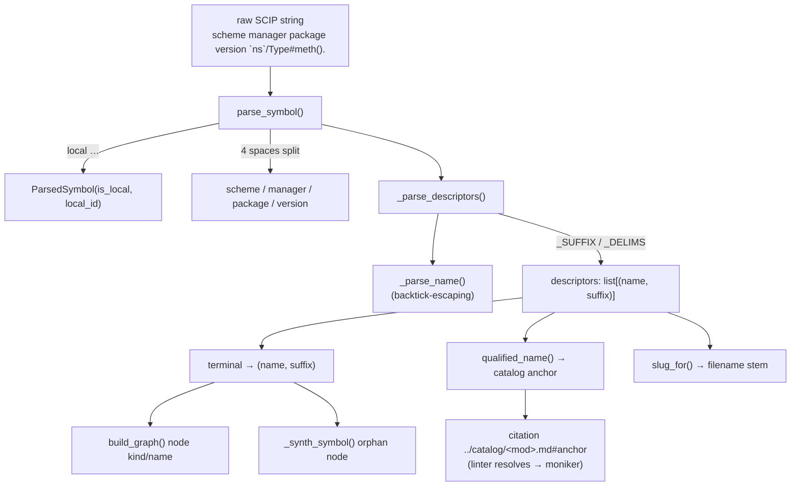

# Monikers — SCIP symbol strings as the grounding id

How a raw SCIP symbol string is parsed into a structured moniker, and why that one
string is the stable identity that catalog anchors, filenames and the citation
linter all agree on.

## Overview

A *moniker* is the authoritative citation id for a symbol: a single opaque string
that SCIP emits for every definition, e.g.
`scip-python python wikify-repo 0.0.0 `wikify.monikers`/parse_symbol().`. It encodes
the language scheme, the package coordinates, and a chain of *descriptors* whose
trailing punctuation says what each name is (`/` namespace, `#` type, `.` term,
`(…).` method). `monikers.py` is the one place that knows this grammar: it turns
the string into a [`ParsedSymbol`](../catalog/wikify/monikers.md#ParsedSymbol) so
every other stage can ask structured questions instead of slicing strings.

The key idea is that the moniker is **language-neutral and globally unique**, so it
can serve as the single join key across the whole pipeline. The graph builder keys
nodes on it; the catalog stores an `anchor → moniker` map in its frontmatter; a
concept-page citation is just `../catalog/<module>.md#<anchor>`; and the linter
resolves that anchor back to a moniker and checks the moniker is in the SCIP graph.
Because [`qualified_name`](../catalog/wikify/coverage.md#qualified_name) is a *pure
function of the moniker*, the anchor the packet tells you to cite and the anchor the
catalog publishes are guaranteed to be the same string — that determinism is what
makes citation linting a mechanical set-membership check rather than fuzzy matching.

## Diagram

## Design rationale (why it's built this way)

The module docstring states the grammar verbatim — `<scheme> <manager> <name>
<version> (<descriptor>)+` or the special form `local <id>` — and names the two jobs
this parser serves: *"read the terminal descriptor (kind/name) when building the
graph"* and *"derive readable filename slugs"*. That dual purpose is why the parser
returns a neutral [`ParsedSymbol`](../catalog/wikify/monikers.md#ParsedSymbol) record
rather than computing any one consumer's answer: graph-building, anchoring, slugging
and coverage each project the same parse differently.

The descriptor suffix table [`_SUFFIX`](../catalog/wikify/monikers.md#_SUFFIX)
(`{"/": "Namespace", "#": "Type", ".": "Term", ":": "Meta", "!": "Macro"}`) and the
delimiter set [`_DELIMS`](../catalog/wikify/monikers.md#_DELIMS) (`set("/#.:!([")`)
are the entire encoding of "what kind is this name". Keeping them as module constants,
not scattered literals, means the suffix vocabulary is defined once; a name runs until
it hits a `_DELIMS` character, and the character it hits *is* the kind tag.

> [!inferred]
> Why a moniker rather than a `(file, line)` pair as the citation id: lines move on
> every edit, but the moniker is stable across commits (it depends only on the
> symbol's qualified name, not its position), and it is language-neutral so a
> Python and a C++ symbol can coexist in one graph. The grounding contract — "this
> claim is about exactly this symbol" — therefore survives reindexing, which a
> line-based anchor could not.

## Entry points

- [`parse_symbol`](../catalog/wikify/monikers.md#parse_symbol) — the single front
  door. Every stage that needs to understand a symbol string calls it: the graph
  builder ([`build_graph`](../catalog/wikify/scip_index.md#build_graph)), the slug
  allocator ([`slug_for`](../catalog/wikify/slug.md#slug_for)), and the coverage /
  anchor logic ([`qualified_name`](../catalog/wikify/coverage.md#qualified_name)).
  Control reaches it whenever a raw moniker must become structured data.

- [`ParsedSymbol`](../catalog/wikify/monikers.md#ParsedSymbol) with its
  [`terminal`](../catalog/wikify/monikers.md#ParsedSymbol.terminal) property — the
  structured result. `terminal` is the most-asked question of a parsed moniker:
  *"(name, suffix) of the last descriptor, or ('', '') if none"* — i.e. what the
  symbol actually *is* (its leaf name and kind), which is what node-building and
  ranking key on.

- [`qualified_name`](../catalog/wikify/coverage.md#qualified_name) — reached during
  catalog and packet generation; it turns a moniker into the **link-safe anchor**
  that both the catalog frontmatter and the concept-page citation use. This is the
  linchpin that makes grounding mechanical (see Mechanism step 5).

## Mechanism (step-by-step)

1. **Split the header.** [`parse_symbol`](../catalog/wikify/monikers.md#parse_symbol)
   first checks for the special `local <id>` form and, if found, returns a
   `ParsedSymbol` carrying only [`is_local`](../catalog/wikify/monikers.md#ParsedSymbol.is_local)
   and [`local_id`](../catalog/wikify/monikers.md#ParsedSymbol.local_id). Otherwise it
   does `symbol.split(" ", 4)` — exactly four splits — to peel off
   [`scheme`](../catalog/wikify/monikers.md#ParsedSymbol.scheme),
   [`manager`](../catalog/wikify/monikers.md#ParsedSymbol.manager),
   [`package`](../catalog/wikify/monikers.md#ParsedSymbol.package) and
   [`version`](../catalog/wikify/monikers.md#ParsedSymbol.version), leaving the entire
   descriptor tail (which itself contains no unescaped spaces) as the fifth part.
   Malformed strings with fewer than five parts degrade gracefully to a near-empty
   `ParsedSymbol` rather than raising.

2. **Walk the descriptors.** The tail goes to
   [`_parse_descriptors`](../catalog/wikify/monikers.md#_parse_descriptors), a hand-written
   scanner that advances an index across the string. Bracketed forms `[name]` and
   `(name)` are recognised as type-parameters and parameters; otherwise it reads a name
   and inspects the following delimiter: a `(` opens a method disambiguator that it skips
   with a paren-depth counter (so nested parens in a signature don't end the descriptor
   early), and any other delimiter is looked up in
   [`_SUFFIX`](../catalog/wikify/monikers.md#_SUFFIX) to tag the kind. Each iteration
   appends a `(name, suffix)` pair; an unexpected character is skipped to guarantee
   forward progress (no infinite loop on garbage).

3. **Read names, honouring escapes.** Name reading delegates to
   [`_parse_name`](../catalog/wikify/monikers.md#_parse_name), whose docstring is
   *"Read a (possibly backtick-escaped) descriptor name starting at `i`."* A leading
   backtick switches to escaped mode: it accumulates characters until a closing
   backtick, treating a doubled `` `` `` as one literal backtick. Unescaped names simply
   run until the next [`_DELIMS`](../catalog/wikify/monikers.md#_DELIMS) character. This
   is why a module path like `` `torch.fx.node` `` with dots inside it stays a single
   namespace descriptor instead of being split on every `.`.

4. **Project to (name, kind).** Consumers rarely want the whole descriptor list — they
   want the leaf. [`terminal`](../catalog/wikify/monikers.md#ParsedSymbol.terminal)
   returns the last `(name, suffix)`. [`build_graph`](../catalog/wikify/scip_index.md#build_graph)
   uses it to set each node's name and kind and to drop locals (parameters / type-params)
   that aren't citable mechanism symbols; [`_synth_symbol`](../catalog/wikify/scip_index.md#_synth_symbol)
   uses the very same parse to *recover* an orphan definition — a symbol pyright saw but
   failed to fully type — building a minimal node from the moniker alone so it stays
   citable. Both also read `descriptors` directly to reject symbols with an empty
   descriptor list.

5. **Derive the citation anchor — the grounding linchpin.**
   [`qualified_name`](../catalog/wikify/coverage.md#qualified_name) takes a moniker, parses
   it, and joins the descriptor names *after* the namespace (dropping `Namespace`-suffix
   descriptors) into e.g. `Trainer.train_step`, then sanitises anything not anchor-safe.
   Its docstring is explicit about why: it is a *"pure function of the moniker, so packet
   citations and catalog frontmatter always agree"*, and link-safe because *"C++ monikers
   from scip-clang can contain `$`/spaces, which would break a markdown `#anchor`"*. The
   catalog publishes an `anchor → moniker` map in its frontmatter built from this same
   function; a concept page cites `../catalog/<module>.md#<anchor>`; and the linter
   resolves that anchor back through the map to a moniker and checks it is in the SCIP
   graph and in this packet's subgraph. Because both sides of the comparison come from one
   pure function, the check is exact.

6. **Other moniker projections.** The same parse feeds several deterministic helpers:
   [`slug_for`](../catalog/wikify/slug.md#slug_for) joins descriptor names with `-` into a
   readable filename stem (`<lang>-<package>-<descriptor_path>`), handling the local case
   specially; [`_owner_class`](../catalog/wikify/coverage.md#_owner_class) walks the
   descriptors to find the enclosing `Type` for a method/term;
   [`_rel_names`](../catalog/wikify/coverage.md#_rel_names) maps relationship target
   monikers to their terminal names; and
   [`_path_from_moniker`](../catalog/wikify/scip_index.md#_path_from_moniker) reads the
   `Namespace` descriptor to reconstruct a repo-relative file path when the emitted path is
   ambiguous. None of these duplicate parsing logic — they all go through
   [`parse_symbol`](../catalog/wikify/monikers.md#parse_symbol).

## Key data structures

- [`ParsedSymbol`](../catalog/wikify/monikers.md#ParsedSymbol) — the neutral parse result:
  the boolean/string header fields ([`is_local`](../catalog/wikify/monikers.md#ParsedSymbol.is_local),
  [`local_id`](../catalog/wikify/monikers.md#ParsedSymbol.local_id),
  [`scheme`](../catalog/wikify/monikers.md#ParsedSymbol.scheme),
  [`manager`](../catalog/wikify/monikers.md#ParsedSymbol.manager),
  [`package`](../catalog/wikify/monikers.md#ParsedSymbol.package),
  [`version`](../catalog/wikify/monikers.md#ParsedSymbol.version)) plus the ordered
  [`descriptors`](../catalog/wikify/monikers.md#ParsedSymbol.descriptors) list of
  `(name, suffix)` pairs. The whole parser exists to populate this one record.

- [`_SUFFIX`](../catalog/wikify/monikers.md#_SUFFIX) and
  [`_DELIMS`](../catalog/wikify/monikers.md#_DELIMS) — the suffix-char → kind map and the
  delimiter set. Together they are the complete on-the-wire encoding of descriptor kinds;
  `_DELIMS` is what terminates a name, and `_SUFFIX` is what that terminator means.

## Dynamics (design intent)

The parser is pure and stateless — no I/O, no model calls — which is why it sits on the
deterministic side of the Python/LLM split and runs inside the linter as a build gate. The
slug projection is pinned by the `tests/test_slug.py` suite (deterministic output,
readability, case preservation, scheme-fallback when no manager, the local-symbol case, and
collision disambiguation), all exercising
[`slug_for`](../catalog/wikify/slug.md#slug_for). The graph-construction projection is pinned
by the C++/Python merge and sharded-index tests (`test_merge_cpp_and_python`,
`test_merged_index_builds_a_correct_graph`, `test_recovered_symbol_joins_with_existing_references`),
all exercising [`build_graph`](../catalog/wikify/scip_index.md#build_graph) — the latter being
the orphan-recovery path that leans on
[`_synth_symbol`](../catalog/wikify/scip_index.md#_synth_symbol) parsing a bare moniker.

## Edge cases

- **Local symbols.** `local <id>` strings have no descriptors; downstream code that calls
  [`terminal`](../catalog/wikify/monikers.md#ParsedSymbol.terminal) on them gets `('', '')`,
  and [`build_graph`](../catalog/wikify/scip_index.md#build_graph) /
  [`_synth_symbol`](../catalog/wikify/scip_index.md#_synth_symbol) skip empty-descriptor
  symbols entirely — locals are never citable.
- **Backtick-escaped names with embedded delimiters.** Dotted module paths or names
  containing `(` survive because [`_parse_name`](../catalog/wikify/monikers.md#_parse_name)
  reads the escaped span literally; the doubled-backtick rule handles a literal backtick
  inside an escaped name.
- **Malformed monikers.** Fewer than five space-separated header parts yields a degenerate
  [`ParsedSymbol`](../catalog/wikify/monikers.md#ParsedSymbol) instead of an exception, and
  an unrecognised descriptor character is skipped rather than looping forever.
- **Anchor-unsafe characters.** [`qualified_name`](../catalog/wikify/coverage.md#qualified_name)
  exists precisely because scip-clang monikers can carry `$`/spaces; it sanitises them so the
  markdown anchor stays valid and resolvable.

## Open questions

- The `(name, suffix)` strings produced here (e.g. `"Method"`, `"Namespace"`) are consumed by
  the graph builder's kind-mapping tables (`_KIND_NAME` / `_SUFFIX_KIND`,
  `_LOCALISH_SUFFIXES`), which are outside this packet's subgraph; how the suffix vocabulary
  maps to final node kinds belongs to the scip-index concept page, not here.
- The catalog-side `anchor → moniker` frontmatter map and the linter's resolution routine are
  the other half of the grounding contract but live in their own modules; this page documents
  only the moniker-parsing source of those anchors.

## See also

- `concepts/wikify-scip-index.md` — how parsed monikers become graph nodes and edges.
- `concepts/wikify-coverage.md` — anchors, catalog `anchor → moniker` maps, and the set-difference floor.
- `concepts/wikify-citation-lint.md` — how a citation anchor is resolved and gated.
