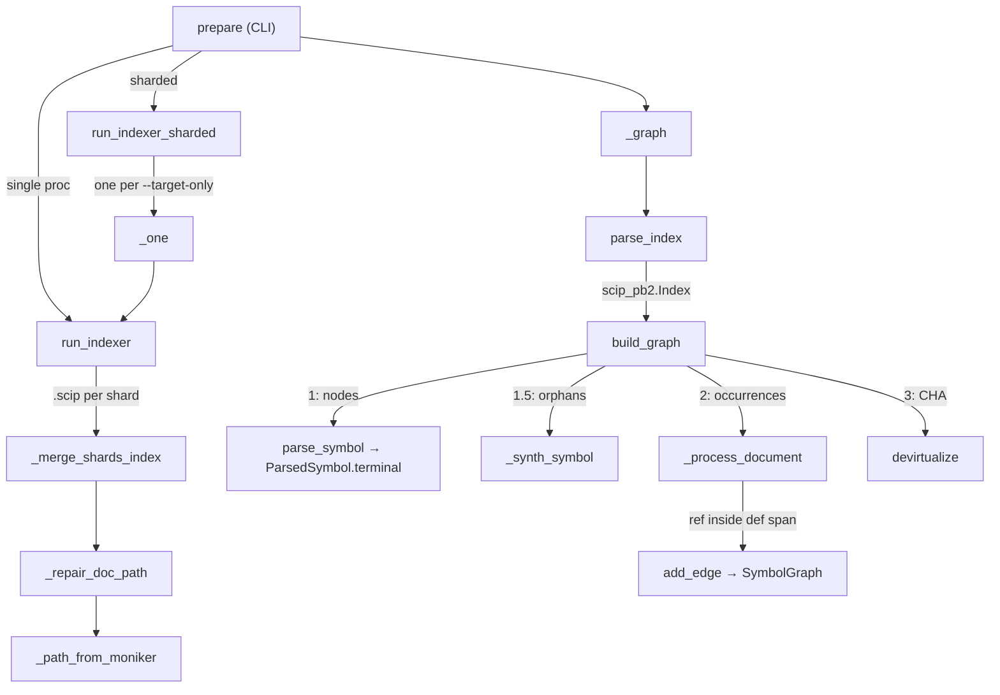

# SCIP indexing → SymbolGraph

## Overview
This is Stage 1: it runs an external SCIP indexer over a checked-out repo, parses
the emitted `.scip` protobuf, and **normalizes** it into the in-repo
[`SymbolGraph`](../catalog/wikify/graph.md#SymbolGraph) — the node table and edge
set every later stage cites against. The whole module is deterministic; there are
no model calls here. The one load-bearing idea, and the thing that makes the rest
of the design make sense, is that **SCIP has no "call" relationship**. It records
*where each symbol is defined and referenced*, with a role bit, but never "F calls
S." So [`build_graph`](../catalog/wikify/scip_index.md#build_graph) does not read a
call graph out of SCIP — it *reconstructs* one by **reference scoping**: a
reference to in-repo symbol `S` whose position falls inside the body span of
definition `F` becomes the edge `F → S`. Symbol-accurate (the indexer's frontend
already bound the name to the right global symbol), but reference-derived, not true
call resolution — that caveat propagates through everything downstream.

A second idea sits underneath: a SCIP **moniker** is the authoritative symbol id
(`scip-python python wikify-repo 0.0.0 \`wikify.scip_index\`/build_graph().`).
Because monikers are global and stable across languages and across separately-run
indexer invocations, every "merge" in this module — Python + C++, or N parallel
shards — is just a *union keyed by moniker*. No symbol resolution is re-done at
merge time; identity is carried in the string.

## Diagram

## Design rationale (why it's built this way)
**Why reference scoping at all.** The module docstring states the constraint
plainly: SCIP has no call role, so callers/callees are *approximated* by reference
scoping. The trade is deliberate — you get the indexer's exact name binding (no
heuristic name matching, the classic source of false edges in name-based call
graphs) at the cost of conflating "references in the body" with "calls." Imports
are explicitly excluded from edges in [`_process_document`](../catalog/wikify/scip_index.md#_process_document)
precisely because an import is a reference that is *not* a call.

**Why nodes and edges are two separate passes.** [`build_graph`](../catalog/wikify/scip_index.md#build_graph)
builds *all* nodes (across every index and document) before it processes any
occurrence. Edges can cross documents — a reference in `a.py` points at a
definition in `b.py` — so every target node must already exist when the edge pass
runs, or the edge silently drops. The orphan-recovery pass (1.5) is wedged
*between* node creation and the edge pass for the same reason: a definition that
lost its node would orphan every cross-document reference to it.

**Why union, not merge.** `build_graph(*indexes)` takes a variadic list and unions
them. The docstring is explicit: multiple indexes (a scip-python index plus a
scip-clang index for a mixed Python/C++ repo) union into one graph because stable
monikers keep symbols distinct across languages and the per-document build is
language-agnostic. The same property is what makes sharding correct.

> [!inferred]
> The `1_000_000`-line sentinel used as a body-span end for the last definition in
> a document (in `_process_document`) is a pragmatic "rest of file" bound, not a
> real range. It works because spans are only ever compared by `_contains` /
> `_span_size` against in-file reference points; nothing reads the literal value.

## Entry points
- [`prepare`](../catalog/wikify/cli.md#prepare) — the CLI command that *drives*
  this module. It acquires the pinned repo, then for Python chooses between
  [`run_indexer`](../catalog/wikify/scip_index.md#run_indexer) and (when the config
  declares `index_shards`) [`run_indexer_sharded`](../catalog/wikify/scip_index.md#run_indexer_sharded),
  optionally runs the C++ indexer, and finally calls
  [`_graph`](../catalog/wikify/cli.md#_graph) to materialize the SymbolGraph. This
  is where Stage 1 begins for a real ingest.
- [`_graph`](../catalog/wikify/cli.md#_graph) — the parse-and-build seam. It calls
  [`parse_index`](../catalog/wikify/scip_index.md#parse_index) on the Python
  `.scip` and, when a C++ index exists, on that too, then hands *both* to
  [`build_graph`](../catalog/wikify/scip_index.md#build_graph) as a variadic union.
  This single function is the entire "two indexes become one graph" mechanism that
  [`test_merge_cpp_and_python`](../catalog/tests/test_cpp_ingestion.md#test_merge_cpp_and_python)
  pins.
- [`index_repo`](../catalog/wikify/scip_index.md#index_repo) — the unsharded
  end-to-end convenience path (run → parse → build) used by tests and small repos,
  a thin sequencing of `run_indexer` and `build_graph`.

## Mechanism (step-by-step)

1. **Run the indexer.** [`run_indexer`](../catalog/wikify/scip_index.md#run_indexer)
   shells out to `scip-python index … --output <.scip>`. Two non-obvious behaviors
   matter: it raises Node's `--max-old-space-size` heap ceiling (pyright OOMs at
   Node's 4 GB default on large repos), and it treats a *non-empty emitted index*
   as success even when the process returns nonzero — pyright exits with an error
   on type-check failures in dependency files while still emitting a complete index
   for the target. Failure is defined as "no documents," checked by `_has_documents`.

2. **Shard when one process can't hold the repo.** For repos too large for a single
   pyright, [`run_indexer_sharded`](../catalog/wikify/scip_index.md#run_indexer_sharded)
   runs one `scip-python --target-only <target>` per shard concurrently (a
   `ThreadPoolExecutor` over [`_one`](../catalog/wikify/scip_index.md#run_indexer_sharded._one)).
   Each shard analyzes the whole repo for type/import resolution but *emits* only
   its target, so monikers stay globally correct while the working set stays
   bounded. A shard that emits nothing returns `None` and is skipped rather than
   sinking the run.

3. **Merge the shards, repairing paths.** [`_merge_shards_index`](../catalog/wikify/scip_index.md#_merge_shards_index)
   unions the shard indexes into one. The wrinkle is `relative_path`: scip-python
   emits a target's files relative to the target dir, and dependency "spillover"
   files relative to some ancestor (`../` prefixes). [`_repair_doc_path`](../catalog/wikify/scip_index.md#_repair_doc_path)
   restores each to repo-relative — trying the target-join first, then falling back
   to [`_path_from_moniker`](../catalog/wikify/scip_index.md#_path_from_moniker),
   which reads the module Namespace descriptor out of a symbol's moniker
   (`\`torch.fx.node\`` → `torch/fx/node.py`) as the authoritative path. Because
   spillover files appear partially in several shards, the merge keeps, per path,
   the document with the *most* symbols — and feeding one document per path also
   prevents double-tallying reference counts.
   [`test_merged_index_builds_a_correct_graph`](../catalog/tests/test_sharded_index.md#test_merged_index_builds_a_correct_graph)
   pins that a global moniker survives the round-trip.

4. **Parse the protobuf.** [`parse_index`](../catalog/wikify/scip_index.md#parse_index)
   is a two-liner: read the bytes, `ParseFromString` into a `scip_pb2.Index`. From
   here on everything is in-memory protobuf objects: an `Index` of `Document`s,
   each carrying `SymbolInformation` (declared symbols) and `Occurrence`s (positions
   tagged with role bits).

5. **Build nodes from `SymbolInformation`.** [`build_graph`](../catalog/wikify/scip_index.md#build_graph)
   walks every document's `symbols`, skipping `local …` ids and dupes. For each it
   calls [`parse_symbol`](../catalog/wikify/monikers.md#parse_symbol) to split the
   moniker into a [`ParsedSymbol`](../catalog/wikify/monikers.md#ParsedSymbol); the
   [`terminal`](../catalog/wikify/monikers.md#ParsedSymbol.terminal) descriptor
   yields the node's [`name`](../catalog/wikify/graph.md#Symbol.name) and
   [`suffix`](../catalog/wikify/graph.md#Symbol.suffix). Function-local suffixes
   (`Parameter`, `TypeParameter`, `Meta`) are dropped — they aren't citable
   mechanism symbols. A [`Symbol`](../catalog/wikify/graph.md#Symbol) is built with
   its [`moniker`](../catalog/wikify/graph.md#Symbol.moniker),
   [`kind`](../catalog/wikify/graph.md#Symbol.kind) (the SCIP kind enum number
   mapped to its name), extracted [`documentation`](../catalog/wikify/graph.md#Symbol.documentation)
   and [`signature`](../catalog/wikify/graph.md#Symbol.signature), plus
   `is_implementation`/`is_type_definition`
   [`relationships`](../catalog/wikify/graph.md#Symbol.relationships) copied off the
   protobuf, and registered via [`add_symbol`](../catalog/wikify/graph.md#SymbolGraph.add_symbol).

6. **Recover orphan definitions (pass 1.5).** pyright sometimes drops the
   `SymbolInformation` for a symbol it couldn't fully type (a `RangeError` on a huge
   class like `nn.Module`) yet still emits its *Definition* occurrence. Without
   recovery those symbols would be uncitable and uncoverable. So `build_graph` walks
   occurrences a first time, and for any Definition-role symbol with no node it calls
   [`_synth_symbol`](../catalog/wikify/scip_index.md#_synth_symbol), which builds a
   minimal node from the moniker alone — authoritative name/suffix, kind *inferred
   from the suffix*, empty docs/signature. Doing this before the edge pass is what
   lets the reference in
   [`test_recovered_symbol_joins_with_existing_references`](../catalog/tests/test_ast_fallback.md#test_recovered_symbol_joins_with_existing_references)
   connect to an AST-recovered definition.

7. **Derive edges per document (the reference-scoping core).**
   [`_process_document`](../catalog/wikify/scip_index.md#_process_document) is run
   once per document. It splits occurrences into definitions (with their enclosing
   body span via [`_occ_enclosing`](../catalog/wikify/scip_index.md#_occ_enclosing))
   and references (via [`_occ_range`](../catalog/wikify/scip_index.md#_occ_range)),
   keeping only in-repo symbols already in the node table. It records each
   definition's location on the node — [`def_path`](../catalog/wikify/graph.md#Symbol.def_path)
   and [`def_line`](../catalog/wikify/graph.md#Symbol.def_line),
   first occurrence wins — and resolves a body span for each: the SCIP enclosing
   range if present, else `[def start, next def start)` in document order. Then for
   each reference it bumps [`ref_count`](../catalog/wikify/graph.md#SymbolGraph.ref_count)
   and appends to [`refs`](../catalog/wikify/graph.md#SymbolGraph.refs) (the
   importance-rank inputs), skips imports, and otherwise finds the **innermost**
   enclosing definition `F` — smallest [`_span_size`](../catalog/wikify/scip_index.md#_span_size)
   containing the point per [`_contains`](../catalog/wikify/scip_index.md#_contains) —
   emitting `F → S` through [`add_edge`](../catalog/wikify/graph.md#SymbolGraph.add_edge).

8. **Devirtualize (Class Hierarchy Analysis).** Reference scoping cannot cross the
   dynamic-dispatch seam: a call routed through `nn.Module.__call__` reaches the
   *base* method, never the override that does the real work, so traversal dies
   there. [`devirtualize`](../catalog/wikify/graph.md#devirtualize) reads each
   node's `is_implementation`
   [`relationships`](../catalog/wikify/graph.md#Symbol.relationships) and adds a
   `base → override` (and class → subclass) edge via
   [`add_edge`](../catalog/wikify/graph.md#SymbolGraph.add_edge) with `virtual=True`,
   so reaching a base also reaches its implementations. These edges are kept
   separately so they can be labelled and audited.

## Key data structures
- **`scip_pb2.Index` / `Document`** — the parsed protobuf. The two fields that
  matter: `doc.symbols` (`SymbolInformation`, the *declared* symbols → nodes) and
  `doc.occurrences` (positions with role bits → def locations + ref edges).
- [`Symbol`](../catalog/wikify/graph.md#Symbol) — one global in-repo node. The
  [`moniker`](../catalog/wikify/graph.md#Symbol.moniker) is the authoritative id;
  [`kind`](../catalog/wikify/graph.md#Symbol.kind)/[`suffix`](../catalog/wikify/graph.md#Symbol.suffix)/[`name`](../catalog/wikify/graph.md#Symbol.name)
  are normalized from the moniker; [`def_path`](../catalog/wikify/graph.md#Symbol.def_path)/[`def_line`](../catalog/wikify/graph.md#Symbol.def_line)/[`enclosing`](../catalog/wikify/graph.md#Symbol.enclosing)
  are filled in during the occurrence pass.
- [`SymbolGraph`](../catalog/wikify/graph.md#SymbolGraph) — the node table
  [`symbols`](../catalog/wikify/graph.md#SymbolGraph.symbols) plus the two adjacency
  views [`_callees`](../catalog/wikify/graph.md#SymbolGraph._callees) /
  [`_callers`](../catalog/wikify/graph.md#SymbolGraph._callers), and the rank inputs
  [`ref_count`](../catalog/wikify/graph.md#SymbolGraph.ref_count) /
  [`refs`](../catalog/wikify/graph.md#SymbolGraph.refs).
- [`Range`](../catalog/wikify/scip_index.md#Range) — the normalized
  `(start_line, start_char, end_line, end_char)` tuple that
  [`_occ_range`](../catalog/wikify/scip_index.md#_occ_range) /
  [`_occ_enclosing`](../catalog/wikify/scip_index.md#_occ_enclosing) collapse SCIP's
  several range encodings into (see Edge cases).
- [`ParsedSymbol`](../catalog/wikify/monikers.md#ParsedSymbol) — the structured
  moniker: scheme/manager/package/version plus the
  [`descriptors`](../catalog/wikify/monikers.md#ParsedSymbol.descriptors) list whose
  last entry is the [`terminal`](../catalog/wikify/monikers.md#ParsedSymbol.terminal).

## Dynamics (design intent)
Sharding is the only concurrency: [`run_indexer_sharded`](../catalog/wikify/scip_index.md#run_indexer_sharded)
fans out up to `max_parallel` indexer processes through a thread pool over
[`_one`](../catalog/wikify/scip_index.md#run_indexer_sharded._one), and the merge,
parse, and graph build that follow are all single-threaded and deterministic.
Ordering is load-bearing inside [`build_graph`](../catalog/wikify/scip_index.md#build_graph):
nodes (all indexes) → orphan recovery → edges (all indexes) → devirtualization, so
that cross-document references always resolve. The C++ and Python paths are not
special-cased anywhere downstream — both produce the same SCIP format, and
[`test_cpp_call_structure`](../catalog/tests/test_cpp_ingestion.md#test_cpp_call_structure)
and [`test_cpp_symbols_and_kinds`](../catalog/tests/test_cpp_ingestion.md#test_cpp_symbols_and_kinds)
pin that the reference-scoping derivation and the moniker/kind normalization both
work unchanged on a scip-clang index.

## Edge cases
- **Multiple SCIP range encodings.** [`_occ_range`](../catalog/wikify/scip_index.md#_occ_range)
  and [`_occ_enclosing`](../catalog/wikify/scip_index.md#_occ_enclosing) handle the
  typed `single_line`/`multi_line` oneof *and* the deprecated packed-int form
  (length 3 = single line, length 4 = multi-line) — a range can arrive in any of
  these and must normalize to one [`Range`](../catalog/wikify/scip_index.md#Range).
- **Spillover documents appearing in many shards** — kept by max symbol count in
  [`_merge_shards_index`](../catalog/wikify/scip_index.md#_merge_shards_index) so a
  partial spillover never overwrites the owning shard's complete copy.
- **Unrepairable shard paths** — if the target-join doesn't land on a real file and
  the moniker has no Namespace descriptor, [`_path_from_moniker`](../catalog/wikify/scip_index.md#_path_from_moniker)
  returns `None` and the path is left as-is.
- **Files pyright never emitted** — covered by the AST fallback, summarized below
  in See also; the indexer module just appends those synthesized documents.
- **Half-open span containment.** [`_contains`](../catalog/wikify/scip_index.md#_contains)
  treats a span as `[start, end)`, so a reference exactly at a definition's end
  position is *not* counted inside it — relevant when two definitions abut.

## Open questions
- The body-span fallback `[def start, next def start)` assumes definition
  occurrences are emitted in source order within a document; the code sorts them,
  but whether SCIP can interleave a nested def's start *before* its parent's
  enclosing range in pathological inputs is not something the source settles.
- Whether `_span_size`'s tuple comparison (`(Δline, Δchar)`) can ever mis-rank two
  truly nested spans with the same line delta is not exercised by a test I can see.

## See also
- [`ast_fallback`](../catalog/wikify/ast_fallback.md#synthesize_index) — the
  deterministic AST-based recovery for `.py` files pyright dropped, whose
  [`synthesize_index`](../catalog/wikify/ast_fallback.md#synthesize_index) /
  [`_document`](../catalog/wikify/ast_fallback.md#_document) /
  [`module_path`](../catalog/wikify/ast_fallback.md#module_path) emit a
  `scip_pb2.Index` in the same shape `build_graph` consumes.
- [`monikers`](../catalog/wikify/monikers.md#parse_symbol) — the SCIP symbol-string
  grammar and parser feeding node normalization.
- [`devirtualize`](../catalog/wikify/graph.md#devirtualize) and the
  [`SymbolGraph`](../catalog/wikify/graph.md#SymbolGraph) API consumed here.
