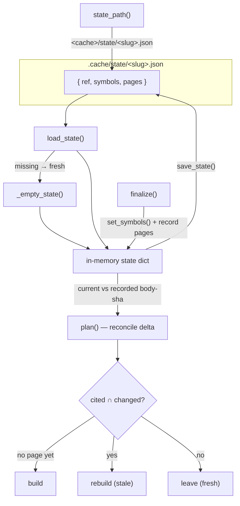

# Reconcile state — the idempotency ledger

How wikify remembers what it already built — a tiny JSON ledger of *(pinned commit, per-symbol body hash, per-page citation set)* that lets a re-run converge to a no-op and `--ref` rebuild only the pages whose cited code actually moved.

## Overview

A wiki is expensive to build (one LLM synthesis call per concept page) and most re-runs change nothing. The reconcile state is the trick that makes re-ingestion cheap: it is a flat JSON file persisted at `.cache/state/<slug>.json` holding exactly three keys — `ref`, `symbols`, `pages`. The single design idea is that **a page is stale iff a symbol it cited changed body**. To decide that, the ledger records *which monikers each page cited* and *the body-sha of every symbol at the last build*. A fresh index is hashed the same way and diffed against the ledger; pages whose cited set intersects the changed set are rebuilt, everything else is left untouched. The module is deliberately inert — its docstring states "This is pure bookkeeping: nothing here calls a model." All comprehension lives elsewhere; this file only remembers.

## Diagram

## Design rationale (why it's built this way)

**Why body-shas instead of the commit alone?** A commit pin tells you *something* changed across the whole tree, but rebuilding every page on every new commit defeats the point. Hashing each symbol's signature-plus-body gives a *per-symbol* change signal, so a one-line fix in one function invalidates only the pages that cite that function. `set_symbols` is the writer for this map, and its docstring is blunt about the contract: "Replace the moniker → body-sha map." It is a wholesale replacement, not a merge — the recorded map always reflects exactly the symbols present at the last successful `finalize`, so a deleted symbol simply disappears from the map (and is later detected as *removed*).

**Why guarantee all three keys are present?** `load_state` goes out of its way to normalize partial or hand-edited files: it starts from `_empty_state` and `.update()`s the on-disk data over it, then explicitly coerces null-valued `symbols`/`pages` back to empty dicts. This means every downstream consumer can assume `state["symbols"]` and `state["pages"]` are dicts without defensive checks — the robustness is centralized here rather than smeared across the diff and finalize code. `test_load_partial_fills_missing_keys` pins exactly this: a file containing only `{"ref": "abc"}` loads back with `symbols == {}` and `pages == {}`.

**Why a fresh empty state on a missing file rather than an error?** First-ever ingest and re-ingest are the *same code path* (invariant 4, idempotent reconcile). `load_state` returning `_empty_state` when the file is absent means a never-built repo presents as "everything to build, nothing recorded" with no special-casing — the plan naturally comes out as all-build.

> [!inferred]
> The build/rebuild/leave decision itself lives in `wikify/diff.py` (read for context, not in this packet's subgraph): it hashes the current graph, computes `changed = {m : old.get(m) != h}` plus `removed`, and for each configured concept routes it to *build* (no recorded page), *rebuild* (recorded cited set intersects the changed+removed set), or *leave*. This concept page documents the **state model** those decisions read from and write to; the diff/plan algorithm is its own concern.

## Entry points

- [`state_path`](../catalog/wikify/state.md#state_path) — the canonical location resolver. Every command that touches the ledger first computes `<cache_dir>/state/<slug>.json` through it; the `Paths` layout object caches the result as [`state`](../catalog/wikify/cli.md#Paths.state) so the rest of the CLI never re-derives the path. Control reaches it once per command, at path-construction time.
- [`prepare`](../catalog/wikify/cli.md#prepare) — Stages 0–4 (acquire, index, build graph, emit packets, print the plan). It `load_state`s the existing ledger so it can show the reconcile delta *before* any synthesis work, letting the agent see what will be built vs. left.
- [`finalize`](../catalog/wikify/cli.md#finalize) — Stage 6, the only writer. After lint passes it reloads the ledger, refreshes the body-sha map via [`set_symbols`](../catalog/wikify/state.md#set_symbols), and records each concept page actually on disk together with the citations it carries, then saves. This is where "what was built" becomes "what is recorded."
- [`plan`](../catalog/wikify/cli.md#plan) — the read-only dry run: `load_state` + diff, render the delta, emit nothing. The honest preview of a reconcile with no side effects.

## Mechanism (step-by-step)

1. **Resolve the ledger path.** Any command builds its `Paths` and obtains [`state`](../catalog/wikify/cli.md#Paths.state), which is [`state_path`](../catalog/wikify/state.md#state_path) applied to the cache dir and slug — `<cache_dir>/state/<slug>.json`. `test_state_path` pins the exact shape (`state/torchtitan.json`). The path is pure function of `(cache_dir, slug)`, so two runs on the same repo always agree on where to look.

2. **Load, normalizing shape.** [`load_state`](../catalog/wikify/state.md#load_state) reads the JSON if it exists, otherwise returns [`_empty_state`](../catalog/wikify/state.md#_empty_state) — `{"ref": None, "symbols": {}, "pages": {}}`. On a real file it overlays the data onto a fresh empty state and coerces null `symbols`/`pages` to empty dicts, so the returned dict is always well-shaped. `test_load_missing_returns_empty_shape` and `test_load_partial_fills_missing_keys` lock both the absent and partial cases.

3. **Compute the delta (read path).** [`prepare`](../catalog/wikify/cli.md#prepare) and [`plan`](../catalog/wikify/cli.md#plan) take the loaded state and the freshly built symbol graph and ask: which recorded body-shas no longer match, and which recorded pages cited a now-changed (or removed) symbol? The answer is the build/rebuild/leave plan. `prepare` prints it so the agent only synthesizes the `todo` set; `plan` prints it and stops.

4. **Refresh the symbol map (write path).** Once lint passes, [`finalize`](../catalog/wikify/cli.md#finalize) reloads the ledger and calls [`set_symbols`](../catalog/wikify/state.md#set_symbols) with the current body-shas, wholesale-replacing the old map. `test_set_symbols_replaces` confirms the replacement semantics: writing `{"a":"1"}` then `{"b":"2"}` leaves only `{"b":"2"}`. Stale entries cannot linger.

5. **Record what was actually built, then persist.** [`finalize`](../catalog/wikify/cli.md#finalize) walks the concept pages on disk, recording for each one the citations it carries and the commit it was built at, then writes the ledger back as sorted, indented JSON. `test_round_trip_preserves_data` proves the full cycle — set ref, set symbols, record a page, save, load — round-trips identically.

## Key data structures

The entire state is one dict with three top-level keys, created by [`_empty_state`](../catalog/wikify/state.md#_empty_state) as `{"ref": None, "symbols": {}, "pages": {}}`:

- **`ref`** — the pinned commit the ledger corresponds to (the "as-of" of everything below).
- **`symbols`** — `moniker → body-sha`. Comparing this map against a fresh index yields the set of *changed* monikers; monikers present here but absent from the new index are *removed*. Written via [`set_symbols`](../catalog/wikify/state.md#set_symbols).
- **`pages`** — `concept → {cited: [monikers], built_ref}`. The `cited` list (deduped and sorted) is what makes staleness decidable: a page is stale exactly when its cited set intersects the changed/removed set. `test_record_page_then_page_cited` shows an unsorted, duplicate-laden cite list stored back sorted-and-deduped with the build ref attached; `test_page_cited_absent_is_empty` and `test_has_page` cover the lookup helpers.

On disk the dict is pretty-printed with `indent=2, sort_keys=True` — `test_save_creates_valid_indented_json` asserts the indentation and key-sorting, which exist purely to keep the committed/diffed JSON stable across runs.

## Dynamics (design intent)

The module is single-purpose bookkeeping with no concurrency, no model calls, and no I/O beyond one file read and one file write. The read/write split is enforced by convention: [`prepare`](../catalog/wikify/cli.md#prepare) and [`plan`](../catalog/wikify/cli.md#plan) only `load_state`, while [`finalize`](../catalog/wikify/cli.md#finalize) is the sole mutator — and it only writes *after* lint succeeds, so a failed build never corrupts the ledger or advances the recorded `ref`. Idempotence is structural: because `set_symbols` replaces (not merges) and the recorded `cited` sets are normalized, a second identical run produces a byte-identical file and an all-`leave` plan.

## Edge cases

- **Missing file** → fresh empty state, not an error ([`load_state`](../catalog/wikify/state.md#load_state) / [`_empty_state`](../catalog/wikify/state.md#_empty_state)); first build and re-build share one path.
- **Partial / hand-edited file** with missing or null `symbols`/`pages` → coerced to empty dicts so downstream code never sees `None` (`test_load_partial_fills_missing_keys`).
- **Removed symbols** — a moniker recorded last time but gone from the new index. The diff treats it as invalidating, so a page that cited deleted code is correctly marked stale even though there is no "changed" hash to compare.

> [!inferred]
> The actual changed/removed comparison and the resulting `Plan` object live in `wikify/diff.py`, outside this packet's subgraph, so the precise routing rules there are summarized from reading that file rather than cited here.

## Open questions

- The writer-side helpers that `finalize` uses to stamp `ref` and per-page records (the `set_ref` / `record_page` functions in `wikify/state.py`) are not in this packet's subgraph, so they are described only via the tests that exercise them (`test_set_ref`, `test_record_page_then_page_cited`) rather than cited directly. Their exact signatures belong in the `wikify/state.md` catalog.
- `save_state` (the JSON writer pinned by `test_save_creates_valid_indented_json`) is likewise out of subgraph here; the persistence format is documented from the test's assertions.

## See also

- `concepts/wikify-reconcile-diff.md` — the build/rebuild/leave planner that reads this ledger (if present).
- `concepts/wikify-cli-pipeline.md` — `prepare` → agent synthesis → `finalize` staging that brackets the state read/write.
