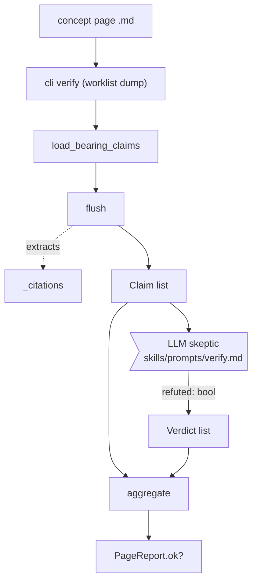

# wikify verify — the adversarial correctness pass above the lint gate

## Overview
The citation linter (`wikify finalize`) proves every claim on a concept page
*cites a real symbol*. It does **not** prove the claim is *true*: a page can be
fully grounded and still describe the mechanism wrong. `verify.py` is the second,
adversarial floor — the *correctness* floor above the grounding floor. Its key
design idea is a hard Python/LLM split: pure Python turns a finished page into a
**reproducible worklist of falsifiable claims**
([`load_bearing_claims`](../catalog/wikify/verify.md#load_bearing_claims)) and later
folds a skeptic's verdicts into a pass/fail tally
([`aggregate`](../catalog/wikify/verify.md#aggregate)) — while the *refutation
itself* (reading source, reasoning about whether the claim holds) is the LLM step,
done out of band by the verifier agent in `skills/prompts/verify.md`. Python decides
*what* must be checked and *whether the page passed*; the model decides *is this
specific claim refuted*. Because the boundary is files, the worklist and the tally
are deterministic even though the judgment is not.

## Diagram

## Design rationale (why it's built this way)
The module docstring states the split plainly: the refutation "is the LLM step (it
reads source and reasons); everything here is pure Python so the worklist and the
pass/fail tally are reproducible." That is the whole point of the file — it is the
*deterministic half* of a two-part pass, and it deliberately contains no model call.

A claim is only worth refuting if it asserts something falsifiable about how the
code works. So extraction is scoped to exactly the sections that make such
assertions —
[`_CLAIM_SECTIONS`](../catalog/wikify/verify.md#_CLAIM_SECTIONS) = `("Overview",
"Design rationale", "Entry points", "Mechanism")`. Everything else on a page (Key
data structures, Dynamics, Edge cases, See also) is descriptive scaffolding, not a
mechanism assertion, and is skipped. The
[`_CLAIM_SECTIONS`](../catalog/wikify/verify.md#_CLAIM_SECTIONS) tuple is matched by
*prefix* (`section.startswith(...)`), so a heading like "Mechanism (step-by-step)"
still qualifies — the page author's parenthetical suffixes don't break extraction
([`test_extracts_claims_from_claim_sections_only`](../catalog/tests/test_verify.md#test_extracts_claims_from_claim_sections_only)).

The unit of a claim mirrors how the synthesis prompt asks pages to be written:
in Entry-points/Mechanism, *one list item* is one claim; in Overview/Design-
rationale, *one prose paragraph* is one claim. This matters because it makes the
worklist line up with the linter's own notion of a citation-bearing item, and lets
a skeptic refute at the granularity the author asserted at.

The sharpest decision is that
[`> [!inferred]`](../catalog/wikify/verify.md#load_bearing_claims) blocks are
**excluded** from the worklist. The docstring is explicit: those are "the page's
own hedged reading, not asserted fact, so there is nothing to refute." Verifying a
block the page already flags as speculation would be a category error — the page
never claimed it as truth
([`test_inferred_block_excluded`](../catalog/tests/test_verify.md#test_inferred_block_excluded)).
This is the same `[!inferred]` convention the grounding floor uses to exempt
uncited prose, reused here to exempt *unasserted* prose.

Reuse over reinvention: claim extraction borrows the linter's own primitives —
[`_LINK`](../catalog/wikify/lint.md#_LINK),
[`_LIST_ITEM`](../catalog/wikify/lint.md#_LIST_ITEM), and
[`_is_symbol_link`](../catalog/wikify/lint.md#_is_symbol_link) are imported from
`lint.py`, so "what counts as a list item" and "what counts as a symbol citation"
are defined in exactly one place. The two floors agree on syntax by construction.

## Entry points
- [`verify`](../catalog/wikify/cli.md#verify) — the CLI command (`wikify verify
  <slug>`) a human or the verifier agent runs to *materialize the worklist*. It
  globs the silo's `concepts/*.md`, calls
  [`load_bearing_claims`](../catalog/wikify/verify.md#load_bearing_claims) on each,
  and echoes a per-page claim count (with `--page` dumping each claim's line,
  section, and citation count). Its docstring underlines the contract:
  "Deterministic; runs no model."
- [`load_bearing_claims`](../catalog/wikify/verify.md#load_bearing_claims) — the
  library entry the CLI and every test reach through. Given a page path it returns
  the ordered list of [`Claim`](../catalog/wikify/verify.md#Claim)s a skeptic must
  try to refute. This is *the* worklist generator.
- [`aggregate`](../catalog/wikify/verify.md#aggregate) — reached *after* the LLM
  pass, with the per-claim [`Verdict`](../catalog/wikify/verify.md#Verdict)s in
  hand. It folds them into a [`PageReport`](../catalog/wikify/verify.md#PageReport)
  whose verdict is the page's verification result.

## Mechanism (step-by-step)
1. **Build the worklist, in document order.**
   [`load_bearing_claims`](../catalog/wikify/verify.md#load_bearing_claims) reads
   the page and walks it line by line, tracking the current `## ` section. Lines are
   ignored entirely until the section name prefix-matches
   [`_CLAIM_SECTIONS`](../catalog/wikify/verify.md#_CLAIM_SECTIONS); a `## ` heading
   also flushes any claim in progress so claims never straddle a section boundary.
   The result is ordered the way the page reads, so a verdict can be pinned back to
   a line.

2. **Segment claims by item vs. paragraph.** Inside a claim section, a line matching
   [`_LIST_ITEM`](../catalog/wikify/lint.md#_LIST_ITEM) (a `-`/`*`/`1.` bullet)
   *starts a new claim* — each Entry-points/Mechanism bullet is its own assertion.
   A blank line, a fence, or a table row ends the current block; any other non-empty
   line is a **continuation** that gets folded into the block in progress. That fold
   is what lets a multi-line Mechanism step — a bullet whose explanation wraps onto
   the next line — count as a single claim rather than two
   ([`test_mechanism_item_absorbs_continuation_line`](../catalog/tests/test_verify.md#test_mechanism_item_absorbs_continuation_line)),
   and what lets a two-line Overview paragraph collapse into one
   ([`test_overview_split_into_paragraphs_and_carries_citation`](../catalog/tests/test_verify.md#test_overview_split_into_paragraphs_and_carries_citation)).

3. **Drop the hedged prose.** While scanning, [`load_bearing_claims`](../catalog/wikify/verify.md#load_bearing_claims)
   tracks an `in_inferred` flag: once a `[!inferred]` marker appears, every following
   blockquote (`>`) line is skipped and the in-progress block is flushed, until a
   non-`>` non-empty line ends the block. Speculation the page already disowned never
   reaches the worklist
   ([`test_inferred_block_excluded`](../catalog/tests/test_verify.md#test_inferred_block_excluded)).

4. **Emit each claim with its citations.** The nested closure
   [`flush`](../catalog/wikify/verify.md#load_bearing_claims.flush) joins the
   accumulated block lines into one text, and — if non-empty — appends a
   [`Claim`](../catalog/wikify/verify.md#Claim) carrying the page name, its 1-based
   start [`line`](../catalog/wikify/verify.md#Claim.line), the section, the prose,
   and the catalog links it cites. Those links are pulled by
   [`_citations`](../catalog/wikify/verify.md#_citations), which runs the linter's
   [`_LINK`](../catalog/wikify/lint.md#_LINK) regex over the text and keeps only the
   targets [`_is_symbol_link`](../catalog/wikify/lint.md#_is_symbol_link) accepts —
   so each worklist entry already knows which symbols the skeptic should read.

5. **(Out of band) the LLM refutes each claim.** Not in this file: the verifier
   agent reads the cited source for each [`Claim`](../catalog/wikify/verify.md#Claim)
   and emits a [`Verdict`](../catalog/wikify/verify.md#Verdict) — `refuted=True` with
   a `note` when the source contradicts the claim, else `refuted=False`. Verdicts are
   keyed to claims by [`Claim.id`](../catalog/wikify/verify.md#Claim.id), the
   `"<page>:<line>"` string, so a refutation points at an exact line.

6. **Fold verdicts into a page verdict.**
   [`aggregate`](../catalog/wikify/verify.md#aggregate) keeps only the
   [`refuted`](../catalog/wikify/verify.md#Verdict.refuted) verdicts and packs them
   into a [`PageReport`](../catalog/wikify/verify.md#PageReport) with the page name,
   the [`total`](../catalog/wikify/verify.md#PageReport.total) claim count, and the
   [`refuted`](../catalog/wikify/verify.md#PageReport.refuted) list. The page passes
   (`PageReport.ok`) only when that list is empty — **any single refuted claim fails
   the whole page**
   ([`test_aggregate_fails_page_on_any_refutation`](../catalog/tests/test_verify.md#test_aggregate_fails_page_on_any_refutation));
   a clean sweep passes
   ([`test_aggregate_passes_when_nothing_refuted`](../catalog/tests/test_verify.md#test_aggregate_passes_when_nothing_refuted)).

## Key data structures
- [`Claim`](../catalog/wikify/verify.md#Claim) — one falsifiable assertion: its
  [`page`](../catalog/wikify/verify.md#Claim.page), 1-based
  [`line`](../catalog/wikify/verify.md#Claim.line), `section`, the claim `text`, and
  the `citations` (catalog links) it makes. Its
  [`id`](../catalog/wikify/verify.md#Claim.id) property, `"<page>:<line>"`, is the
  stable handle a [`Verdict`](../catalog/wikify/verify.md#Verdict) references.
- [`Verdict`](../catalog/wikify/verify.md#Verdict) — the skeptic's answer for one
  claim: a `claim_id`, the boolean
  [`refuted`](../catalog/wikify/verify.md#Verdict.refuted), and an optional `note`
  (e.g. "source says O(n)").
- [`PageReport`](../catalog/wikify/verify.md#PageReport) — the page-level roll-up:
  [`page`](../catalog/wikify/verify.md#PageReport.page),
  [`total`](../catalog/wikify/verify.md#PageReport.total) claims, the list of
  [`refuted`](../catalog/wikify/verify.md#PageReport.refuted) verdicts, and a derived
  `ok` (true iff nothing was refuted).

## Dynamics (design intent)
The whole module is order-preserving and stateless across pages: claims come out in
document order, and [`aggregate`](../catalog/wikify/verify.md#aggregate) is a pure
fold over the verdict list — no I/O, no model. The pass/fail rule is intentionally
*pessimistic*: it is set-membership ("is the refuted list non-empty?"), not a
threshold or a vote, so one credible refutation is enough to mark the page
unverified ([`test_aggregate_fails_page_on_any_refutation`](../catalog/tests/test_verify.md#test_aggregate_fails_page_on_any_refutation)).
Note the [`total`](../catalog/wikify/verify.md#PageReport.total) is taken from the
*claim* count, not the verdict count, so the report still reports the denominator
even if the agent returned fewer verdicts than claims.

## Edge cases
- **Inferred blocks contribute nothing.** A page that hedges a whole section behind
  `[!inferred]` yields zero claims from it — by design, not omission
  ([`test_inferred_block_excluded`](../catalog/tests/test_verify.md#test_inferred_block_excluded)).
- **Section suffixes still match.** Because
  [`_CLAIM_SECTIONS`](../catalog/wikify/verify.md#_CLAIM_SECTIONS) is matched by
  prefix, "Mechanism (step-by-step)" and "Overview" both extract, while a non-claim
  heading like "Key data structures" extracts nothing
  ([`test_extracts_claims_from_claim_sections_only`](../catalog/tests/test_verify.md#test_extracts_claims_from_claim_sections_only)).
- **Empty blocks are dropped.** [`flush`](../catalog/wikify/verify.md#load_bearing_claims.flush)
  only appends a [`Claim`](../catalog/wikify/verify.md#Claim) when the joined text is
  non-empty, so stray blank lines and fence boundaries never produce phantom claims.
- **A claim need not cite.** [`_citations`](../catalog/wikify/verify.md#_citations)
  can legitimately return an empty list (an Overview paragraph with no symbol link);
  the claim is still on the worklist — it is the *linter's* job, not verify's, to
  require citations in Entry-points/Mechanism.

## Open questions
- The wiring that runs the LLM refutation between
  [`load_bearing_claims`](../catalog/wikify/verify.md#load_bearing_claims) and
  [`aggregate`](../catalog/wikify/verify.md#aggregate) lives in
  `skills/prompts/verify.md`, outside this packet — how verdicts are collected and
  fed back is not visible in the cited source.
- Whether [`PageReport`](../catalog/wikify/verify.md#PageReport) results are surfaced
  as a CLI non-zero exit / build gate (the way `finalize` lint is) is not shown here;
  the [`verify`](../catalog/wikify/cli.md#verify) command in this packet only dumps
  the worklist.

## See also
- [overview](../overview.md) — where verify sits in the ingest pipeline.
- The citation linter (`lint.py`) — the *grounding* floor this pass sits above; it
  shares [`_LINK`](../catalog/wikify/lint.md#_LINK),
  [`_LIST_ITEM`](../catalog/wikify/lint.md#_LIST_ITEM), and
  [`_is_symbol_link`](../catalog/wikify/lint.md#_is_symbol_link) with this module.
