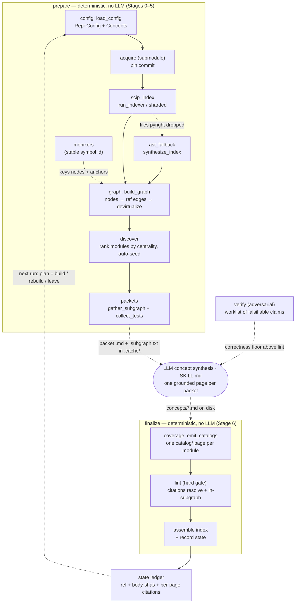
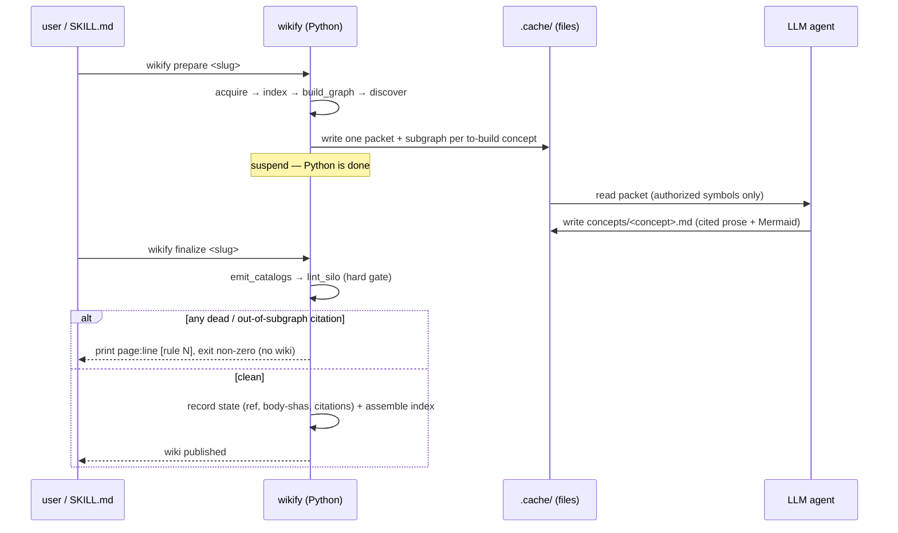

# wikify-repo — what it is and how it fits together

## In one paragraph
`wikify` is the tool that builds *this kind of wiki*: it ingests a code repo into a
grounded, lint-clean markdown wiki an agent can answer internals questions from. Its
defining idea is a **hard split around the model** — the README calls it "hard," and
the CLI's own docstring states it: *"the deterministic half never calls a model; the
agent half never parses protobuf."* Everything mechanical (acquire the source, index
it to SCIP, build a symbol graph, pick what deserves a deep page, carve a grounding
packet for each, then lint/verify/catalog the results) is pure, deterministic Python.
The single creative step — writing one prose-plus-diagram concept page per packet — is
an LLM, run **out of process**, that never sees protobuf. The two halves never share
memory; they hand off through **files in `.cache/`**, which is exactly why there are
two top-level commands (`prepare` emits packets and stops; `finalize` picks the agent's
pages back up and gates them) rather than one. The payoff of making the boundary files
is *idempotent reconcile*: a re-run on the same commit converges to a no-op, and
`--ref <commit>` rebuilds only the pages whose cited code actually moved.

## Core architecture
The pipeline is a straight deterministic spine with the LLM bolted in at exactly one
seam. `prepare` runs Stages 0–5 and suspends; the agent synthesizes; `finalize` runs
the gates and assembles.

The substrate the whole right-hand side reads is the **symbol graph**, and the join key
threaded through every stage — graph node id, catalog anchor, citation target, lint
resolution — is the **SCIP moniker**.

### One ingest, end-to-end

## Main concepts

### The CLI — the deterministic driver around synthesis
`wikify/cli.py` is the Typer app that *is* the architecture: `prepare` runs the
mechanical front half and stops at the packet handoff; `finalize` resumes after the
agent has written pages, gates them, and assembles; `plan` and `lint` are read-only
windows onto the same machinery. The file/handoff boundary lets each half be tested and
re-run in isolation and lets the expensive model work replay from a frozen packet.
See **[concepts/wikify-cli.md](concepts/wikify-cli.md)**.

### Config — the per-repo ingest contract
An ingest is configured by a wiki-shaped file: `config/<slug>.md`, YAML frontmatter for
typed scalars plus a `## Concepts` body that *is* the table of contents. The agent edits
markdown, never a second syntax; the parser claws back the strictness TOML would give
(unknown keys fail loudly, `slug` is required). Concept seeds are optional — `(auto)`
hands the agenda to discovery. See **[concepts/wikify-config.md](concepts/wikify-config.md)**.

### SCIP indexing → SymbolGraph
Stage 1 runs an external SCIP indexer (scip-python, optionally scip-clang) over the
pinned tree and normalizes the protobuf into the in-repo graph. The load-bearing
admission: **SCIP has no "call" relationship**, so edges are *reconstructed* by
reference scoping — a reference inside a definition's body span becomes an `F → S` edge.
Multiple indexes (Python + C++, or N parallel shards) union by moniker. See
**[concepts/wikify-scip_index.md](concepts/wikify-scip_index.md)**.

### AST fallback — symbol recovery without a type checker
scip-python is a type checker: on pathological files (huge generic classes) pyright can
drop a whole file's index. The fallback re-parses just those files with Python's `ast`
and fabricates a synthetic SCIP index whose monikers match byte-for-byte, so recovered
definitions unify with existing references by string equality. Enumeration, not
traversal — deterministic and crash-proof. See
**[concepts/wikify-ast_fallback.md](concepts/wikify-ast_fallback.md)**.

### Monikers — the stable grounding id
A SCIP moniker is the authoritative, language-neutral, position-independent id for a
symbol, and the single join key across the whole pipeline: graph nodes key on it,
catalogs publish an `anchor → moniker` map, a concept citation is just
`../catalog/<module>.md#<anchor>`, and the linter resolves the anchor back to a moniker.
Because the anchor is a *pure function of the moniker*, citation linting is a mechanical
set-membership check, not fuzzy matching. See
**[concepts/wikify-monikers.md](concepts/wikify-monikers.md)**.

### The symbol graph — citation namespace, edges, and packets
The graph is simultaneously the **citation namespace** the linter resolves against and
the **call-ish graph** discovery and packets traverse. A class-hierarchy pass,
`devirtualize`, adds *audited* base→override edges so traversal crosses the
dynamic-dispatch seam a static walk dies at. Per concept, a relevance-bounded subgraph
is carved (`gather_subgraph`) — the *only* symbols that page may cite — and rendered into
a grounding packet with snippets and exercising tests. See
**[concepts/wikify-graph.md](concepts/wikify-graph.md)**.

### Discover — the derived comprehension agenda
Nobody hand-lists which subsystems deserve a deep page. Discovery treats each module as
a candidate, scores it by aggregate inbound fan-in, drops the test/example/vendored tail,
and auto-seeds each survivor from its highest-centrality symbols — capped to a budget,
fully deterministic so the same commit yields the same agenda. Importance is a graph
property, not an opinion. See **[concepts/wikify-discover.md](concepts/wikify-discover.md)**.

### Coverage — the whole-repo floor as a set-difference
Concept synthesis is selective on purpose, so on its own it leaves subsystems invisible.
Coverage is the floor: it *subtracts* what the deep pages cite from every symbol SCIP
enumerated and deterministically writes one `catalog/` page per module for the rest — a
**set-difference, not a graph walk**, which is what lets it represent code a reachability
check would false-flag as dead. Two tiers, graded separately: concepts for depth,
catalogs for representation. See **[concepts/wikify-coverage.md](concepts/wikify-coverage.md)**.

### Lint — the hard citation gate
The linter is the build gate that makes the wiki trustable. Three hard rules over each
concept page: every citation must *resolve* (rule 1), load-bearing sections must carry a
citation per item (rule 2), and no page may cite a symbol outside its packet's authorized
subgraph (rule 3, the anti-hallucination catch). It judges syntax the agent must use
anyway, never meaning; `> [!inferred]` is the sanctioned escape hatch for ungroundable
claims. A failure halts `finalize`. See **[concepts/wikify-lint.md](concepts/wikify-lint.md)**.

### Verify — the adversarial correctness floor
Lint proves a claim *cites a real symbol*; it does not prove the claim is *true*. Verify
is the second floor: pure Python turns a finished page into a reproducible worklist of
falsifiable claims and later folds a skeptic's verdicts into a pass/fail tally, while the
*refutation itself* (read source, decide if it holds) is the out-of-band LLM step. Any
single refuted claim fails the page. See **[concepts/wikify-verify.md](concepts/wikify-verify.md)**.

### State — the idempotency ledger
A tiny JSON ledger of *(pinned commit, per-symbol body-sha, per-page citation set)* is
what makes re-ingestion cheap. A page is stale iff a symbol it cited changed body, so a
re-run on the same commit converges to an all-`leave` no-op and `--ref` rebuilds only the
moved delta. Pure bookkeeping; `finalize` is the sole writer, and only after lint passes.
See **[concepts/wikify-state.md](concepts/wikify-state.md)**.

## How a request flows
One ingest follows the spine top to bottom. **Config** parses `config/<slug>.md` into a
`RepoConfig`; **acquire** pins the source as a submodule; **scip_index** (with
**ast_fallback** filling pyright's holes) produces SCIP indexes that **graph**'s
`build_graph` unions into one **moniker**-keyed `SymbolGraph` and devirtualizes;
**discover** ranks modules and seeds an agenda; the packet builder carves a bounded
subgraph per concept and `prepare` **suspends**, leaving packets in `.cache/`. The
**LLM** writes one grounded page per packet. `finalize` resumes: **coverage** emits the
catalog floor first (the homes citations resolve against), **lint** gates every page,
**verify** can adversarially re-check the survivors, and on green the index is assembled
and the **state** ledger records what was built — so the next run knows what to skip.

## Map of the wiki
- **"What is wikify and how do the pieces compose?"** → you're reading it.
- **"How does `<mechanism>` work, and why?"** → the concept page that owns it (linked per
  subsection above) — prose, a Mermaid diagram, and woven citations.
- **"What is `<symbol>` — signature, definition, who calls it?"** → its home under
  [`catalog/`](catalog/), one page per module: signature, extracted docstring, a source
  link, and importance-ranked uses-by. The catalog is the exhaustive per-module index and
  the resolution table the linter checks citations against.
- **Need line-level certainty?** Drop from a catalog entry to the pinned source at the
  recorded commit.
- **The concept table and what else lives in this wiki** → the top-level
  [`index.md`](../../index.md) (read first; `grep` it to route).
